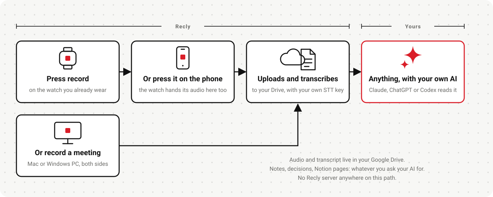
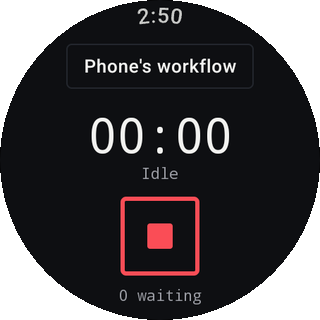
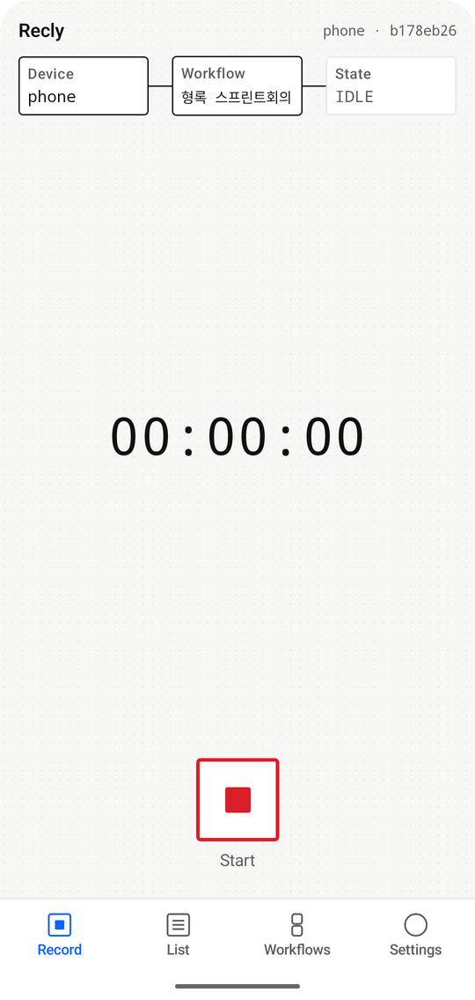
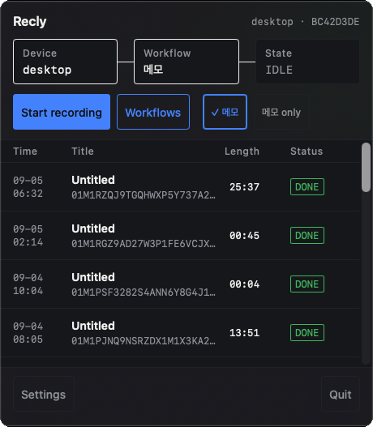
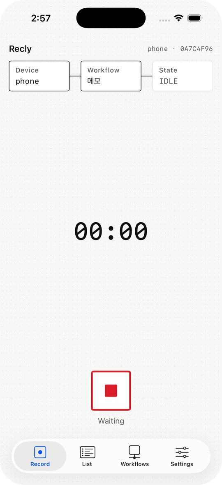
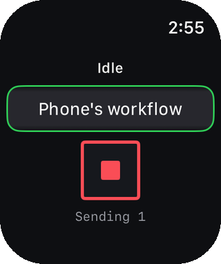

<div align="center">


# Recly

**Plaud 같은 AI 노트테이커를, 이미 가진 워치와 폰으로.<br>오디오는 내 Drive에, 녹취는 내 키로, 노트는 내 AI가.**

[다운로드](#recly-받기) · [설치 안내](docs/install.md) · [개인정보처리방침](https://recly.dev/policy/privacy-policy.ko) · [Issues](https://github.com/rokrokss/recly/issues) · [English](README.md)

[](LICENSE)
[](https://github.com/rokrokss/recly/releases)
[](https://github.com/rokrokss/recly/releases)
[](https://github.com/rokrokss/recly/stargazers)

</div>

<p align="center"></p>

Plaud나 NotePin은 세 가지를 팝니다. 녹음기, 녹취, AI 노트. 녹음기는 이미 손목에 있고 AI는 이미
구독 중입니다. Recly는 지원 기기의 로컬 전사 또는 **내** API 키로 녹취를 만들고, 원본 오디오와 결과를
**내** Google Drive에 남깁니다. Recly 서버는 없고, 회의에 들어오는 봇도 없고, 월 구독료도 없습니다.

## 왜 Recly인가

- **이미 차고 있는 녹음기.** Galaxy Watch 홈 키를 두 번 누르면 녹음이 시작되고, 워치는 폰에 오디오를
  넘기고, 나머지는 폰이 합니다. 여섯 클라이언트(Galaxy Watch, Android, Apple Watch, iPhone, macOS,
  Windows)가 같은 방식으로 녹음하고 같은 처리 흐름을 사용하며, 데스크톱은 내 마이크와
  Zoom·Teams·Meet 상대방 소리를 트랙을 나눠 담습니다.
- **저장소는 내 Drive뿐.** 녹음은 내 Google Drive의 `recly/2026/2026-09/` 같은 폴더로 갑니다. Google이
  제공하는 가장 좁은 권한(`drive.file`)만 쓰고, 업로드가 확인되기 전에는 원본을 지우지 않습니다. Recly는
  내 파일을 볼 수 없습니다. 볼 서버 자체가 없으니까요.
- **파일이 인터페이스.** 내 에이전트가 Drive에서 전사 결과를 읽어 후속 작업을 합니다. 설정에서 로컬 전사,
  외부 API, 전사 안 함을 선택합니다. 외부 전사는 provider(AssemblyAI, 클로바, Deepgram, OpenAI, Azure
  등) 중 하나에 내 키를 넣어 씁니다. 지원하는 경우 화자를 자동으로 구분합니다. 노트는 내 에이전트의 몫입니다.
- **몰래 하는 것은 없다.** 녹음은 언제나 보입니다. 데스크톱은 회의를 감지하면 먼저 묻고, 그다음에
  녹음합니다. 분석 도구, 크래시 리포트, 업데이트 핑도 없습니다.

## 무엇이 어디서 실행되나

| 단계 | 실행되는 곳 | 기기를 떠나는 것 |
|---|---|---|
| 녹음 | 내 워치·폰·데스크톱 | 없음. 워치는 짝 지은 내 폰으로만 오디오를 넘깁니다. |
| 저장 | 내 Google Drive | 오디오 파트와 작은 메타데이터 파일, 내 계정으로. |
| 녹취 | 내가 고른 provider, 내 키로 | 외부 API를 선택했을 때만 오디오. 로컬 분석에는 외부 전사 전송이 없습니다. 결과는 녹음 옆에 파일로 돌아옵니다. |
| 노트 | 내 AI 에이전트(Claude, ChatGPT, Codex 등) | 에이전트가 내 Drive에서 녹취록을 읽고 내 Notion에 노트를 씁니다. Recly는 관여하지 않습니다. |
| 처리 설정, API 키 | 기기 안 | 동기화하지 않습니다. 설정 내보내기에는 키 값이 포함되지 않아 기기마다 별도로 입력합니다. |

네트워크로 나가는 경로 전부를 하나도 빼지 않고 적은 문서가 [개인정보처리방침](https://recly.dev/policy/privacy-policy.ko)입니다.

## Recly 받기

스토어 출시는 곧 예정입니다. 그전까지는 [Releases](https://github.com/rokrokss/recly/releases)의 프리릴리스
빌드를 쓸 수 있습니다.

| 플랫폼 | 요구 사항 | 지금 | 곧 |
|---|---|---|---|
| Android 폰 | Android 14 이상 | [Releases](https://github.com/rokrokss/recly/releases)의 APK | Google Play |
| Galaxy Watch | Wear OS 5 이상 | Releases의 APK를 ADB로 설치([방법](docs/install.md#galaxy-watch)) | Google Play |
| iPhone | iOS 17 이상 | 소스에서 빌드 | App Store · TestFlight |
| Apple Watch | watchOS 10 이상 | iPhone 앱과 함께 소스에서 빌드 | App Store |
| macOS | macOS 14.4 이상 | 소스에서 빌드 | 공증된 DMG · Homebrew |
| Windows | Windows 11 | [Releases](https://github.com/rokrokss/recly/releases)의 MSI(미서명, [안내](docs/install.md#windows)) | 서명된 MSI · winget |

플랫폼별 순서, 워치 사이드로드, Windows SmartScreen 경고 넘기기는 [설치 안내](docs/install.md)에 있습니다.
소스 빌드는 [docs/development.md](docs/development.md)를 보세요.

## 동작 방식

1. **녹음.** 워치에서 녹음을 누르거나(Galaxy Watch는 홈 키 두 번 누르기에 연결할 수 있습니다), Mac
   메뉴 막대 아이콘, Windows 트레이 아이콘을 누릅니다. 데스크톱은 회의 앱이 마이크를 열면 알아차리고
   녹음할지 묻습니다.
2. **업로드.** 멈추면 녹음이 있는 그대로 내 Drive로 갑니다. 워치는 먼저 폰에 넘깁니다. 네트워크가
   끊겨 있으면 기다렸다가 다시 시도하고, Drive가 확인하기 전에는 원본을 지우지 않습니다.
3. **전사하고 완료.** 원본 업로드 후 전사와 결과 업로드를 처리합니다.
   설정에서 저장 폴더와 전사 방식을 정합니다. 전사 안 함은 원본만 업로드합니다.

로컬 엔진이 있는 기기의 새 설치는 로컬 전사가 기본입니다. Apple 어댑터는 iOS/macOS 26과 지원 기기·언어
모델이 필요합니다. Android·Windows와 OS 26 미만 Apple 기기는 아직 엔진이 없어 새 설치가 전사 안 함으로
시작하고 로컬 선택지를 표시하지 않습니다. 전사하려면 외부 API를 선택합니다.
로컬에서 클라우드로 자동 전환하지 않습니다.
화면은 영어·한국어·일본어·중국어 간체/번체·스페인어·프랑스어·독일어·포르투갈어·아랍어·힌디어·러시아어를
지원합니다. 전사는 20개 언어 선택값을 제공하며 제공자나 기기에서 지원하는 언어만 표시합니다.
데스크톱은 항상 회의 모드(마이크 + 시스템 오디오)로 녹음하고 마이크는 자동으로 선택합니다.

설정·전사 파일 계약은 [`spec/`](spec/)에 있습니다.

## 노트: 내 에이전트로

Recly의 파이프라인은 일부러 녹취록에서 끝납니다. 녹취록을 노트로 만드는 일은 이미 쓰고 있는 AI 구독이
잘하는 일이라, Recly는 과금되는 기능 대신 에이전트용 **스킬**을 함께 배포합니다. Drive는 앱이 쓰는
원본 보관소라 에이전트는 읽기만 합니다. 노트와 그 뒤의 모든 수정은 내 Notion에 남습니다.

| 스킬 | 하는 일 |
|---|---|
| [`recly-notes`](skills/recly-notes/SKILL.md) | 녹음(최근 것, 또는 내가 지정한 것)을 찾아 녹취록을 읽고 회의록, 결정 기록, 인터뷰·강의 노트, 메모를 씁니다 |
| [`recly-notion`](skills/recly-notion/SKILL.md) | 그 노트를 내 Notion의 "Recly Recordings" 데이터베이스에 녹음당 한 페이지로 보관하고, 나중에 다시 찾아 줍니다 |

```bash
npx skills add rokrokss/recly            # Agent Skills를 지원하는 어떤 에이전트든
# 또는 Claude Code 안에서:
/plugin marketplace add rokrokss/recly
/plugin install recly@recly
```

플러그인이 Notion의 호스팅 MCP 서버를 등록하므로 `/mcp`로 한 번 로그인하면 됩니다. 코딩 에이전트 대신
Claude 앱이나 ChatGPT 앱을 쓴다면 같은 파일 다섯 개가 거기서도 동작합니다. 각 설정 방법은
[skills/README.md](skills/README.md)에 있습니다.

그다음 이렇게 부탁하면 됩니다. *"최근 녹음으로 회의록 만들어서 Notion에 넣어 줘"*, *"지난주에 가격에
대해 뭘 결정했지?"*. 양식이 마음에 안 들면 스킬 파일을 고치면 됩니다. 그게 이 구조의 요점입니다.

## 클라이언트

| 클라이언트 | 만든 것 | 하는 일 |
|---|---|---|
| Galaxy Watch (Wear OS) | Kotlin · Wear Compose | 녹음, Android 폰에 넘기기 |
| Android 폰 | Kotlin · Compose | 녹음, 처리 설정·실행, Google 로그인 |
| Apple Watch | SwiftUI | 녹음, iPhone에 넘기기 |
| iPhone | SwiftUI | 녹음, 처리 설정·실행, Google 로그인 |
| macOS | SwiftUI 메뉴 막대 앱 | 회의 캡처(마이크 + 시스템 오디오), 녹음 처리 |
| Windows | Compose Desktop + Rust 캡처 헬퍼 | 회의 캡처, 녹음 처리 |

여섯 클라이언트는 Kotlin Multiplatform 코어 하나를 공유합니다. 고정 녹음 처리 흐름, 재개 가능한 Drive
업로드, 녹취 어댑터, 작업 큐가 거기 있습니다.

<p align="center">
  &nbsp;&nbsp;
  &nbsp;&nbsp;
  &nbsp;&nbsp;
  &nbsp;&nbsp;
  
</p>

## 프라이버시

Recly에는 서버가 없습니다. 데이터가 갈 수 있는 곳은 내 Google Drive, 내가 고른 녹취 provider,
그리고 짝 지은 내 워치·폰뿐입니다. [개인정보처리방침](https://recly.dev/policy/privacy-policy.ko)이 그 경로를
전부 나열하고, [docs/recly.md §15](docs/recly.md#15-프라이버시데이터-흐름-구-docs15)가 그 뒤의 엔지니어링
계약입니다. 네트워크 호출을 추가하는 변경은 그 절을 먼저 고쳐야 합니다.

## 기여 · 보안 · 라이선스

- **기여**: 버그, 질문, 아이디어 모두 [Issues](https://github.com/rokrokss/recly/issues/new/choose)로.
  규칙은 [CONTRIBUTING.md](CONTRIBUTING.md)에 있습니다. CLA는 없습니다.
- **보안**: 취약점은 [SECURITY.md](SECURITY.md)의 비공개 경로로 알려 주세요.
- **라이선스**: [AGPL-3.0-or-later](LICENSE). 앱스토어 배포를 위한 추가 허가 두 가지는
  [LICENSE-EXCEPTIONS.md](LICENSE-EXCEPTIONS.md)에 있습니다. "Recly"와 아이콘은 상표입니다.
  [TRADEMARK.md](TRADEMARK.md)를 보세요. 서드파티 구성 요소는 [THIRD-PARTY-NOTICES.md](THIRD-PARTY-NOTICES.md)에
  있습니다.

## 개발자를 위해

저장소 구조, 빌드·테스트, 릴리스 절차, 설계 문서 목록은 영어 [README.md](README.md#for-developers)와
[docs/development.md](docs/development.md)에 있습니다. 설계 문서 [docs/recly.md](docs/recly.md)는 한국어입니다.
