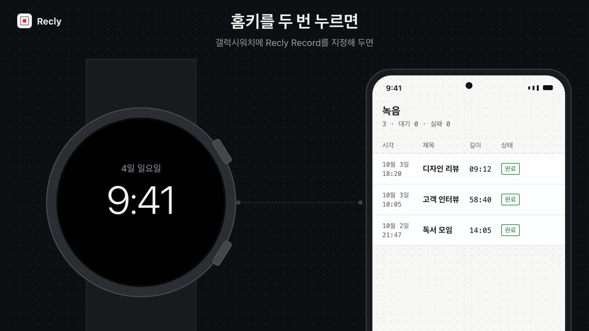
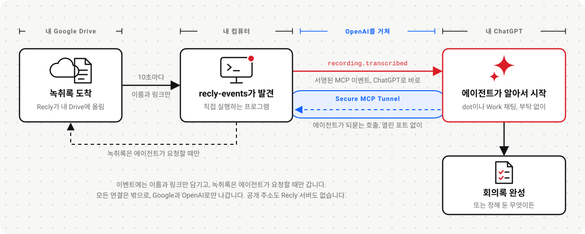
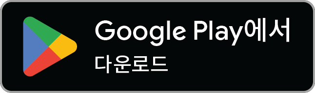
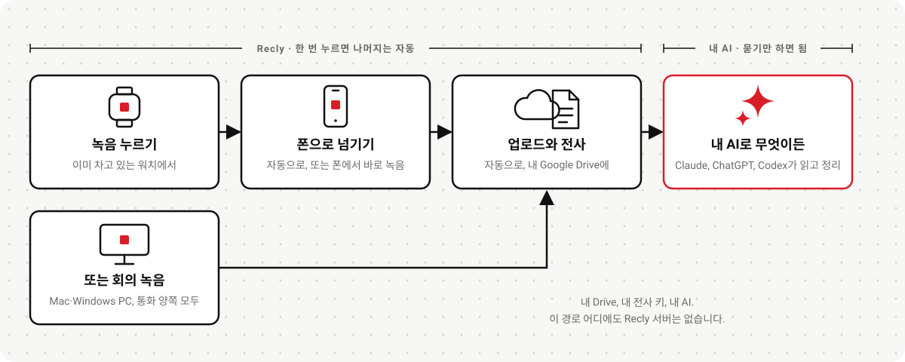
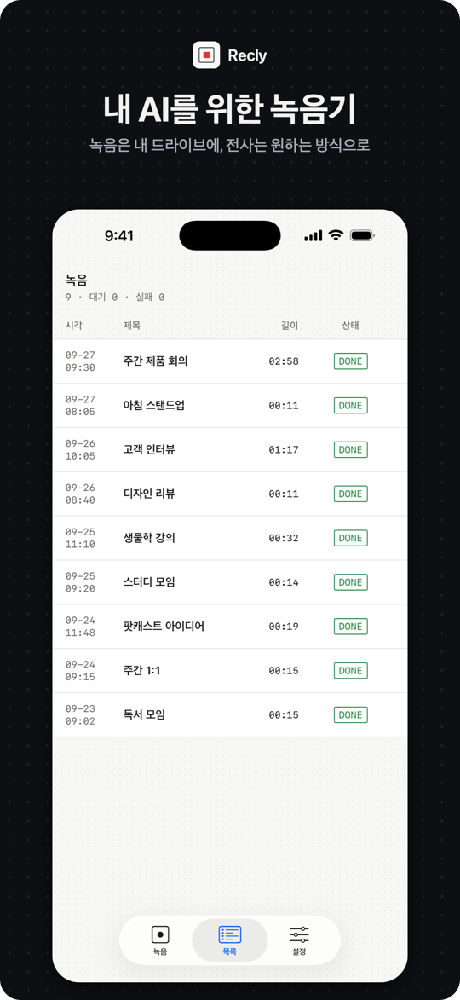
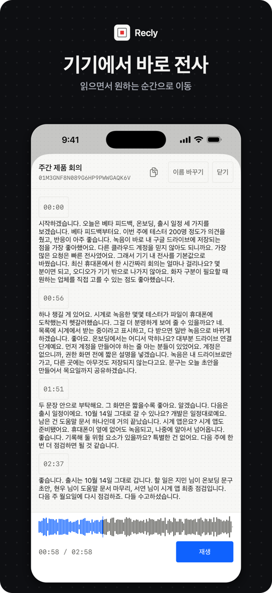
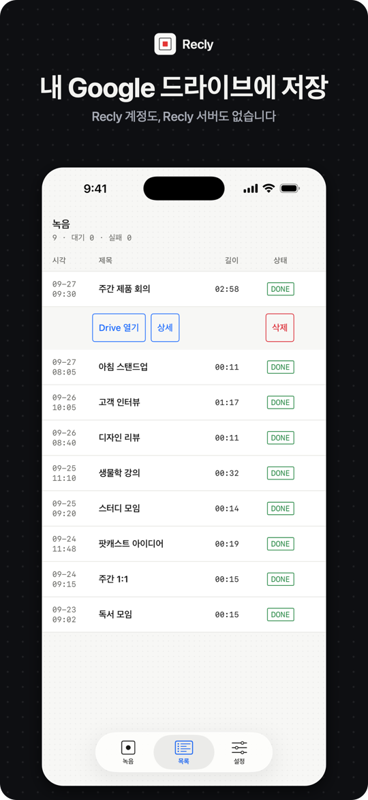
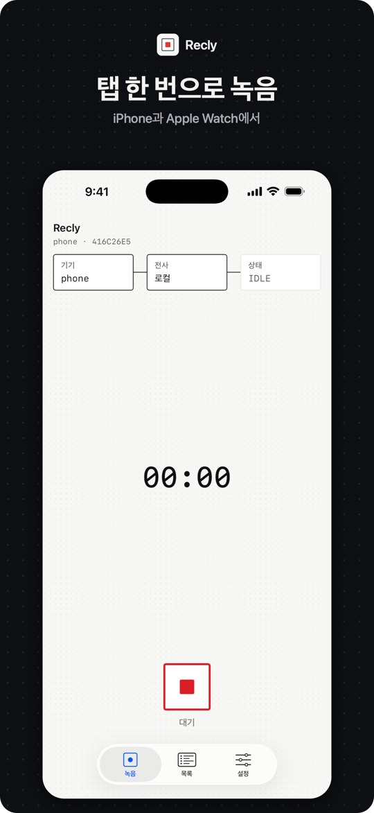
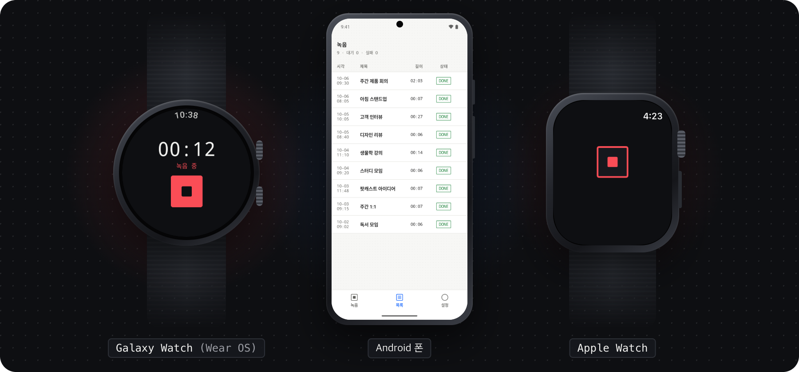

<div align="center">


# Recly

**AI 녹음기는 이미 손목에 있습니다.**

Plaud 같은 AI 노트테이커를, 이미 가진 워치와 폰으로.<br>오디오는 내 Drive에, 녹취는 내 키로, 노트는 내 AI가.

[App Store](https://apps.apple.com/app/recly-record-for-your-ai/id6809930443) · [Google Play](https://play.google.com/store/apps/details?id=app.recly) · [Mac·Windows](#recly-받기) · [자동 회의록](#저절로-써지는-회의록) · [설치 안내](docs/install.ko.md) · [자주 묻는 질문](docs/faq.ko.md) · [개인정보처리방침](https://recly.dev/policy/privacy-policy.ko) · [Issues](https://github.com/rokrokss/recly/issues) · [English](README.md)

[](LICENSE)
[](https://github.com/rokrokss/recly/releases)
[](https://github.com/rokrokss/recly/releases)
[](https://github.com/rokrokss/recly/stargazers)

</div>

<p align="center"></p>

Plaud나 NotePin은 세 가지를 팝니다. 녹음기, 녹취, AI 노트. 녹음기는 이미 손목에 있고 AI는 이미
구독 중입니다. Recly는 지원 기기의 로컬 전사 또는 **내** API 키로 녹취를 만들고, 원본 오디오와 결과를
**내** Google Drive, iCloud, 또는 고른 폴더에 남깁니다. Recly 서버는 없고, 회의에 들어오는 봇도 없고, 월
구독료도 없습니다.

## 저절로 써지는 회의록

녹음을 멈추면 ChatGPT 에이전트가 보통 1분 안에 알아서 회의록을 씁니다. 새 녹취록은 하나하나
[MCP 이벤트](https://developers.openai.com/plugins/build/mcp-events)가 됩니다. Recly Mac·Windows 앱에 들어 있는 recly-events가 `recording.transcribed`를
내 에이전트(dot이나 Work 채팅)에게 보내면, 에이전트가 녹취록을 읽고 녹음마다 하라고 정해 둔 일을 합니다. 회의록,
결정 사항과 할 일, 후속 메일 초안 같은 것들입니다.

<p align="center"></p>

- **프롬프트가 아니라 이벤트.** OpenAI의 MCP Events는 앱이 에이전트를 깨울 수 있게 합니다.
  `recording.transcribed`는 서명된 채 ChatGPT에 닿고, 새 녹취록마다 에이전트가 한 번씩 일합니다.
- **내 터널을 거쳐.** 에이전트는 내 [OpenAI Secure MCP Tunnel](https://developers.openai.com/api/docs/guides/secure-mcp-tunnels)로 recly-events에 되묻습니다. 터널은
  recly-events가 내 쪽에서 열기 때문에 내 컴퓨터에는 공개 주소도 열린 포트도 필요 없고, Recly 서버도 여전히
  없습니다.
- **녹취록은 에이전트가 요청할 때만.** 이벤트에는 녹음 이름, 제목, Google Drive 링크만 담깁니다. 녹취록은
  에이전트가 필요할 때 `get_transcript`로 내 터널을 거쳐 읽습니다. ChatGPT의 Google Drive 앱은 필요 없습니다.
- **놓치는 것 없이.** 잠들었던 컴퓨터는 깨어나면 그사이의 녹취록을 따라잡고, 에이전트가 아직 가져가지 않은
  이벤트는 30일 동안 우편함에 남습니다.

**켜는 법:** Mac·Windows 앱(0.2.0부터)의 설정 → 에이전트 연결에서 켭니다. 단계는
[ChatGPT 에이전트 안내](docs/agent.ko.md)에 있습니다. 서버, Linux, 앱이 없는 컴퓨터에서는
[recly-events를 직접 실행하세요](docs/recly-events.ko.md). 필요한 것: Google Drive에 저장되는 녹음, ChatGPT
dot(이 글을 쓰는 시점에 ChatGPT Business Premium, 또는 EEA·스위스·영국 밖의 ChatGPT Pro) 또는 ChatGPT 웹의 Work
채팅, 터널과 키를 만들 OpenAI Platform 계정, 그리고 켜 둔 컴퓨터.

## 왜 Recly인가

- **이미 차고 있는 녹음기.** Galaxy Watch 홈 키를 두 번 누르면 녹음이 시작되고, 워치는 폰에 오디오를
  넘기고, 나머지는 폰이 합니다. 폰·Mac·Windows PC도 녹음하고, 데스크톱은 내 마이크와 Zoom·Teams·Meet
  상대방 소리를 트랙을 나눠 담습니다.
- **저장소는 내 것뿐.** 녹음은 Google이 제공하는 가장 좁은 권한인 `drive.file`로 내 Google Drive의
  `recly/memo/2026-10/` 같은 폴더에 가거나, iPhone·Mac에서는 내 iCloud로, 또는 Obsidian 볼트 같은 내가 고른
  로컬 폴더로 갑니다. 업로드가 확인되기 전에는 원본을 지우지 않고, Recly에는 내 파일을 볼 서버가 없습니다.
- **파일이 인터페이스.** 녹취록은 오디오 옆에 놓이는 평범한 파일이고, 어떤 에이전트·스크립트·앱이든 읽을 수
  있게 [형식이 문서화](spec/)되어 있습니다. 기기 안에서, 내 키로(AssemblyAI, CLOVA, Deepgram, OpenAI, Azure
  등), 또는 전사 없이. 화자는 기기 안에서도, 지원하는 업체에서도 구분합니다. 노트는 유료 기능이 아니라 내
  에이전트의 몫입니다. 녹음 하나를 바로 요약하고 싶다면 **ChatGPT로 계속하기** 뒤에 내 ChatGPT 요금제로 요약합니다.
- **표시하고, 고치고, 찾기.** 녹음 중에 폰·두 워치·데스크톱에서 **하이라이트**를 누르면 그 순간이 녹음 파일에
  담겨 에이전트가 봅니다. 녹음 뒤에는 낱말을 고치고, 화자 이름을 붙이고, 지금 설정으로 다시 전사하고, 모든
  제목과 녹취록을 검색하고, 녹취록을 `.txt`·`.md`·`.srt`·`.vtt`로, 오디오를 `.m4a`로 공유합니다. 이름과 용어를
  어휘로 넣어 두면 바르게 받아 적는 데 쓰이고, 다른 곳의 오디오·동영상 파일도 녹음으로 가져올 수 있습니다.
- **몰래 하는 것은 없다.** 녹음은 언제나 보입니다. 데스크톱은 회의를 감지하면 먼저 묻고, 그다음에
  녹음합니다. 분석 도구, 크래시 리포트, 업데이트 핑도 없습니다.

## 무엇이 어디서 실행되나

| 단계 | 실행되는 곳 | 기기를 떠나는 것 |
|---|---|---|
| 녹음 | 내 워치·폰·데스크톱 | 없음. 워치는 짝 지은 내 폰으로만 오디오를 넘깁니다. |
| 저장 | 내 Google Drive(iPhone·Mac은 내 iCloud, iPhone·Mac·Windows·Android는 고른 로컬 폴더도 가능) | Google Drive나 iCloud: 오디오 파트와 작은 메타데이터 파일, 내 계정으로. 로컬 폴더: 기기를 떠나는 것 없음. |
| 녹취 | 기기 안, 또는 내가 고른 업체(내 키로) | 기기 안: 음성 인식 서비스로 가는 오디오 없음. 외부: 합친 오디오가 고른 업체로 갑니다. 어휘를 넣었다면 어휘도 함께 갑니다. 결과는 녹음 옆에 기록됩니다. |
| 노트 | 내 AI 에이전트(Claude, ChatGPT, Codex 등) | 에이전트가 내 저장소에서 녹취록을 읽고 내가 노트를 두는 곳에 씁니다(예시 스킬은 Notion). 자동 회의록을 켜면 recly-events가 새 녹취록마다 OpenAI를 거쳐 내 ChatGPT 에이전트에게 알립니다. 녹음 이름, 제목, Drive 링크를 보내고, 녹취록은 에이전트가 요청할 때만 보냅니다. 오디오는 보내지 않습니다. |
| 요약(선택) | ChatGPT로 로그인한 뒤 녹음에서 **요약하기**를 고르면 내 ChatGPT 요금제 | 그 녹음의 녹취록 텍스트와 하이라이트, 요약 형식·나에 대해에 적은 내용이 OpenAI로 갑니다. 오디오는 보내지 않습니다. **이 녹음에 대해 묻기**는 여기에 질문을 더해 보냅니다. 요약은 고칠 수 있고, Drive·iCloud의 녹음 폴더에 함께 두어 다른 기기에서도 보입니다. 로컬 폴더라면 기기에 둡니다. |
| 처리 설정, API 키 | 기기 안 | 동기화하지 않습니다. **설정 파일** → **설정 내보내기**에는 키 값이 포함되지 않아 기기마다 별도로 입력합니다. |

네트워크로 나가는 경로 전부를 하나도 빼지 않고 적은 문서가 [개인정보처리방침](https://recly.dev/policy/privacy-policy.ko)입니다.

## Recly 받기

<a href="https://apps.apple.com/app/recly-record-for-your-ai/id6809930443"></a>
<a href="https://play.google.com/store/apps/details?id=app.recly"></a>

| 플랫폼 | 요구 사항 | 기기 안 전사 | 받는 곳 |
|---|---|---|---|
| Android 폰 | Android 14 이상 | 64비트, 보고 메모리 6 GiB 이상(실제로는 8 GB 기기), 약 1 GB 한 번 다운로드 | [Google Play](https://play.google.com/store/apps/details?id=app.recly) |
| Galaxy Watch | Wear OS 5 이상 | — (폰이 전사) | [Google Play](https://play.google.com/store/apps/details?id=app.recly), Android 폰 앱과 함께 |
| iPhone | iOS 17 이상 | iOS 26 이상 | [App Store](https://apps.apple.com/app/recly-record-for-your-ai/id6809930443) |
| Apple Watch | watchOS 10 이상 | — (iPhone이 전사) | [App Store](https://apps.apple.com/app/recly-record-for-your-ai/id6809930443)의 iPhone 앱에 포함 |
| macOS | macOS 14.4 이상, Apple Silicon | macOS 26 이상 | [Releases](https://github.com/rokrokss/recly/releases/latest)의 공증된 DMG |
| Windows | Windows 11, x64 | 64비트, 보고 메모리 6 GiB 이상(실제로는 8 GB 기기), 약 1 GB 한 번 다운로드 | [Releases](https://github.com/rokrokss/recly/releases/latest)의 MSI(베타, 미서명: [안내](docs/install.ko.md#windows) 참고) |

기기 안 전사가 없는 기기는 [내 키로 외부 업체를 쓰거나](docs/setup.ko.md#3-전사-방식-고르기) 전사 없이
녹음합니다.

플랫폼별 순서, 릴리스마다 함께 올라가는 폰·워치 APK 사이드로드, Windows SmartScreen 경고 넘기기는
[설치 안내](docs/install.ko.md)에 있습니다. 소스 빌드는 [docs/development.md](docs/development.md)(영어)를
보세요.

**다음:** [설정하기](docs/setup.ko.md)(저장소와 전사), 원하면 이어서
[ChatGPT 에이전트로 자동 회의록](docs/agent.ko.md). 궁금한 점: [자주 묻는 질문](docs/faq.ko.md).

**베타.** Windows 앱은 CI에서 빌드하고 테스트하지만 아직 실제 Windows PC에서 확인하지 못했습니다.
발견한 문제는 [Issues](https://github.com/rokrokss/recly/issues)에 알려 주세요.

## 동작 방식

<p align="center"></p>

1. **녹음.** 워치에서 녹음을 누르거나(Galaxy Watch는 홈 키 두 번 누르기에 연결할 수 있습니다), Mac
   메뉴 막대 아이콘이나 Windows 트레이 아이콘을 누릅니다. 데스크톱은 회의 앱이 마이크를 열면 알아차리고 녹음할지 묻습니다. 녹음 중에는 **하이라이트**로
   순간을 표시합니다(Apple Watch는 이중 탭).
2. **업로드.** 멈추면 녹음이 있는 그대로 내 저장소로 갑니다. Google Drive, 또는 고른 iCloud나 로컬
   폴더입니다. 워치는 먼저 폰에 넘깁니다. 네트워크가 끊겨 있으면 기다렸다가 다시 시도하고, 업로드가
   확인되기 전에는 원본을 지우지 않습니다.
3. **전사하고 완료.** 원본 업로드 후 전사와 결과 업로드를 처리합니다.
   설정에서 저장 폴더와 전사 방식을 정합니다. 전사 안 함은 원본만 업로드합니다.

새로 설치하면 기기가 할 수 있는 곳에서는 기기 안에서 전사합니다. iPhone·Mac은 Apple 음성 인식으로,
Android·Windows는 오픈소스 Qwen3-ASR 0.6B 모델로 하며, 이 모델은 약 1 GB를 내가 시작할 때 한 번
내려받습니다. 요구 사항은 [위 표](#recly-받기)에 있습니다. 그 밖의 기기는 전사가 꺼진 채 시작하니 내 키로
외부 업체를 고르세요. 기기 안 전사도 화자를 구분합니다. iPhone·Mac 앱에는 모델이 들어 있고, Android·Windows는
같은 다운로드에서 약 41 MB를 더 받아 문장 단위로 구분합니다. 클라우드로 넘어가는 일은 없습니다.

화면은 영어·한국어·일본어·중국어 간체/번체·스페인어·프랑스어·독일어·포르투갈어(브라질/포르투갈)·아랍어·
힌디어·러시아어·이탈리아어·폴란드어·튀르키예어·필리핀어·벵골어·우르두어·스와힐리어·베트남어·페르시아어·태국어를
지원합니다. 전사는 20개 언어 선택값을 제공하며 제공자나 기기에서 지원하는 언어만 표시합니다.
데스크톱은 항상 회의 모드(마이크 + 시스템 오디오)로 녹음하고 마이크는 자동으로 선택합니다.

설정·전사 파일 계약은 [`spec/`](spec/)에 있습니다.

<p align="center">
  
  
  
  
</p>

## 노트: 내 에이전트로

Recly의 파이프라인은 일부러 녹취록에서 끝납니다. 녹취록을 노트로 만드는 일은 이미 쓰고 있는 AI 구독이
잘하는 일이라, Recly는 과금되는 기능 대신 녹취록을 내 에이전트에게 넘깁니다. 녹취록이 올라오는 순간
알아서([저절로 써지는 회의록](#저절로-써지는-회의록)), 또는 내가 부탁할 때.

다른 양식의 노트, ChatGPT 밖에 두는 노트, 지난 녹음들에 대한 질문에는 Claude, ChatGPT, Codex 등 어떤
에이전트에서든 쓰는 **예시 스킬** 두 개를 함께 배포합니다. 그대로 쓰거나, 고치거나, 내 양식과 노트 앱에
맞게 직접 만들어 쓰세요. 에이전트는 녹음을 읽기만 하고, 예시 스킬에서는 노트가 내 Notion에 남습니다.

| 예시 스킬 | 하는 일 |
|---|---|
| [`recly-notes`](skills/recly-notes/SKILL.md) | 녹음(최근 것, 또는 내가 지정한 것)을 찾아 녹취록을 읽고 회의록, 결정 기록, 인터뷰·강의 노트, 메모를 씁니다 |
| [`recly-notion`](skills/recly-notion/SKILL.md) | 그 노트를 내 Notion의 "Recly Recordings" 데이터베이스에 녹음당 한 페이지로 보관하고, 나중에 다시 찾아 줍니다 |

```bash
npx skills add rokrokss/recly            # Agent Skills를 지원하는 어떤 에이전트든
# 또는 Claude Code 안에서:
/plugin marketplace add rokrokss/recly
/plugin install recly@recly
```

플러그인이 Notion의 호스팅 MCP 서버를 등록하므로 `/mcp`로 한 번 로그인하면 됩니다. Claude 앱에서는
[최신 릴리스](https://github.com/rokrokss/recly/releases/latest)의 `recly-notes.zip`과
`recly-notion.zip`을 스킬로 올립니다. ChatGPT 앱에서는 두 ZIP을 풀어 안의 파일 다섯 개를 프로젝트에 올립니다.
각 설정 방법은 [skills/README.md](skills/README.md)(영어)에 있습니다.

그다음 이렇게 부탁하면 됩니다. *"최근 녹음으로 회의록 만들어서 Notion에 넣어 줘"*, *"지난주에 가격에
대해 뭘 결정했지?"*. 다른 양식이 필요하거나 Notion이 아닌 곳에 노트를 두고 싶다면 스킬을 고치거나, 하나를
복사해 [직접 만드세요](skills/README.md#write-your-own). 그게 이 구조의 요점입니다.

로컬 폴더나 Mac의 iCloud에 있는 녹음은 `recly-events mcp`로 같은 컴퓨터의 Claude Desktop, Claude Code, Codex가
목록 보기·검색·읽기를 할 수 있습니다. 로그인도 네트워크도 없습니다. 설정: [로컬 MCP 서버](docs/mcp.ko.md).

## 클라이언트

| 클라이언트 | 만든 것 | 하는 일 |
|---|---|---|
| Galaxy Watch (Wear OS) | Kotlin · Wear Compose | 녹음, Android 폰에 넘기기 |
| Android 폰 | Kotlin · Compose | 녹음, 처리 설정·실행, Google 로그인 |
| Apple Watch | SwiftUI | 녹음, iPhone에 넘기기 |
| iPhone | SwiftUI | 녹음, 처리 설정·실행, Google 로그인 |
| macOS | SwiftUI 메뉴 막대 앱 | 회의 캡처(마이크 + 시스템 오디오), 녹음 처리 |
| Windows | Compose Desktop + Rust 캡처 헬퍼 | 회의 캡처, 녹음 처리 |

여섯 클라이언트는 Kotlin Multiplatform 코어 하나를 공유합니다. 고정 녹음 처리 흐름, 재개 가능한 Drive
업로드, 녹취 어댑터, 작업 큐가 거기 있습니다.

<p align="center"></p>

## 프라이버시

Recly에는 서버가 없습니다. 데이터는 고른 저장소(내 Google Drive, iPhone·Mac에서는 내 iCloud, 또는 기기 안에
머무는 로컬 폴더), 내 키로 고른 전사 업체, 짝지은 내 워치와 폰 사이, 그리고 자동 회의록을 켰다면 OpenAI를 거쳐
내 ChatGPT 에이전트에게만 갑니다. 에이전트에게 가는 것은 녹음의 이름·제목·Drive 링크와, 에이전트가 요청할 때의
녹취록이고, 오디오는 가지 않습니다. [개인정보처리방침](https://recly.dev/policy/privacy-policy.ko)이 그 경로를 전부 나열하고,
[docs/recly.md §15](docs/recly.md#15-privacy--data-flows-formerly-docs15)가 그 뒤의 엔지니어링 계약입니다.
네트워크 호출을 추가하는 변경은 그 절을 먼저 고쳐야 합니다.

## 기여 · 보안 · 라이선스

- **기여**: 버그, 질문, 아이디어 모두 [Issues](https://github.com/rokrokss/recly/issues/new/choose)로.
  규칙은 [CONTRIBUTING.md](CONTRIBUTING.md)에 있습니다. CLA는 없습니다.
- **보안**: 취약점은 [SECURITY.md](SECURITY.md)의 비공개 경로로 알려 주세요.
- **라이선스**: [AGPL-3.0-or-later](LICENSE). 앱스토어 배포를 위한 추가 허가 두 가지는
  [LICENSE-EXCEPTIONS.md](LICENSE-EXCEPTIONS.md)에 있습니다. "Recly"와 아이콘은 상표입니다.
  [TRADEMARK.md](TRADEMARK.md)를 보세요. 서드파티 구성 요소는 [THIRD-PARTY-NOTICES.md](THIRD-PARTY-NOTICES.md)에
  있습니다.

## 개발자를 위해

저장소 구조, 빌드·테스트, 릴리스 절차, 설계 문서 목록은 영어 [README.md](README.md#for-developers)와
[docs/development.md](docs/development.md)에 있습니다. 설계 문서 [docs/recly.md](docs/recly.md)도 영어입니다.
