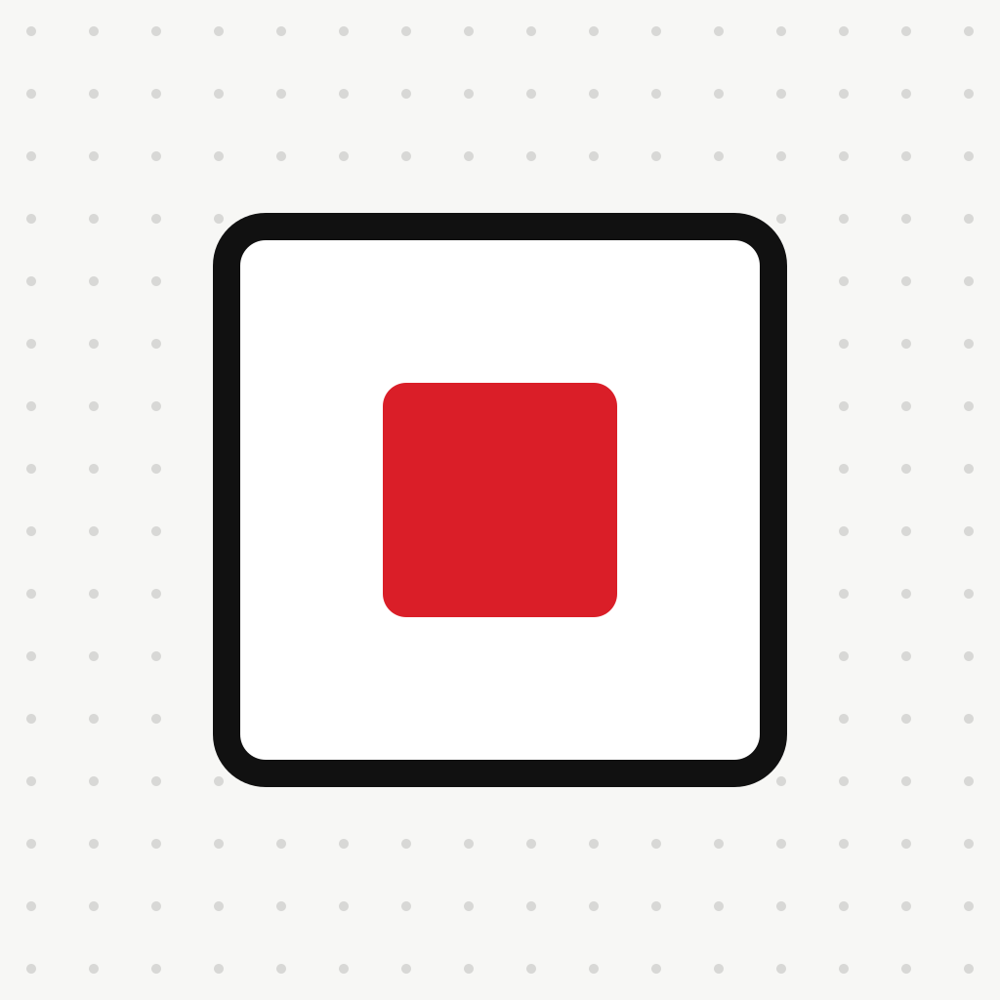

<div align="center">



# Recly

**Record on your watch, phone or desktop. The original lands in your own Google Drive.<br>Then the workflow you defined runs. Nothing goes anywhere else.**

[Download](#get-recly) · [Install guide](docs/install.md) · [Privacy](docs/policy/privacy-policy.md) · [Issues](https://github.com/rokrokss/recly/issues) · [한국어](README.ko.md)

[](LICENSE)
[](https://github.com/rokrokss/recly/releases)
[](https://github.com/rokrokss/recly/releases)
[](https://github.com/rokrokss/recly/stargazers)

</div>

Meeting-note apps and AI recorders keep the transcript and throw the audio away, on their servers,
under their subscription. Recly is the opposite: an honest recorder that **records and uploads,
nothing more**. The original audio stays in **your** Google Drive, and what happens next
(a webhook, a transcript, the notes) is a workflow **you** wrote, running with **your** keys.
There is no Recly server, no bot joining your call, and no monthly fee.

## Why Recly

- **Six clients, one habit.** Galaxy Watch, Android, Apple Watch, iPhone, macOS and Windows all
  record the same way and run the same kind of workflow. Watches hand recordings to your phone;
  desktops capture your mic and the other side of a Zoom, Teams or Meet call as separate tracks.
- **Your Drive is the only storage.** Recordings go to a folder like `recly/2026/2026-09/` in
  your own Google Drive, using the narrowest permission Google offers (`drive.file`), and are never
  deleted before the upload is confirmed. Recly cannot see your files. It has no server to see them with.
- **Files and webhooks are the interface.** When a recording finishes, Recly can call a signed
  webhook so n8n, a Cloudflare Worker or your own script takes over. Transcription is an optional
  step you add with your own key from any of 14 providers (AssemblyAI, Clova, Deepgram, OpenAI,
  Azure and more). Notes are your agent's job, not a paid tier.
- **Nothing covert.** Recording is always visible. Desktops detect a meeting, ask, and only then
  record. No analytics, no crash reporting, no update pings.

## What runs where

| Step | Where it happens | What leaves your device |
|---|---|---|
| Recording | Your watch, phone or desktop | Nothing. A watch hands the audio to your paired phone, and only there. |
| Storage | Your Google Drive | The audio parts and a small metadata file, to your own account. |
| Webhook | An address you typed into the workflow | One signed POST with the recording's metadata and Drive links. Never the audio, never the transcript text. |
| Transcription | A provider you chose, with your own key | The audio, only if you added this step. The transcript is written back next to the recording. |
| Notes | Your own AI agent (Claude, ChatGPT, Codex, ...) | The agent reads the transcript from your Drive and writes the notes to your Notion. Recly is not involved. |
| Workflow definitions, API keys, webhook secrets | Your device's secure storage | Nothing. They are never synced. Move them with Settings → Export/Import. |

The full list of every network path, with nothing left out, is in the
[privacy policy](docs/policy/privacy-policy.md).

## Get Recly

Store releases are coming soon. Until then, pre-release builds are on the
[Releases](https://github.com/rokrokss/recly/releases) page.

| Platform | Requires | Today | Soon |
|---|---|---|---|
| Android phone | Android 14+ | APK from [Releases](https://github.com/rokrokss/recly/releases) | Google Play |
| Galaxy Watch | Wear OS 5+ | APK from Releases, installed over ADB ([how](docs/install.md#galaxy-watch)) | Google Play |
| iPhone | iOS 17+ | Build from source | App Store · TestFlight |
| Apple Watch | watchOS 10+ | Build from source, with the iPhone app | App Store |
| macOS | macOS 14.4+ | Build from source | Notarized DMG · Homebrew |
| Windows | Windows 11 | MSI from [Releases](https://github.com/rokrokss/recly/releases) (unsigned, see [guide](docs/install.md#windows)) | Signed MSI · winget |

The [install guide](docs/install.md) has the step-by-step for each platform, including sideloading
a watch and getting past the Windows SmartScreen warning. Building from source is in
[docs/development.md](docs/development.md).

## How it works

1. **Record.** Tap Record on the watch (a Galaxy Watch can bind it to a double press of the home
   key), the menu-bar icon on a Mac, or the tray icon on Windows. Desktops notice when a meeting
   app opens your mic and ask whether to record.
2. **Upload.** When you stop, the recording goes to your Drive as it is. Watches hand off to the
   phone first. If the network is down, it waits and retries. The original is never deleted before
   Drive has acknowledged it.
3. **Run your workflow.** The steps you defined run on the device that recorded: upload, then
   optionally a webhook and a transcript. Workflows are edited on the phone or desktop and can be
   exported as a JSON file to carry to another device.

A workflow is a small JSON document. The schema and examples are in [`spec/`](spec/), so anything
that can read JSON (your n8n flow, your script) knows exactly what it will receive.

## Notes: bring your own agent

Recly's pipeline ends at the transcript on purpose. Turning it into notes is something your
existing AI subscription already does well, so Recly ships **skills** for your agent instead of a
metered feature. Drive stays the archive the app writes and the agent only reads it. The notes,
and every edit you make to them later, live in your Notion.

| Skill | What it does |
|---|---|
| [`recly-notes`](skills/recly-notes/SKILL.md) | Finds a recording (the latest, or the one you name), reads its transcript and writes minutes, a decision log, interview or lecture notes, or a memo |
| [`recly-notion`](skills/recly-notion/SKILL.md) | Keeps those notes in a "Recly Recordings" database in your Notion, one page per recording, and finds them again later |

```bash
npx skills add rokrokss/recly            # any agent that supports Agent Skills
# or, inside Claude Code:
/plugin marketplace add rokrokss/recly
/plugin install recly@recly
```

The plugin registers Notion's hosted MCP server; run `/mcp` once to sign in. Using the Claude or
ChatGPT apps instead of a coding agent? The same five files work there too. Setup for each is in
[skills/README.md](skills/README.md).

Then ask: *"Make minutes from the latest recording and put them in Notion"* or *"What did we
decide about pricing last week?"*. Don't like the format? Edit the skill file. That is the point.

## Clients

| Client | Built with | What it does |
|---|---|---|
| Galaxy Watch (Wear OS) | Kotlin · Wear Compose | Record, hand off to the Android phone |
| Android phone | Kotlin · Compose | Record, edit and run workflows, Google sign-in |
| Apple Watch | SwiftUI | Record, hand off to the iPhone |
| iPhone | SwiftUI | Record, edit and run workflows, Google sign-in |
| macOS | SwiftUI menu-bar app | Meeting capture (mic + system audio), run workflows |
| Windows | Compose Desktop + Rust capture helper | Meeting capture, run workflows |

All six share one Kotlin Multiplatform core: the workflow engine, resumable Drive uploads,
webhooks, transcription adapters and the job queue.

## Privacy

Recly has no server. The only places data can go are your Google Drive, the webhook address you
typed in, the transcription provider you chose, and your own paired watch or phone. The
[privacy policy](docs/policy/privacy-policy.md) lists every one of those paths, and
[docs/recly.md §15](docs/recly.md#15-프라이버시데이터-흐름-구-docs15) is the engineering contract
behind it: any change that adds a network call must update that section first.

## Contributing, security, license

- **Contributing**: bugs, questions and ideas all go to
  [Issues](https://github.com/rokrokss/recly/issues/new/choose). Conventions are in
  [CONTRIBUTING.md](CONTRIBUTING.md). There is no CLA.
- **Security**: report vulnerabilities privately via [SECURITY.md](SECURITY.md).
- **License**: [AGPL-3.0-or-later](LICENSE), with two additional permissions in
  [LICENSE-EXCEPTIONS.md](LICENSE-EXCEPTIONS.md) so the apps can be distributed through app stores.
  "Recly" and its icon are trademarks; see [TRADEMARK.md](TRADEMARK.md). Third-party components are
  listed in [THIRD-PARTY-NOTICES.md](THIRD-PARTY-NOTICES.md).

## For developers

```
core/        Kotlin Multiplatform shared core (:core)
android/     :app (phone), :wear (Galaxy Watch), :recording (shared recorder), :datalayer (phone↔watch contract)
apple/       Rec.xcworkspace — RecKit (Swift package) + RecPhone / RecWatch / RecMac
windows/     app/ (Compose Desktop) + capture-helper/ (Rust, WASAPI)
spec/        JSON Schema + examples — the contract every client honors
skills/      the `recly` agent plugin — recly-notes (transcript → notes) · recly-notion (notes ↔ Notion)
scripts/     icon rendering, local webhook receiver
docs/        recly.md (the design source of truth) + install.md + development.md + policy/
```

| Document | Contents |
|---|---|
| [docs/development.md](docs/development.md) | Build and test every client, values filled in locally (OAuth client IDs), cutting a release |
| [docs/recly.md](docs/recly.md) | **The design source of truth** (Korean). Architecture, workflow contract, recording and retention, webhooks, storage and secrets, auth, transcription, per-platform notes, privacy, open decisions. Its section numbers are a contract: code comments cite them as `docs/NN "…"` |
| [spec/](spec/) | Machine-readable contract: `workflow.schema.json`, `recording.meta.schema.json`, `webhook.payload.schema.json`, `transcript.schema.json`, `examples/` |
| [skills/README.md](skills/README.md) | The `recly` plugin: what the two skills do and how to set them up in Claude Code, the Claude app and ChatGPT |
| [AGENTS.md](AGENTS.md) | Orientation for coding agents working in this repository |
