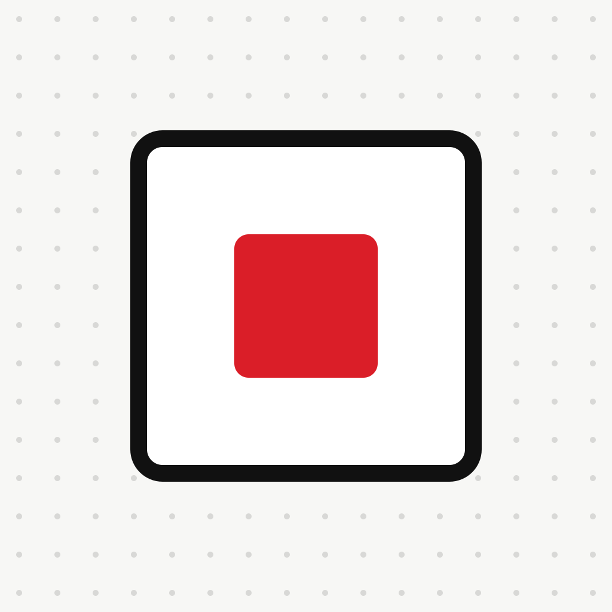
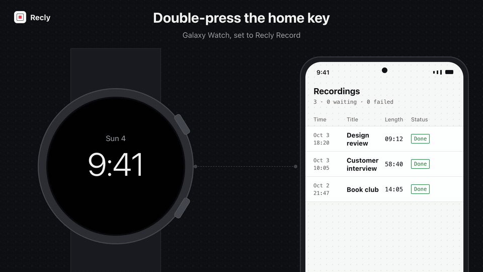
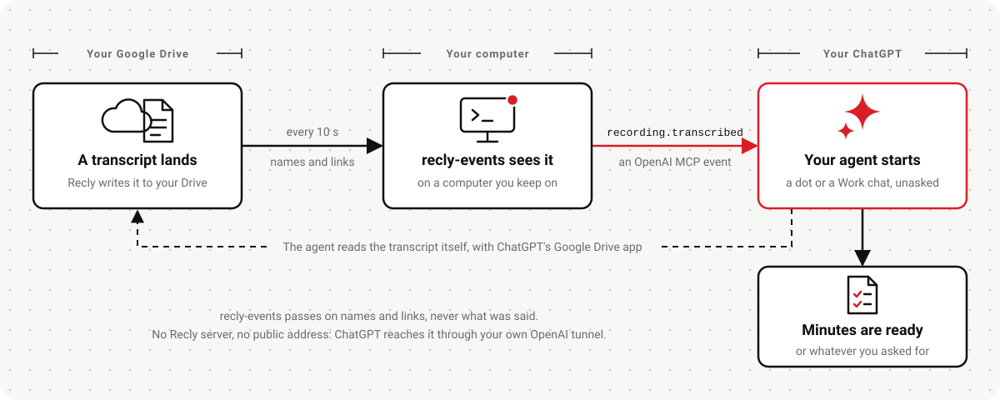
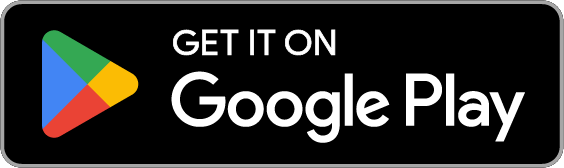
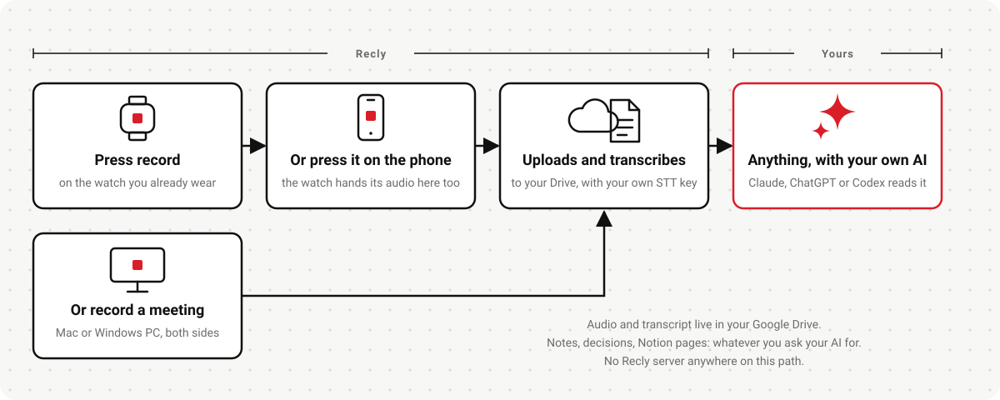
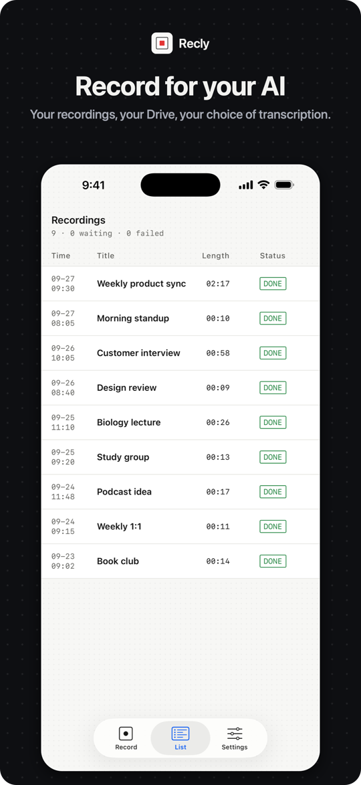
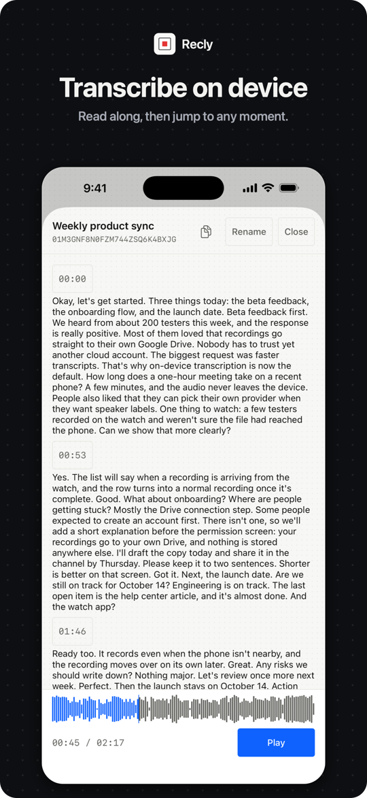
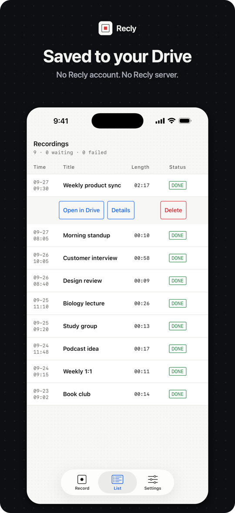
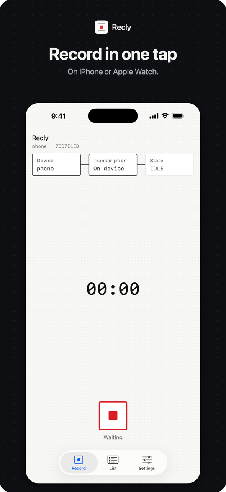
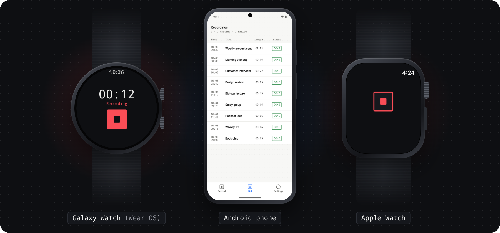

<div align="center">



# Recly

**Your AI recorder is already on your wrist.**

A Plaud-style AI notetaker, running on the watch and phone you already own.<br>Your Drive keeps the audio, your own key transcribes it, your own AI writes the notes.

[App Store](https://apps.apple.com/app/recly-record-for-your-ai/id6809930443) · [Google Play](https://play.google.com/store/apps/details?id=app.recly) · [Mac & Windows](#get-recly) · [Automatic minutes](#minutes-that-write-themselves) · [Install guide](docs/install.md) · [FAQ](docs/faq.md) · [Privacy](https://recly.dev/policy/privacy-policy) · [Issues](https://github.com/rokrokss/recly/issues) · [한국어](README.ko.md)

[](LICENSE)
[](https://github.com/rokrokss/recly/releases)
[](https://github.com/rokrokss/recly/releases)
[](https://github.com/rokrokss/recly/stargazers)

</div>

<p align="center"></p>

A Plaud or a NotePin sells you three things: a recorder, transcription, and AI notes. You already
wear the recorder, and you already pay for the AI. Recly supplies the one piece you are missing,
transcription on a supported device or with **your own** API key, and keeps the original audio in
**your** Google Drive, iCloud or a folder you pick. There is no Recly server, no bot joining your
call, and no monthly fee.

## Minutes that write themselves

Stop recording, and your ChatGPT agent writes the minutes by itself, usually within a minute. Every
new transcript becomes an [MCP event](https://developers.openai.com/plugins/build/mcp-events): recly-events, built into the Recly Mac and Windows
apps, sends `recording.transcribed` to your agent, a dot or a Work chat, and the agent reads the
transcript and does what you asked for every recording: minutes, decisions and action items, a
follow-up email to draft.

<p align="center"></p>

- **An event, not a prompt.** OpenAI's MCP Events let an app start your agent. `recording.transcribed`
  reaches ChatGPT signed, and every new transcript starts a run of your agent.
- **Through your own tunnel.** Your agent calls recly-events back through your own
  [OpenAI Secure MCP Tunnel](https://developers.openai.com/api/docs/guides/secure-mcp-tunnels). recly-events opens it from your side, so your computer needs
  no public address and opens no port, and there is still no Recly server.
- **Names and links, never what was said.** The event names the recording and links its files in
  your Google Drive. The agent reads the transcript itself, with ChatGPT's Google Drive app.
- **Nothing missed.** A computer that slept catches up when it wakes, and events your agent has not
  picked up wait in an inbox for 30 days.

**Turn it on** in the Mac or Windows app (0.2.0 and later), under Settings → Agent connection: the
[ChatGPT agent guide](docs/agent.md) has the steps. On a server, Linux or a computer without the
app, [run recly-events yourself](docs/recly-events.md). You need recordings stored in Google Drive;
a ChatGPT dot (at the time of writing, ChatGPT Business Premium, or ChatGPT Pro outside the EEA,
Switzerland and the UK) or a Work chat on ChatGPT web; ChatGPT's Google Drive app, connected to the
Google account Recly uploads to; an OpenAI Platform account for the tunnel and its key; and a
computer that stays on.

## Why Recly

- **The recorder you already wear.** A double press of the Galaxy Watch's home key starts
  recording; the watch hands the audio to your phone, and the phone does the rest. Phones, Macs and
  Windows PCs record too, and desktops capture your mic and the other side of a Zoom, Teams or Meet
  call as separate tracks.
- **Only your own storage.** Recordings go to a folder like `recly/memo/2026-10/` in your own Google
  Drive, through `drive.file`, the narrowest permission Google offers; or to your iCloud on iPhone
  and Mac; or to a local folder you pick, such as an Obsidian vault. The original is never deleted
  before the upload is confirmed, and Recly has no server that could see your files.
- **Files are the interface.** Transcripts are plain files next to the audio, in a
  [documented format](spec/) any agent, script or app can read. Transcribe on the device, with your
  own key (AssemblyAI, CLOVA, Deepgram, OpenAI, Azure and more, with speakers separated where the
  provider can), or not at all. Notes are your agent's job, not a paid tier.
- **Nothing covert.** Recording is always visible. Desktops detect a meeting, ask, and only then
  record. No analytics, no crash reporting, no update pings.

## What runs where

| Step | Where it happens | What leaves your device |
|---|---|---|
| Recording | Your watch, phone or desktop | Nothing. A watch hands the audio to your paired phone, and only there. |
| Storage | Your Google Drive (or your iCloud on iPhone and Mac, or a local folder you pick on iPhone, Mac, Windows and Android) | To Google Drive or iCloud: the audio parts and a small metadata file, to your own account. A local folder: nothing leaves the device. |
| Transcription | On device, or a provider you chose with your own key | On device: no audio goes to a speech service. External: the joined audio goes to the provider you selected. Results are written next to the recording. |
| Notes | Your own AI agent (Claude, ChatGPT, Codex, ...) | The agent reads the transcript from your storage and writes the notes wherever you keep them (Notion, in the example skills). If you turn on automatic minutes, recly-events tells your ChatGPT agent about each new transcript through OpenAI: the recording's name, title and Drive links, never the audio or what was said. |
| Processing settings and API keys | Your device | Nothing is synced. **Settings file** → **Export settings** moves configuration only; enter keys separately on each device. |

The full list of every network path, with nothing left out, is in the
[privacy policy](https://recly.dev/policy/privacy-policy).

## Get Recly

<a href="https://apps.apple.com/app/recly-record-for-your-ai/id6809930443"></a>
<a href="https://play.google.com/store/apps/details?id=app.recly"></a>

| Platform | Requires | On-device transcription | Get it |
|---|---|---|---|
| Android phone | Android 14+ | 64-bit, 6 GiB+ reported memory (an 8 GB device in practice), ~1 GB one-time download | [Google Play](https://play.google.com/store/apps/details?id=app.recly) |
| Galaxy Watch | Wear OS 5+ | — (the phone transcribes) | [Google Play](https://play.google.com/store/apps/details?id=app.recly), with the Android phone app |
| iPhone | iOS 17+ | iOS 26+ | [App Store](https://apps.apple.com/app/recly-record-for-your-ai/id6809930443) |
| Apple Watch | watchOS 10+ | — (the iPhone transcribes) | Comes with the iPhone app from the [App Store](https://apps.apple.com/app/recly-record-for-your-ai/id6809930443) |
| macOS | macOS 14.4+, Apple Silicon | macOS 26+ | Notarized DMG from [Releases](https://github.com/rokrokss/recly/releases/latest) |
| Windows | Windows 11, x64 | 64-bit, 6 GiB+ reported memory (an 8 GB device in practice), ~1 GB one-time download | MSI from [Releases](https://github.com/rokrokss/recly/releases/latest) (beta, unsigned: see the [guide](docs/install.md#windows)) |

Devices without on-device transcription
[use an external provider with your own key](docs/setup.md#3-choose-how-to-transcribe), or record
without transcription.

The [install guide](docs/install.md) has the steps for each platform, including sideloading the
phone and watch APKs that each release carries and getting past the Windows SmartScreen warning.
Building from source is in [docs/development.md](docs/development.md).

**Next:** [set it up](docs/setup.md) (storage and transcription), then, if you like,
[automatic minutes with a ChatGPT agent](docs/agent.md). Questions: [FAQ](docs/faq.md).

**Beta.** The Windows app is built and tested in CI but has not yet been checked on a real
Windows PC. Please report what you find in [Issues](https://github.com/rokrokss/recly/issues).

## How it works

<p align="center"></p>

1. **Record.** Tap Record on the watch (a Galaxy Watch can bind it to a double press of the home
   key), the menu-bar icon on a Mac, or the tray icon on Windows. Desktops notice when a meeting
   app opens your mic and ask whether to record.
2. **Upload.** When you stop, the recording goes to your storage as it is: Google Drive, or the
   iCloud or local folder you chose. Watches hand off to the phone first. If the network is down, it
   waits and retries. The original is never deleted before the upload is confirmed.
3. **Transcribe and finish.** After the original upload, the phone or desktop transcribes and
   uploads the result. Choose the transcription method and storage folder in Settings. Turning
   transcription off keeps the original upload.

New installs transcribe on the device where it can: with Apple's speech recognizer on iPhone and
Mac, and with the open-source Qwen3-ASR 0.6B model on Android and Windows, a one-time download of
about 1 GB that starts only when you ask. The requirements are in the [table above](#get-recly).
Elsewhere transcription starts off; choose an external provider with your own key. On-device
transcription does not separate speakers and never falls back to a cloud service.

The interface supports English, Korean, Japanese, Simplified and Traditional Chinese, Spanish,
French, German, Portuguese, Arabic, Hindi and Russian. Transcription offers 20 language choices,
filtered by the provider or the device's speech engine. Desktop recordings always use meeting mode
(microphone plus system audio), with automatic microphone selection.

Settings and transcript formats are documented in [`spec/`](spec/).

<p align="center">
  
  
  
  
</p>

## Notes: bring your own agent

Recly's pipeline ends at the transcript on purpose. Turning it into notes is something your
existing AI subscription already does well, so instead of a metered feature Recly hands the
transcript to your agent: on its own,
[the moment the transcript lands](#minutes-that-write-themselves), or whenever you ask.

For notes in another format, notes kept outside ChatGPT, or questions across past recordings, Recly
ships two **example skills** for any agent: Claude, ChatGPT, Codex and others. Use them as they are,
change them, or write your own for your format and notes app. The agent only reads the recordings;
in the examples, the notes live in your Notion.

| Example skill | What it does |
|---|---|
| [`recly-notes`](skills/recly-notes/SKILL.md) | Finds a recording (the latest, or the one you name), reads its transcript and writes minutes, a decision log, interview or lecture notes, or a memo |
| [`recly-notion`](skills/recly-notion/SKILL.md) | Keeps those notes in a "Recly Recordings" database in your Notion, one page per recording, and finds them again later |

```bash
npx skills add rokrokss/recly            # any agent that supports Agent Skills
# or, inside Claude Code:
/plugin marketplace add rokrokss/recly
/plugin install recly@recly
```

The plugin registers Notion's hosted MCP server; run `/mcp` once to sign in. In the Claude app,
upload `recly-notes.zip` and `recly-notion.zip` from the
[latest release](https://github.com/rokrokss/recly/releases/latest) as skills. In the ChatGPT app,
unzip them and upload the five files inside to a project. Setup for each is in
[skills/README.md](skills/README.md).

Then ask: *"Make minutes from the latest recording and put them in Notion"* or *"What did we
decide about pricing last week?"*. Want another format, or notes somewhere other than Notion?
Edit a skill, or copy one and [write your own](skills/README.md#write-your-own). That is the point.

## Clients

| Client | Built with | What it does |
|---|---|---|
| Galaxy Watch (Wear OS) | Kotlin · Wear Compose | Record, hand off to the Android phone |
| Android phone | Kotlin · Compose | Record, configure processing, Google sign-in |
| Apple Watch | SwiftUI | Record, hand off to the iPhone |
| iPhone | SwiftUI | Record, configure processing, Google sign-in |
| macOS | SwiftUI menu-bar app | Meeting capture (mic + system audio), process recordings |
| Windows | Compose Desktop + Rust capture helper | Meeting capture, process recordings |

All six share one Kotlin Multiplatform core: the fixed recording flow, resumable Drive uploads,
transcription adapters and the job queue.

<p align="center"></p>

## Privacy

Recly has no server. Data goes only to the storage you choose (your Google Drive, your iCloud on
iPhone and Mac, or a local folder that stays on your device), to the transcription provider you
chose with your own key, between your own paired watch and phone, and, if you turn on automatic
minutes, to your ChatGPT agent through OpenAI: the recording's name, title and Drive links, never
the audio or what was said. The [privacy policy](https://recly.dev/policy/privacy-policy) lists
every one of those paths, and
[docs/recly.md §15](docs/recly.md#15-privacy--data-flows-formerly-docs15) is the engineering contract
behind it: any change that adds a network call must update that section first.

## Contributing, security, license

- **Contributing**: bugs, questions and ideas all go to
  [Issues](https://github.com/rokrokss/recly/issues/new/choose). Conventions are in
  [CONTRIBUTING.md](CONTRIBUTING.md). There is no CLA.
- **Security**: report vulnerabilities privately via [SECURITY.md](SECURITY.md).
- **License**: [AGPL-3.0-or-later](LICENSE), with two additional permissions in
  [LICENSE-EXCEPTIONS.md](LICENSE-EXCEPTIONS.md) so the apps can be distributed through app stores.
  "Recly" and its icon are trademarks; see [TRADEMARK.md](TRADEMARK.md). Third-party components are
  listed in [THIRD-PARTY-NOTICES.md](THIRD-PARTY-NOTICES.md).

## For developers

```
core/        Kotlin Multiplatform shared core (:core)
android/     :app (phone), :wear (Galaxy Watch), :recording (shared recorder), :datalayer (phone↔watch contract)
apple/       Rec.xcworkspace — RecKit (Swift package) + RecPhone / RecWatch / RecMac
windows/     app/ (Compose Desktop) + capture-helper/ (Rust, WASAPI)
spec/        JSON Schema + examples — the contract every client honors
skills/      example agent skills (the `recly` plugin) — recly-notes (transcript → notes) · recly-notion (notes ↔ Notion)
events/      recly-events — optional program that tells a ChatGPT agent about new transcripts (MCP events)
scripts/     icon rendering
docs/        recly.md (the design source of truth) + user guides (install, setup, agent, recly-events, faq) + development.md + policy/
```

| Document | Contents |
|---|---|
| [docs/development.md](docs/development.md) | Build and test every client, values filled in locally (OAuth client IDs), cutting a release |
| [docs/recly.md](docs/recly.md) | **The design source of truth**. Architecture, the internal step model, recording and retention, processing settings and secrets, auth, transcription, per-platform notes, privacy, open decisions. Its section numbers are a contract: code comments cite them as `docs/NN "…"` |
| [docs/install.md](docs/install.md) · [setup.md](docs/setup.md) · [agent.md](docs/agent.md) · [recly-events.md](docs/recly-events.md) · [faq.md](docs/faq.md) | The user guides, also at [recly.dev](https://recly.dev) |
| [spec/](spec/) | Machine-readable contract: `recording-settings.schema.json`, `recording.meta.schema.json`, `transcript.schema.json`, `examples/` |
| [events/README.md](events/README.md) | The recly-events reference: commands, configuration, the event and its tools, building it |
| [skills/README.md](skills/README.md) | The `recly` plugin: what the two example skills do, how to set them up in Claude Code, the Claude app and ChatGPT, and how to write your own |
| [AGENTS.md](AGENTS.md) | Orientation for coding agents working in this repository |
