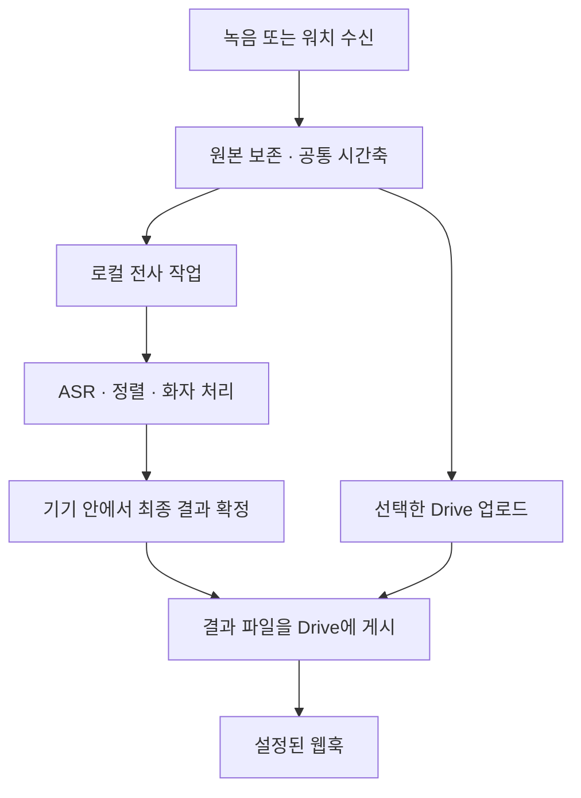

# Recly 로컬 자동 전사: 성능 우선 아키텍처 계획

기준일: **2026-09-23**. 상태: **설계 제안, 구현 전**.
**최신 제품 방향:** [고정 녹음 처리 흐름 계획](2026-09-24-fixed-recording-flow-plan.md).
사용자 대면 워크플로우를 제거하고, 설정에서 로컬/외부 API/전사 안 함을 선택하는 방향으로 대체했다.
**2026-09-24 갱신:** 실행 정책·선정 기준·검증/구현 순서는
[녹음 후 로컬 자동 전사 계획](2026-09-24-local-transcription-validation-plan.md)이 대체한다.
이전의 녹음 중 선행 처리, 데스크톱 Qwen 우선 선정, 워크플로우 밖의 앱 전체 자동 전사는 현재 계획이 아니다.
기존 외부 API 선택·설정과 단일 파일 제출은 최신 고정 흐름에서도 유지한다.
아래는 최초 계획 시점의 조사 기록이며, 이후 중단된 예비 시험의 범위도 새 계획에 정리했다.
이 문서는 [오픈소스 조사](2026-09-23-local-transcription.md)와
[공식 문서·논문·제품 사례 조사](2026-09-23-local-transcription-references.md)를 바탕으로,
통합 난이도를 선정 기준에서 제외하고 다시 설계한 계획이다. 제품 계약인 `docs/recly.md`를
아직 변경하지 않았다. 문헌 조사와 코드 확인을 했으며, 모델 추론·실기기 성능 측정은 하지 않았다.

## 1. 결정과 전제

**자동 전사는 기본 ON으로 한다. 로컬 전사를 녹음의 기본 처리 과정으로 만들고, 업로드와 독립시킨다.**
사용자는 모델을 골라야 녹음할 수 있는 것이 아니라, 녹음하면 이 기기에서 처리할 수 있는 가장 좋은
경로로 결과를 받는다. 녹음 중에도 안전하게 처리할 여유가 있으면 선행 처리하고, 종료 후 남은 부분을
완성한다. 워치는 녹음을 보존·전송하고 폰이 전사한다. Recly 서버는 만들지 않는다.

주요 대상은 한국어, 문장 안에서 영어 기술 용어가 섞이는 대화, 짧은 워치 메모, 30~120분 회의다.
여기서 성능은 **녹음 안정성 → 전사·화자 정확도 → 완료 지연 → 에너지·메모리** 순으로 판단한다.
폰에서 발열로 녹음이 끊기거나 OS가 프로세스를 종료시키는 구성은 정확도가 좋아도 탈락이다.
그 제약 안에서 정확도가 동등하면 더 빠르고 전력을 덜 쓰는 구성을 선택한다. 구현 비용은 비교하지 않는다.

지금 정할 구조와 실측 뒤 정할 값을 구분한다.

| 지금 결정 | 실측 뒤 확정 |
|---|---|
| 기본 ON, 로컬 우선, 업로드와 별도 실행 | 기기·언어별 기본 모델과 양자화 정밀도 |
| KMP는 작업·상태·결과, 네이티브는 오디오·추론·하드웨어 관리 | Core ML/Metal/NPU/GPU별 실제 실행 분할 |
| 구간 단위 저장·재개, 녹음 우선, 작업당 고정된 모델 조합 | 구간 길이, 겹침, batch·thread 수, 메모리 예산 |
| 화자·시간·겹친 발화를 포함한 결과, 원음에 근거한 수정 | 별도 화자 분리와 통합 모델 중 회의별 우수 경로 |
| 클라우드 전사는 사용자가 지정한 경우에만 실행 | 숫자로 약속할 전사 시간·배터리 사용량 |

앞선 추천 중 **Android의 Whisper small CPU 실행을 최종 목표로 삼는 부분은 철회**한다.
이는 호환성 비교 기준이다. **SpeechTranscriber도 Apple 전체의 영구 최종 엔진으로 고정하지 않는다.**
지원 기기에서 매우 유력한 효율 경로지만, 한국어·한영 혼용 회의의 최고 정확도까지 입증된 것은 아니다.

## 2. 2026년 9월 자료에서 실제로 확인한 것

### 같은 조건의 한국어 비교

[Whisper Notes의 2026-09-01 실험](https://whispernotes.app/blog/apple-speech-vs-whisper)은
M5 MacBook Air 32GB/macOS 27.0에서 같은 FLEURS 낭독 자료를 처리했다.
한국어 CER은 Qwen3-ASR 1.7B **3.54**, Whisper large-v3-turbo **4.25**,
SpeechTranscriber **4.31**, Whisper small **7.30**이었다. 낮을수록 좋다.
다만 약 150문장 규모이고, 작성자도 약 1%p 이내 차이는 우열을 단정하기 어렵다고 설명한다.
따라서 앞의 세 엔진을 유력 후보로 보되 Qwen의 회의 우승을 선언하지 않는다.
같은 글의 처리 배속은 여러 언어의 개별 샘플 중앙값이다. 한국어 1시간 회의 완료 시간이나
스마트폰 배터리 수치로 환산하지 않는다. Apple 시스템 서비스의 메모리도 앱 RSS만으로 비교할 수 없다.

### 비교 범위를 넓혀야 하는 모델

| 후보 | 확인된 능력과 설계상 역할 | 아직 입증되지 않은 것 |
|---|---|---|
| [Qwen3-ASR 1.7B / 0.6B](https://huggingface.co/Qwen/Qwen3-ASR-1.7B) | 한국어 포함 30개 언어와 22개 중국어 방언. 데스크톱 정확도 경로의 첫 후보는 1.7B, 폰 비교군은 0.6B와 1.7B. 별도 ForcedAligner 0.6B가 한국어를 지원 | Recly 회의 정확도, 폰의 지속 처리 전력, 모든 단어의 시간 정보가 ASR 비용만으로 나온다는 가정 |
| [Whisper large-v3-turbo](https://aihub.qualcomm.com/mobile/models/whisper_large_v3_turbo) | Apple·PC·Snapdragon의 가속 경로를 비교할 공통 모델. 원본 large-v3도 정확도 비교군에 포함 | NPU가 모든 기기·모든 연산을 가속한다는 보장, Turbo가 항상 large-v3보다 좋은 품질이라는 주장 |
| [Nemotron 3.5 ASR streaming 0.6B](https://huggingface.co/nvidia/nemotron-3.5-asr-streaming-0.6b) | 한국어 전사 지원, cache-aware 스트리밍. 겹친 입력을 계속 재인코딩하지 않는 모바일 선행 처리 후보 | H100 처리량을 폰 성능으로 해석할 수 없음. Android NPU 이식과 한영 혼용 품질은 별도 검증 |
| [Cohere Transcribe 03-2026](https://huggingface.co/CohereLabs/cohere-transcribe-03-2026) | 2B, 한국어 포함 14개 언어. 데스크톱 최종 전사 경쟁 후보 | 영어 순위가 한국어 순위라는 근거, 화자 분리까지 제공한다는 가정 |
| [MOSS-Transcribe-Diarize 0.9B](https://huggingface.co/OpenMOSS-Team/MOSS-Transcribe-Diarize) | 2026-07 공개. 전사·화자·시간을 함께 출력, 50개 이상 언어와 최대 90분 입력을 표방. 회의 경로의 필수 비교군 | 카드의 주 평가표는 한국어 회의 직접 비교가 아님. 90분 지원이 폰에서 작은 RAM·낮은 전력으로 실행된다는 뜻은 아님 |

모든 모델을 한 녹음에 실행하는 앙상블은 기본값으로 두지 않는다. 동일 자료에서 단일 엔진과
선택적 재처리의 오류·시간·전력 개선을 먼저 측정한다. 모델 이름에 작은 숫자가 붙었다는 사실만으로
빠르다고 판단하지 않는다. 인코더 구조, 생성 토큰 수, 캐시, 메모리 이동과 가속 가능 연산이 중요하다.

### 새 가속 경로와 자료의 한계

- [Qualcomm의 모델 카드](https://huggingface.co/qualcomm/Whisper-Large-V3-Turbo)는 Snapdragon용
  사전 변환 모델과 런타임 조합을 제공한다. 그러나 위 AI Hub 웹페이지에는 모바일 미지원 문구와
  Galaxy 지원 목록이 함께 있다. **가능성이 높은 가속 후보**이며, 특정 SDK·SoC·드라이버·모델 파일로
  실제 실행에 성공하기 전에는 출시 기본값으로 표시하지 않는다. 인코더 지연과 토큰당 디코더 지연은
  30초 오디오 전체 완료 시간이나 기기 전체 최대 RAM이 아니다.
- [NPUsper, 2026-07 arXiv 사전논문](https://arxiv.org/html/2607.01108v1)은 모바일 Whisper의 중복
  계산·패딩·디코더 실행을 줄이는 방향을 제시한다. Galaxy S25 실험이 있지만 주 평가는 Whisper base와
  영어 자료다. 최적화 아이디어를 활용하되 한국어 Turbo의 전력 절감률로 옮겨 쓰지 않는다.
- Apple의 Qwen 실행은 모두 새로 만드는 가정이 아니다.
  [mlx-audio-swift의 구현](https://github.com/Blaizzy/mlx-audio-swift/blob/main/Sources/MLXAudioSTT/Models/Qwen3ASR/README.md)이
  Qwen ASR와 aligner의 Swift·MLX 경로를 제공한다. 공개 구현의 존재와 iPhone 백그라운드 적합성은 구분한다.
- Windows는 [Windows ML의 공급자 선택](https://learn.microsoft.com/en-us/windows/ai/new-windows-ml/supported-execution-providers)을
  활용할 수 있다. NVIDIA, Intel, Qualcomm, AMD별 경로가 있으나 모델 그래프·드라이버·OS 제약이 각각 다르다.
  [DirectML은 유지보수 단계](https://learn.microsoft.com/en-us/windows/ai/directml/)이므로 새 설계의 유일한
  가속 기반으로 고정하지 않는다.

## 3. 플랫폼별 목표 구성

아래의 **첫 후보는 성능 검증을 시작할 구체적인 선택**이다. 검증하지 않은 경로를 이미 지원되는
제품 기능으로 보지 않는다. 기본값은 앱이 가진 검증된 기기 프로필로 정하고 사용자가 모델을 공부할
필요가 없게 한다. 모르는 기기에는 보수적인 로컬 경로를 쓰며 자동 전사 설정은 그대로 유지한다.

| 플랫폼 | 성능 우선 첫 후보 | 실행 경로와 승격 조건 |
|---|---|---|
| iPhone | 지원 기기의 SpeechTranscriber를 효율 기준으로 삼고, Whisper Turbo·Qwen 0.6B/1.7B를 정확도 후보로 경쟁 | 시스템 Speech와 Core ML/ANE·Metal·MLX를 실제 기기에서 비교. 최고 품질 모델이 시간·메모리·열 예산을 통과하면 기본값으로 승격. ASR 한 번으로 충분한 메모에는 추가 전체 전사 없음 |
| Apple Silicon Mac | **Qwen3-ASR 1.7B + 필요한 정렬·화자 처리**로 시작 | MLX/Metal 우선 비교, WhisperKit/Core ML Turbo 및 원본 large-v3, Cohere, MOSS와 한국어 회의 평가. SpeechTranscriber는 저전력·빠른 초안 경로. MLX가 ANE를 사용한다고 가정하지 않음 |
| Android / 검증된 Snapdragon | **Whisper large-v3-turbo의 QNN/QAIRT NPU 경로**를 고성능 배치 후보로 먼저 검증 | Qwen 0.6B/1.7B와 Nemotron 0.6B도 같은 열·전력 예산에서 비교. NPU 변환 품질·실제 가속 비율·긴 파일 완료가 통과해야 프로필에 등록 |
| Android / Exynos·MediaTek·기타 | **Qwen3-ASR 0.6B INT8와 Whisper 계열**의 가속 가능한 구성을 경쟁 | 벤더 NPU·GPU를 각각 검증. Qualcomm 경로를 재사용할 수 있다고 가정하지 않음. GPU보다 CPU가 빠른 작은 구간은 CPU, 작은 모델만 가능한 기기는 그중 최고 품질 선택 |
| Windows / NVIDIA GPU | **Qwen3-ASR 1.7B + 화자 분리**로 시작 | 네이티브 CUDA·TensorRT 계열 실행, Cohere/MOSS/Whisper large-v3와 경쟁. 서버용 Python/vLLM 처리량을 Windows 배포 성능으로 간주하지 않음 |
| Windows / Intel·AMD·Snapdragon | 위 후보 중 **해당 하드웨어에서 실제로 가속되는 모델** | Windows ML/ORT + OpenVINO·VitisAI/MIGraphX·QNN 등을 모델별 검증. 변환·연산 지원이 부족하면 Whisper Turbo의 네이티브 GPU 경로와 비교 |
| Intel Mac·CPU 위주 PC·낮은 메모리 기기 | Qwen 0.6B INT8 / Whisper small·Turbo 중 실측 우수 구성 | 네이티브 CPU/OpenVINO 등. 느린 기기는 예약·재개로 완료하며 고급 기기의 처리 시간을 약속하지 않음 |
| Apple Watch·Galaxy Watch | **녹음 → 폰 전달 → 폰 자동 전사** | 워치 자체의 큰 ASR 모델 실행을 기본으로 넣지 않음. 수신한 파트의 무결성 확인 후 선행 처리, 전체 메타가 완성돼야 최종 확정 |

[ORT QNN](https://onnxruntime.ai/docs/execution-providers/QNN-ExecutionProvider.html)은 Android와
Windows Snapdragon 실행을 지원한다. [whisper.cpp](https://github.com/ggml-org/whisper.cpp)는
Apple·Android·Windows 및 여러 CPU/GPU 가속 경로의 비교 기준으로 둔다. **런타임이 하드웨어를
지원한다는 사실과 특정 ASR 모델 전체가 효율적으로 실행된다는 사실은 다르다.** 프로파일에서
CPU fallback, CPU↔가속기 복사, 모델 준비 시간까지 확인한다.

Android ML Kit와 Windows 시스템 Speech도 비교 대상에서 배제하지 않는다. 다만 현재 확인한
ML Kit 파일 입력은 실시간 공급 제한과 기기 범위가 있고, Windows Speech는 한국어·SDK·패키징을
더 확인해야 한다. 따라서 이들을 모든 Android/Windows의 파일 전사 경로로 확정하지 않는다.
근거는 [공식 API 조사](2026-09-23-local-transcription-references.md)의 플랫폼 절에 있다.

## 4. 전체 처리 구조



Drive 미연결·오프라인·업로드 실패 상태에서도 F까지 완료한다. G/H는 사용자 워크플로우가
요청한 경우에만 생성한다. 저장 버튼을 누른 직후 결과를 읽기 위해 네트워크를 기다릴 이유가 없다.
Drive 작업이 오래 걸려도 계산이 밀리지 않도록, 기존 직렬 실행기 밖에 **계산과 전송의 별도 실행 슬롯**을 둔다.
DB 상태 전이는 짧은 트랜잭션으로 직렬화하고 추론·전송 중 DB mutex를 잡지 않는다.

### 작업 정책

녹음마다 전사 정책을 고정한다. 우선순위는 **녹음별 지정 → 명시적 워크플로우 전사 설정 → 기기 기본값**이다.
새 설치의 기기 기본값은 `local / automatic / on`이다. 워크플로우에 클라우드 제공자를 명시한 기존
사용자는 그 선택을 유지한다. 자동 로컬 작업과 명시적 전사가 같은 결과 파일을 두 번 덮어쓰지 않는다.
전사 OFF는 새 자동 작업을 만들지 않는 명시적 정책으로 취급한다.

- 기존 녹음 전체, Drive에서 조회·입양한 녹음을 업데이트 직후 일괄 전사하지 않는다.
- 기존 사용자의 설정을 덮어쓰지 않고, 새 녹음부터 적용되는 자동 전사 상태를 화면에 명확히 표시한다.
- 워치 재전송·앱 재실행·반복 callback은 `recordingId + audioRevision + policyRevision`으로 중복 제거한다.
- 워크플로우의 업로드용 `minDurationSec`가 짧은 음성 메모의 로컬 전사를 막지 않게 분리한다.
  무음 판정은 별도이며, 짧다는 이유만으로 유효한 발화를 버리지 않는다.
- 전사가 실패해도 녹음은 저장한다. 원인을 표시하고 재시도한다. 사용자가 지정하지 않은 클라우드로
  원음을 보내는 fallback은 없다.

### 두 단계 결과는 두 번의 전체 ASR를 뜻하지 않는다

`draft`는 아직 경계·화자가 바뀔 수 있는 결과, `final`은 해당 버전의 처리가 끝난 결과다.
같은 ASR 실행의 결과를 누적한 뒤 경계·화자·시간을 확정하는 것이 기본이다.

짧은 메모는 선정한 엔진 한 번으로 끝낸다. 회의에서는 먼저 끝난 문장을 보여주고, 낮은 신뢰도,
문장 잘림, 반복, 음성이 있는데 빈 결과, 언어 전환, 겹친 발화 등의 구간만 원음으로 재평가한다.
다른 엔진의 confidence 숫자를 같은 척도로 비교하지 않고 오류 검출기를 검증 자료에서 보정한다.
오류 검출기가 놓치는 자신만만한 오인식도 있기 때문에 데스크톱의 전체 2차 전사와 비교해
선택적 재처리의 품질 손실을 측정한다. 전체 재전사가 실질적으로 이기는 회의 프로필에만 적용한다.

초안 엔진과 최종 엔진을 항상 둘 다 돌리는 구성, 모든 녹음을 여러 모델로 투표하는 구성,
텍스트 LLM이 문맥으로 원문을 다시 쓰는 구성은 채택 근거가 없다. 전문 용어 사전·사용자 힌트는
ASR가 실제 오디오를 해석할 때 활용하고, 요약·회의록 작성은 기존 agent workflow에 남긴다.

## 5. 정확도와 지속 성능을 만드는 오디오 경로

### 원본과 시간축

1. 캡처 callback은 원본 저장을 최우선으로 한다. 추론·모델 로드·DB 작업을 그 안에서 실행하지 않는다.
2. 기기 입력을 받아 모델의 요구 sample rate로 한 번 변환한다. 가능하면 AAC로 압축하기 전 PCM을
   전사에 공급한다. 성능 프로필에서 이득이 확인되면 최종 전사까지 로컬 무손실 sidecar도 유지한다.
   현재 16kHz mono/32kbps AAC 업로드 계약과 별개인 임시 자산이며, 저장 공간·쓰기 전력까지 비교한다.
   워치 전송 원본은 현재 AAC를 입력으로 처리한다. 비트레이트 변경은 품질 이득을 측정한 후 별도 계약 변경으로 판단한다.
3. 닫힌 파트를 순차 디코딩하는 bounded PCM 버퍼를 둔다. 전체 2시간 녹음을 한 WAV로 합쳐 메모리에
   올리지 않는다. 모델별 feature는 필요한 경우만 계산·캐시하고 서로 다른 모델의 mel을 무조건 공유하지 않는다.
4. 원본의 sample offset, 파트 offset, 실제 duration, gap을 보존한다. VAD로 무음을 건너뛰어도
   원본 시간축을 압축하지 않는다. AAC encoder delay·padding 및 mic/system drift도 정렬 시험에 포함한다.
5. 엔진이 제공하는 장문 파일 처리와 내부 문맥 연결을 우선 사용한다. 모든 엔진의 입력을 앱에서
   일률적으로 10~30초짜리 독립 전사 요청으로 나누지 않는다. 모델 내부의 입력 창, 오디오를 읽는
   버퍼, 중단·재개를 위한 작업 구간은 서로 다른 단위다. 직접 분할은 엔진 입력 한도나 재개 기능이
   요구하는 경우에만 적용하고 발화 경계·모델 문맥 길이에 맞춘다. 필요한 문맥 겹침과 결과 병합은
   경계의 누락·중복·용어 일관성을 검증한 뒤 정한다. 짧은 메모에는 추가 분할을 강제하지 않는다.
   고정 시간마다 단어를 잘라내거나, 매초 지난 수십 초 전체를 다시 인코딩하지 않는다.

구간 처리는 메모리 상한과 중단·재개에 유용하지만 그 자체가 발열 제한은 아니다. 구간을 쉬지 않고
처리하면 높은 부하가 이어진다. 실행 간격·동시 실행 수·가속기 선택은 별도로 제어한다. 확정 결과를
저장해도 엔진의 내부 상태까지 복원할 수 있다는 뜻은 아니므로, 지원하지 않는 엔진은 안전한 경계부터
제한된 범위를 재처리한다.

근거: [Whisper의 내부 30초 창 처리](https://github.com/openai/whisper#python-usage),
[WhisperKit의 파일 점진 로딩과 전사 API](https://github.com/argmaxinc/argmax-oss-swift/blob/main/Sources/WhisperKit/Core/WhisperKit.swift).

VAD는 보수적으로 사용한다. 작은 목소리·문장 첫 자음·먼 화자를 삭제하는 비용이 무음 계산 절약보다
클 수 있다. 발화 전후 여유 구간을 남기고 원본으로 재검증한다. 강한 잡음 제거는 음성을 바꿀 수 있어
기본 강제 적용하지 않는다. 처리한 오디오를 쓸 때에도 원본으로 돌아갈 수 있게 한다.

### 데스크톱 채널과 화자

현재의 `mic`, `sys`, `mix`를 살린다. 화상회의라면 mic/sys를 각각 처리하는 경로와 mix 하나를 처리하는
경로를 비교한다. 별도 채널이 이미 분리해 준 음성을 섞어서 다시 화자 분리할 이유는 없다.
다만 sys에는 여러 원격 화자가, mic에는 방 안의 여러 사람과 스피커 누출음이 있을 수 있다.
채널 이름을 사람 이름으로 단정하지 않고, 시간·음향 상관관계로 중복 음성을 판별한다.
mix 전사에서 mic 텍스트를 문자열로 빼는 방식은 쓰지 않는다.

기본 회의 후보는 ASR와 독립적인 **speech segmentation → speaker embedding → 회의 전체 clustering → 단어 귀속**이다.
[pyannote community-1](https://huggingface.co/pyannote/speaker-diarization-community-1)을 정확도 기준으로
사용하고, 플랫폼 가속 이식본은 원본과 비교한다. 이 모델은 로컬 실행과 transcript 결합을 위한
exclusive diarization을 제공하지만, 겹친 발화의 원래 라벨도 함께 보존해야 한다.
MOSS 통합 경로와 화자별 문자 오류율로 경쟁시킨다. 빠른 스트리밍 화자 라벨은 임시이며 종료 후
전체 회의에서 번호를 정리한다. 청크마다 화자 1부터 새로 붙이지 않는다.

겹친 발화가 중요한 구간에는 음원 분리와 재인식을 실험한다. 분리 모델이 만든 왜곡도 측정하고,
전체 녹음에 무조건 실행하지 않는다. 인원 수 힌트가 없다고 화자를 네 명 이하로 고정하지 않는다.
발화가 겹치면 겹친 구간으로 표현하고, 사람을 확정할 수 없는 경우 `unknown` 상태를 허용한다.

Qwen처럼 별도 alignment가 필요한 경로에는 그 처리 비용도 포함한다. 정렬기는 잘못 인식한 단어를
정답으로 바꾸지 않는다. 한국어 단어 분할 방식과 영문 용어를 유지하며 단어/구절 단위 시간을 검증한다.
최종 결과에는 적어도 재생 가능한 구절 시간과 화자 정보의 확정 여부가 있어야 한다.

## 6. 기기 자원과 백그라운드 실행

스케줄러는 기기·OS·가속기·RAM·언어·녹음 종류에 맞는 **검증된 모델 프로필**을 선택한다.
첫 실행 때 큰 벤치마크를 돌려 사용자의 배터리를 쓰지 않는다. 출시 전 프로필과 짧은 로컬 capability
probe를 이용하고, 정상 처리에서 얻은 지연·메모리 정보로 thread/batch/동시성을 조절한다. 수집값은 기기에만 둔다.

폰은 무거운 추론을 한 번에 하나만 실행하는 것으로 시작한다. ASR·화자 분리의 모델 상주를 조절하고,
batch와 캐시를 먼저 줄인 뒤 pause한다. 단순히 NPU가 있다는 이유로 큰 모델을 상주시켜 두지 않는다.
데스크톱은 오디오 디코드·가속기 실행·업로드를 겹치되 큰 모델 두 개를 경쟁시키는 것이 실제로 빠른지 측정한다.
작업 중 모델을 바꿔야 하면 구간 경계에서 기록하고 해당 구간을 재검증한다. 기존 결과의 출처를 숨기지 않는다.

| 상황 | 동작 |
|---|---|
| 녹음 중, 성능 여유 확인 | 낮은 우선순위로 선행 처리. 캡처 queue가 밀리면 즉시 양보 |
| 녹음 종료 또는 워치 파일 수신 | 모델 준비·OS 실행 기회가 있으면 자동 시작 |
| 발열·저전력 모드·메모리 압박 | thread/batch 축소 또는 checkpoint 후 대기. 자동 전사 설정은 ON 유지 |
| 앱/OS가 작업 종료 | 완료된 구간 보존, 다음 실행 기회에 재개 |
| 모델 미설치·공간 부족 | 녹음 보존, 준비 상태 표시, 다운로드/공간 문제 해소 후 재개 |
| Drive 오프라인·로그아웃 | 로컬 계산 계속. 게시 작업만 대기 |
| 사용자가 취소·삭제 | 계산 중지, lease 해제, 이후 자동 부활하지 않도록 상태 저장 |

충전 중일 때만 전사하는 것을 일률적인 기본값으로 만들지 않는다. 열 상태가 회복되거나 적절한
실행 기회가 생기면 계속한다. 동시에 **자동 ON은 모든 OS 상태에서 즉시 완료를 보장한다는 뜻이 아니다.**

- **iOS:** 자동 대기는 네트워크 요구 없는 `BGProcessingTask`로 예약한다. 이 기회의 시각은 OS가 정한다.
  `BGContinuedProcessingTask`는 [Apple이 설명한 명시적 사용자 동작](https://developer.apple.com/videos/play/wwdc2025/227/)
  에 연결한다. 명확한 “저장하고 전사”/“지금 전사” 동작과 진행 UI에서만 사용하고, 설정이 ON이라는
  이유로 워치의 자동 수신에 적용하지 않는다. GPU는 entitlement와 runtime resource 지원을 확인한다.
  background에서 GPU 실행이 가능한 것으로 추정하지 않는다. 지원하지 않는 경우 checkpoint 후 기다린다.
- **Android:** 자동 대기는 별도의 네트워크 불필요 작업으로 예약한다. 즉시 장시간 처리에는 앱 상태와
  [해당 foreground service 유형](https://developer.android.com/develop/background-work/services/fgs/service-types)을
  확인한다. 녹음이 끝났는데 마이크 서비스를 유지해 계산 시간을 확보하지 않는다.
  [Android 16 WorkManager 장시간 작업의 quota](https://developer.android.com/develop/background-work/background-tasks/persistent/how-to/long-running)를
  반영하고 중지·재개를 구현한다. API 34와 이후 버전의 서비스 조건을 구분한다.
- **macOS/Windows:** 캡처와 분리된 작업 executor를 사용한다. Windows는 네이티브 추론 helper를 별도
  프로세스로 두어 드라이버/추론 실패가 녹음 프로세스를 종료시키지 않게 한다. 사용자에게 Python 서버
  설치를 요구하지 않는다. 필요한 런타임을 앱이 관리하며 로컬 IPC로 연결한다.

## 7. 코어 경계·저장·계약 변경

### 추론 인터페이스

공통 코어에 가짜 API 키를 넣어 로컬 모델을 HTTP provider처럼 다루지 않는다.
기존 cloud provider의 submit/poll은 유지하고 다음 **로컬 계산 포트**를 따로 추가한다.
이름은 구현 시 조정할 수 있으며 아직 실제 API가 아니다.

| 포트 | 책임 |
|---|---|
| `LocalTranscriptionEngine` | capabilities, 모델 준비, 오디오 입력, partial/final 구간 event, 취소·재개 |
| `AudioSource` | PCM 범위 읽기, track/part/sample time 매핑, source revision |
| `DiarizationEngine` / `AlignmentEngine` | 해당 기능이 ASR에 없을 때 실행, 원본 시간축으로 출력 |
| `ComputeScheduler` | 자원 예산, 가속기 슬롯, OS 실행 기회, 대기 이유 |
| `ModelStore` | 설치·검증·버전·용량·원자적 교체. Apple 시스템 모델은 AssetInventory adapter |
| `TranscriptRepository` | 임시/최종 revision, 사용자 편집, 출처, 게시할 artifact |

KMP 경계를 통해 매 프레임 PCM과 토큰을 무수히 복사하지 않는다. 오디오 파이프와 추론은 native 쪽에
두고 코어에는 구간 결과와 checkpoint를 전달한다. 모델별 sample rate, batch/streaming 여부,
한국어/혼용 지원, 최대 문맥, timestamps, diarization, 필요한 가속기를 명시적으로 선언한다.

### 내구성과 게시

로컬 DB에 `transcription_request`, `transcription_chunk`, `transcript_revision`,
`artifact_publication`에 해당하는 상태를 저장한다. 큰 PCM·feature·embedding은 관리되는 로컬 파일에
두고 DB에는 위치·hash·범위를 둔다. 큰 텐서를 `step_run.state_json`에 직렬화하지 않는다.

- 요청: source manifest hash, policy snapshot, engine/model revision, quantization, OS/build,
  진행률, 대기 이유, 취소 여부, 실행 lease. Apple 시스템 모델 버전이 노출되지 않으면 그 사실도 기록한다.
- 청크: 원본 sample 범위, 입력 hash, 결과 revision, 완료 여부, 재처리 이유. 모델/런타임과 맞지 않는
  캐시를 재사용하지 않는다. opaque KV cache가 재개 불가능하면 마지막 확정 경계부터 제한된 문맥만 재실행한다.
- 최종 결과: 원자적 파일 교체 + DB commit, revision별 provenance. 이후 사용자 편집을 자동 전사가 덮지 않는다.
- 게시: `recordingId + transcriptRevision + destination`별 outbox. Drive 업로드 재시도는 전사를 다시 실행하지 않는다.
  웹훅은 확정 revision과 요구된 게시가 완료된 뒤 보내며 idempotency key를 사용한다. 네트워크에서
  정확히 한 번 전달을 보장한다고 주장하지 않고, 수신 측이 중복을 제거할 수 있게 한다.
- 보관: 계산이 읽는 원본에는 lease를 둔다. 업로드가 끝났다고 미완료 전사의 원본을 7일 뒤 지우지 않는다.
  사용자가 녹음을 삭제하면 로컬 전사/embedding/cache도 함께 지운다. Drive 연결 해제는 로컬 계산을 막지 않는다.

### 기존 코드에서 바뀌어야 하는 지점

| 현재 근거 | 구현 시 변경 |
|---|---|
| `core/src/commonMain/kotlin/recly/core/transcribe/SttProvider.kt:31`, `:80` — 파일 제출/폴링과 API 키 context | cloud와 local 실행 계약 분리 |
| `core/src/commonMain/kotlin/recly/core/transcribe/TranscribeRunner.kt:61`, `:83`, `:183` — 제공자/키, 전체 파트 합치기, Drive 폴더 의존 | 로컬 청크 입력과 로컬 최종 확정 경로 추가 |
| `core/src/commonMain/kotlin/recly/core/transcribe/TranscribeRunner.kt:236` — mono, 없으면 mix 선택 | 채널별 시간축·품질에 따른 입력 계획 추가 |
| `core/src/commonMain/kotlin/recly/core/transcribe/ResultFiles.kt:27`, `:40` — 로컬 파일 쓰기와 Drive 게시 결합 | 로컬 artifact commit과 원격 outbox 분리 |
| `core/src/commonMain/kotlin/recly/core/job/Executor.kt:72` — 잡 하나씩 직렬 실행 | 별도 계산 executor와 전송 executor, DB claim/삭제 규칙 공유 |
| `core/src/commonMain/kotlin/recly/core/ReclyCore.kt:112` — 큐가 Drive 접근 준비에 연결 | 로컬 요청이 Google 인증·연결 해제 상태와 독립 실행 |
| `core/src/commonMain/kotlin/recly/core/job/JobService.kt:66` — workflow minDurationSec로 skip | 로컬 자동 전사 생성과 업로드 workflow 선택 분리 |
| `core/src/commonMain/kotlin/recly/core/job/JobStore.kt:211`, `:276` — purge가 기존 job 완료 여부에 의존 | 로컬 작업/lease/sidecar까지 retention 판단에 포함 |
| `core/src/commonMain/kotlin/recly/core/platform/CoreDeps.kt:10` | native local engine와 scheduler 주입 경계 추가 |
| `android/app/src/main/kotlin/app/recly/android/work/WorkScheduler.kt:64` — 모든 작업에 네트워크 조건 | 전송과 계산 예약 분리 |
| `apple/RecKit/Sources/RecKit/Jobs/BackgroundJobs.swift:67` — network-required 예약, `:87` — 업로드 전용 continued task | 계산 예약·사용자 시작 전사·청크 진행률·expiration 처리 추가 |
| `core/src/commonMain/kotlin/recly/core/workflow/WorkflowParser.kt:316`, `spec/workflow.schema.json:106` — upload 선행, secretRef 필수 | local 전사와 게시를 표현하는 다음 workflow schema 정의 |
| `spec/transcript.schema.json:10`, `:12`, `:48` — schema 1, mono/mix, 화자 필수 | 다음 transcript schema에서 revision·출처·채널·unknown/overlap 표현 |

현재 workflow schema는 **3**이다. 구현에서는 다음 버전의 계약을 정의하고 기존 1~3 문서의 의미를
보존한다. 기존 순차 cloud workflow의 순서를 임의로 바꾸지 않는다. 새 로컬 경로는 계산·업로드·게시의
의존성을 가진 실행 계획으로 컴파일한다. 계산 결과를 기다리는 workflow 단계는 이미 생성된 동일 요청을
참조하므로 다시 전사하지 않는다. 일반 사용자는 내부 작업 그래프를 편집하지 않는다.

transcript는 기존 v1 reader의 수용 범위를 확인하면서 다음 버전 reader를 먼저 배포한다.
새 파일을 조용히 v1이라고 표시하지 않는다. 필요하면 v1 호환 export를 함께 제공하고, 그 과정에서
unknown/채널/겹침 정보를 어떻게 축약했는지 명시한다. 워치·폰·데스크톱·webhook·agent skill의 소비자까지
변경 범위를 확인한다. `docs/recly.md`의 관련 ADR과 §3·§5~§8·§10~§15를 같은 구현 단계에서 갱신하되,
기존 절 번호와 인용되는 소제목은 유지한다.

## 8. 모델 관리와 로컬이라는 계약

모델은 앱이 검증한 manifest의 revision·hash·runtime/SoC 조건으로 설치한다. 다운로드·압축 해제·컴파일
여유 공간을 각각 계산하고, 취소·부분 다운로드 재개·해시 검증·원자적 교체·이전 버전 복귀를 제공한다.
진행 중인 작업의 모델을 정리하지 않는다. 한 앱 업데이트 때문에 모든 기기의 모델을 동시에 바꾸지 않는다.
OS 관리 Speech 모델은 앱이 동일하게 고정할 수 없으므로 OS 업데이트 후 회귀 평가를 따로 한다.

초기 모델 준비는 자동 전사 설정과 함께 용량·다운로드 상태를 보여준다. 준비되지 않았더라도 녹음은
가능하고 작업은 기다린다. 모델 파일 다운로드와 음성 업로드는 서로 다른 동작이다. 모델 다운로드,
Apple 자산, Windows 실행 공급자 설치 등 실제 필요한 모든 외부 경로를 구현 시 `docs/recly.md` §15에 추가한다.
음성·전사·성능 로그를 모델 제공자에게 보내지 않는다. 제3자 런타임의 telemetry와 자동 원격 fallback도 검사한다.

코드·모델 가중치·변환본·벤더 런타임의 라이선스를 각각 확인한다. gated 모델의 사용자 동의가 필요한
다운로드를 자동 우회하지 않는다. 앱 배포물에 포함할 수 있는 경로를 확정하거나, 조건이 허용되는
대체 모델을 사용한다. 이번 조사에서 gated 모델에 동의하거나 가중치를 내려받지는 않았다.

## 9. 성능 평가와 출시 판정

모델 선택보다 먼저 재현 가능한 평가 harness를 만든다. 각 실행은 데이터 revision, 정답 전사,
normalizer, 모델 hash, 정밀도, runtime commit, OS/driver, 디코딩 설정, 시작 온도와 전원 상태를 기록한다.
측정은 동일 기기·동일 입력·동일 scorer로 수행한다. 공개 자료의 서로 다른 CER/WER를 한 순위표로 섞지 않는다.

### 평가 자료

- 한국어 FLEURS는 재현성 확인에 사용한다. 최종 선택에는 실제 메모·회의·원거리·소음 음성이 필요하다.
- 동의와 사용권이 확보된 한국어/한영 혼용 회의를 2·4·6명 이상, 겹친 발화, 숫자·사람 이름·제품명·개발 용어로 구분한다.
  같은 발화자의 자료가 튜닝과 최종 평가 양쪽에 섞이지 않게 분리한다.
- [HiKE의 한영 혼용 평가](https://aclanthology.org/2026.findings-eacl.33/)를 참고해 영어 단어·구·문장 전환을 구분한다.
  영어를 전부 한글로 음차한 결과가 유리해지도록 정규화하지 않는다.
- 실제 phone/watch AAC, desktop mic/sys/mix, 긴 무음, 블루투스 입력, 중단·재개와 실제 gap을 포함한다.
  길이는 짧은 메모와 30·60·120분으로 나눈다. MOSS의 단일 입력 한도 밖은 분할·화자 연결까지 평가한다.

### 지표와 판정

| 영역 | 측정 | 선택 기준 |
|---|---|---|
| 녹음 | 누락 샘플·dropout·timestamp drift, STT 없는 기준과 비교 | 전사 때문에 새로 발생한 캡처 손실이 없어야 함 |
| 글자·내용 | 한국어 CER와 WER를 각각, 영어 WER, 고유명사/숫자 오류, 누락·무음 환각 | 회의 유형별 결과와 신뢰구간 확인. 평균 개선이 특정 유형의 큰 회귀를 가리지 못하게 함 |
| 화자 | DER, cpCER/cpWER, 인원 수 오류, 긴 회의의 speaker ID 변경 | 겹침 포함 점수와 제외 점수 구분. 사용자가 틀린 사람의 말로 읽게 되는 오류를 직접 측정 |
| 시간 | 구절/단어 경계 오차, 음성 클릭 시 재생 위치 | 원본 시간축으로 비교. 무음 삭제로 앞당겨지는 오류는 계약 실패 |
| 반응 | cold/warm 첫 결과, 녹음 종료 후 첫 결과·최종 완료, p50/p95, RTF | 모델 로드·정렬·화자 분리·파일 저장까지 포함. RTF는 총 처리 시간/오디오 길이 |
| 자원 | 기기 전체/관련 프로세스 메모리, 가속기 사용, 전력·Wh/오디오 시간, 온도, 속도 저하 | 60~120분 지속 처리와 녹음 동시 실행으로 판단. 앱 RSS 또는 첫 30초만으로 통과시키지 않음 |
| 재개 | 화면 잠금·OS 중지·프로세스 kill·재부팅·저장 공간 부족 | 확정 청크 재처리 없음, 중복 결과/게시 없음, 미완료 원본 보존 |

**초기 엔지니어링 목표이며 측정된 수치가 아닌 것:** 고성능 폰의 파일 전사 RTF ≤ 0.5,
가속 데스크톱 RTF ≤ 0.2를 기본 프로필의 탐색 목표로 둔다. 이는 60분 오디오에 각각 30분/12분까지
허용하는 상한 목표이며, 짧은 메모의 첫 결과와 녹음 중 선행 처리 후 완료 지연은 별도 지표다.
이 목표를 맞추려고 CER을 크게 악화시키지 않는다. 더 빠른 결과가 가능한 기기는 그 성능을 사용한다.
정확도·배터리의 절대 출시 수치는 기준 자료와 실기기 측정 없이 만들지 않는다.

기기군마다 품질과 시간·에너지의 Pareto 후보를 좁힌다. 품질이 통계적으로 동등하면 낮은 지연/에너지
경로를 택하고, 차이가 유의하면 최종 전사의 정확도를 우선한다. 4bit/INT8/FP16/BF16의 품질을 각각
측정한다. 큰 모델 4bit가 작은 모델 INT8보다 항상 낫다는 가정도 하지 않는다.

오프라인 시험은 모델 준비 후 네트워크를 끄고 수행한다. HTTP transport를 실패시키는 단위 시험과
실기기 네트워크 관찰을 함께 사용한다. CI는 작은 fixture의 계약·복구·정렬을 검증하고,
긴 음성·실기기 열 시험은 별도 벤치마크 작업으로 수행한다. 사용자의 녹음을 CI에 넣지 않는다.

## 10. 실행 단계와 완료 조건

| 단계 | 산출물 | 다음 단계로 넘어가는 조건 |
|---|---|---|
| 1. 비교 기준 | 오디오/정답 corpus, 동일 scorer, 모델·엔진 reference harness, 실기기 목록 | 한국어·혼용·화자·지속 처리 결과를 재현 가능. 각 플랫폼 첫 기본 프로필 결정 |
| 2. 로컬 처리 기반 | 별도 계산 요청/queue, chunk checkpoint, local artifact, source lease, versioned 계약 | Drive 없이 녹음→최종 결과. kill/restart·삭제·retention 경쟁 통과 |
| 3. 플랫폼 추론 | Apple Speech/Core ML/MLX, Android 가속, Windows native helper와 검증 프로필 | source 모델 대비 변환 품질·지속 전력·취소·OS 실행 조건 통과. 미지원 장치는 검증된 fallback |
| 4. 회의 품질 | 채널별 입력, 화자 정리, alignment, 선택적 재처리 또는 통합 모델 | 동일 회의에서 단일 ASR 기준보다 화자별 오류 개선. 부하까지 포함해 이득 확인 |
| 5. 기본 ON 제품화 | 모델 준비 UI, 진행/대기 상태, 기존 사용자 정책 보존, Drive/outbox/webhook | 중복 작업 없음, 명시한 클라우드 선택 보존, 로컬 완료와 업로드 상태를 따로 표시 |
| 6. 출시 검증 | 기기별 성능 보고서, 고정 model/runtime 목록, rollback, OS 업데이트 회귀 절차 | 녹음 무손실·오프라인·120분·열·백그라운드·이전 계약 호환 검증 |

구현 순서가 통합하기 쉬운 모델을 최종 승자로 만드는 근거가 되지 않게 한다. 단계 1에서 기준을 확보하고,
단계 3의 실제 배포 런타임으로 다시 확인한다. iPhone·Snapdragon·비 Snapdragon Android·Apple Silicon·
Windows NVIDIA·Windows iGPU/ARM을 각각 시험한다. 한 Mac의 결과로 여섯 클라이언트를 승인하지 않는다.

이번 작업의 종료점은 이 계획이다. 모델 설치·추론, 제품 코드·schema 변경, 출시 기본값 변경은 하지 않았다.

## 11. 이번 문서 작업의 확인 기록

코드는 현재 저장소를 읽어 위 `파일:줄` 근거와 대조했다. `rg --files`, `rg -n`, `sed`, `nl`로
전사·작업 큐·OS 예약·보관·schema를 확인했다. 외부 자료는 위에 연결한 공식 문서, 모델 카드,
실험 작성자의 글과 논문이다. 모델 성능 수치는 외부 실험이며 Recly 측정값이 아니다.

실행 명령: `make test > /tmp/recly-performance-plan-20260923/make-test.log 2>&1`

```text
BUILD SUCCESSFUL in 4s
123 actionable tasks: 1 executed, 122 up-to-date
```

기존 JVM 테스트 태스크 확인 결과다. 이 결과는 새 로컬 추론의 품질·속도 검증을 뜻하지 않는다.
`git diff --check`는 출력 없이 exit 0이었다. 새 문서들은 아직 untracked이므로 Python으로 세 문서의
로컬 링크·코드 참조 위치·공백·code fence도 별도로 확인했다.

```text
PASS: 3 documents, 7 local links, 14 code reference locations; whitespace and code fences valid
```

앱 코드·`spec/`는 변경하지 않았으므로 Apple/Rust 빌드나 모델 벤치마크는 실행하지 않았다.
