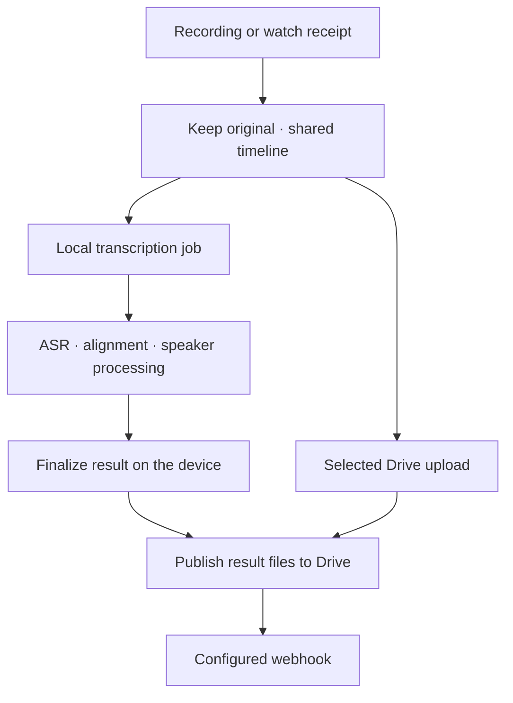

# Recly local automatic transcription: performance-first architecture plan

Reference date: **2026-09-23**. Status: **design proposal, not implemented**.
**Latest product direction:** [Fixed recording processing flow plan](2026-09-24-fixed-recording-flow-plan.md).
It was replaced by a direction that removes user-facing workflows and chooses local / external API / off in the settings.
**2026-09-24 update:** The execution policy, selection criteria and verification/implementation order are replaced by the
[post-recording local automatic transcription plan](2026-09-24-local-transcription-validation-plan.md).
The earlier pre-processing during recording, Qwen-first selection on desktop, and app-wide automatic transcription outside workflows are not the current plan.
The existing external API choice and settings and single-file submission stay in the latest fixed flow as well.
What follows is the research record from the time of the initial plan; the scope of the preliminary tests that were later stopped is also summarized in the new plan.
This document is a plan redesigned on the basis of the [open-source research](2026-09-23-local-transcription.md) and the
[research into official documents, papers and product examples](2026-09-23-local-transcription-references.md),
with integration difficulty excluded from the selection criteria. The product contract `docs/recly.md`
has not been changed yet. Literature research and code checks were done; no model inference or real-device performance measurement was done.

## 1. Decision and premises

**Automatic transcription is ON by default. Local transcription becomes the default processing of a recording, independent of upload.**
The user does not have to choose a model before they can record; when they record, they get the result through the best
path this device can process. If there is enough headroom to process safely during recording, processing starts ahead, and the remaining part
is completed after the recording ends. The watch keeps and transfers the recording, and the phone transcribes. No Recly server is built.

The main targets are Korean, conversations where English technical terms are mixed into sentences, short watch memos, and 30–120 minute meetings.
Here performance is judged in the order **recording stability → transcription and speaker accuracy → completion latency → energy and memory**.
A configuration in which heat interrupts recording on the phone or the OS kills the process is out, even if its accuracy is good.
Within that constraint, when accuracy is equal, the faster configuration that uses less power is chosen. Implementation cost is not compared.

The structure to decide now is kept separate from the values to decide after measurement.

| Decided now | Settled after measurement |
|---|---|
| Default ON, local first, runs separately from upload | Default model and quantization precision per device and language |
| KMP handles jobs, state and results; native handles audio, inference and hardware management | The actual execution split across Core ML/Metal/NPU/GPU |
| Per-segment saving and resume, recording first, a fixed model combination per job | Segment length, overlap, batch and thread counts, memory budget |
| Results that include speakers, time and overlapping speech; corrections grounded in the original audio | The better path per meeting type between separate speaker diarization and an integrated model |
| Cloud transcription runs only when the user specifies it | Transcription time and battery use to promise as numbers |

Of the earlier recommendations, **the part that made Android's Whisper small on CPU the final target is withdrawn**.
It is a compatibility comparison baseline. **SpeechTranscriber is not fixed as the permanent final engine for all of Apple either.**
It is a very strong efficiency path on supported devices, but its top accuracy on Korean and Korean-English mixed meetings has not been proven.

## 2. What the September 2026 sources actually confirm

### Korean comparison under the same conditions

[Whisper Notes' 2026-09-01 experiment](https://whispernotes.app/blog/apple-speech-vs-whisper)
processed the same FLEURS read-speech data on an M5 MacBook Air 32GB/macOS 27.0.
Korean CER was Qwen3-ASR 1.7B **3.54**, Whisper large-v3-turbo **4.25**,
SpeechTranscriber **4.31** and Whisper small **7.30**. Lower is better.
However, the data is about 150 sentences, and the author also explains that differences within about 1 percentage point are hard to call.
So the first three engines are treated as strong candidates, but Qwen is not declared the winner for meetings.
The processing speed multiples in the same article are medians of individual samples across several languages. They are not converted into a completion time for a 1-hour
Korean meeting or into smartphone battery figures. The memory of Apple system services also cannot be compared by app RSS alone.

### Models that widen the comparison

| Candidate | Confirmed capability and design role | Not yet proven |
|---|---|---|
| [Qwen3-ASR 1.7B / 0.6B](https://huggingface.co/Qwen/Qwen3-ASR-1.7B) | 30 languages including Korean, and 22 Chinese dialects. The first candidate for the desktop accuracy path is 1.7B; the phone comparison group is 0.6B and 1.7B. A separate ForcedAligner 0.6B supports Korean | Recly meeting accuracy, sustained processing power on phones, the assumption that timing for every word comes at the ASR cost alone |
| [Whisper large-v3-turbo](https://aihub.qualcomm.com/mobile/models/whisper_large_v3_turbo) | A common model for comparing the acceleration paths of Apple, PC and Snapdragon. The original large-v3 is also in the accuracy comparison group | A guarantee that the NPU accelerates every operation on every device, the claim that Turbo is always better quality than large-v3 |
| [Nemotron 3.5 ASR streaming 0.6B](https://huggingface.co/nvidia/nemotron-3.5-asr-streaming-0.6b) | Supports Korean transcription, cache-aware streaming. A mobile pre-processing candidate that does not keep re-encoding overlapping input | H100 throughput cannot be read as phone performance. Android NPU porting and Korean-English mixed quality need separate verification |
| [Cohere Transcribe 03-2026](https://huggingface.co/CohereLabs/cohere-transcribe-03-2026) | 2B, 14 languages including Korean. A competing candidate for final desktop transcription | Evidence that its English ranking is its Korean ranking, the assumption that it also provides speaker diarization |
| [MOSS-Transcribe-Diarize 0.9B](https://huggingface.co/OpenMOSS-Team/MOSS-Transcribe-Diarize) | Released 2026-07. Outputs transcription, speakers and time together; claims 50+ languages and up to 90 minutes of input. A required comparison group for the meeting path | The card's main evaluation table is not a direct comparison on Korean meetings. 90-minute support does not mean it runs on a phone with little RAM and low power |

An ensemble that runs every model on one recording is not the default. On the same data, the improvement in errors, time and power of a single engine
versus selective reprocessing is measured first. A model is not judged fast just because its name carries a small number.
Encoder structure, the number of generated tokens, cache, memory movement and acceleratable operations are what matter.

### New acceleration paths and the limits of the sources

- [Qualcomm's model card](https://huggingface.co/qualcomm/Whisper-Large-V3-Turbo) provides pre-converted models
  and runtime combinations for Snapdragon. However, the AI Hub web page above carries both a not-supported-on-mobile notice and
  a list of supported Galaxy devices. It is **a likely acceleration candidate**, and until it actually runs with a specific SDK, SoC, driver and model file,
  it is not shown as a release default. Encoder latency and per-token decoder latency are
  not the full completion time for 30 seconds of audio or the peak RAM of the whole device.
- [NPUsper, a 2026-07 arXiv preprint](https://arxiv.org/html/2607.01108v1), proposes reducing redundant
  computation, padding and decoder runs in mobile Whisper. It has Galaxy S25 experiments, but its main evaluation is on Whisper base and
  English data. Its optimization ideas are used, but they are not carried over as a power-saving rate for Korean Turbo.
- Running Qwen on Apple does not assume building everything from scratch.
  [mlx-audio-swift's implementation](https://github.com/Blaizzy/mlx-audio-swift/blob/main/Sources/MLXAudioSTT/Models/Qwen3ASR/README.md)
  provides a Swift · MLX path for Qwen ASR and the aligner. The existence of a public implementation is kept separate from its suitability for iPhone background work.
- Windows can use [Windows ML's provider selection](https://learn.microsoft.com/en-us/windows/ai/new-windows-ml/supported-execution-providers).
  There are paths for NVIDIA, Intel, Qualcomm and AMD, but the model graph, driver and OS constraints differ for each.
  [DirectML is in maintenance mode](https://learn.microsoft.com/en-us/windows/ai/directml/), so it is not fixed as the only
  acceleration basis of the new design.

## 3. Target configuration per platform

The **first candidates** below **are concrete choices to start performance verification with**. Unverified paths are not treated as product
features that are already supported. The default is decided by the verified device profiles the app carries, so the user does not need to study
models. Unknown devices use a conservative local path, and the automatic transcription setting stays as it is.

| Platform | Performance-first first candidate | Execution path and promotion condition |
|---|---|---|
| iPhone | SpeechTranscriber on supported devices as the efficiency baseline, with Whisper Turbo and Qwen 0.6B/1.7B competing as accuracy candidates | Compare system Speech with Core ML/ANE, Metal and MLX on real devices. If the highest-quality model passes the time, memory and heat budgets, it is promoted to the default. No extra full transcription for memos where one ASR pass is enough |
| Apple Silicon Mac | Starts with **Qwen3-ASR 1.7B + alignment and speaker processing as needed** | MLX/Metal compared first; Korean meeting evaluation against WhisperKit/Core ML Turbo and the original large-v3, Cohere and MOSS. SpeechTranscriber is the low-power, fast-draft path. Does not assume that MLX uses the ANE |
| Android / verified Snapdragon | **The QNN/QAIRT NPU path of Whisper large-v3-turbo** verified first as the high-performance batch candidate | Qwen 0.6B/1.7B and Nemotron 0.6B also compared under the same heat and power budget. Registered in a profile only when NPU conversion quality, the actual acceleration ratio and long-file completion pass |
| Android / Exynos · MediaTek · other | Acceleratable configurations of **Qwen3-ASR 0.6B INT8 and the Whisper family** compete | Vendor NPUs and GPUs verified separately. Does not assume the Qualcomm path can be reused. CPU for small segments where CPU is faster than GPU; on devices that can only run small models, the highest quality among them |
| Windows / NVIDIA GPU | Starts with **Qwen3-ASR 1.7B + speaker diarization** | Native CUDA · TensorRT-family execution, competing with Cohere/MOSS/Whisper large-v3. Server Python/vLLM throughput is not taken as Windows deployment performance |
| Windows / Intel · AMD · Snapdragon | Of the candidates above, **the model that is actually accelerated on that hardware** | Windows ML/ORT + OpenVINO · VitisAI/MIGraphX · QNN, etc. verified per model. If conversion or operator support falls short, compared with Whisper Turbo's native GPU path |
| Intel Mac · CPU-heavy PCs · low-memory devices | The configuration that measures best among Qwen 0.6B INT8 / Whisper small · Turbo | Native CPU/OpenVINO, etc. Slow devices finish through scheduling and resume, and the processing times of high-end devices are not promised |
| Apple Watch · Galaxy Watch | **Record → deliver to the phone → automatic transcription on the phone** | Running a large ASR model on the watch itself is not a default. Pre-processing starts after the integrity of received parts is checked; the result is finalized only once the full meta is complete |

[ORT QNN](https://onnxruntime.ai/docs/execution-providers/QNN-ExecutionProvider.html) supports Android and
Windows Snapdragon execution. [whisper.cpp](https://github.com/ggml-org/whisper.cpp) is kept as
a comparison baseline across Apple, Android, Windows and several CPU/GPU acceleration paths. **That a runtime supports the hardware
is different from a particular ASR model running efficiently as a whole.** Profiles also check
CPU fallback, CPU↔accelerator copies and model preparation time.

Android ML Kit and Windows system Speech are not excluded from the comparison either. However, the ML Kit
file input confirmed so far has a real-time feeding limit and a device range, and Windows Speech needs more checking of Korean, the SDK and packaging.
So they are not settled as the file transcription path for all Android/Windows devices.
The evidence is in the platform section of the [official API research](2026-09-23-local-transcription-references.md).

## 4. Overall processing structure


```mermaid
flowchart TD
    A[Recording or watch receipt] --> B[Keep original · shared timeline]
    B --> C[Local transcription job]
    B --> D[Selected Drive upload]
    C --> E[ASR · alignment · speaker processing]
    E --> F[Finalize result on the device]
    F --> G[Publish result files to Drive]
    D --> G
    G --> H[Configured webhook]
```

Even when Drive is not connected, the device is offline or the upload failed, processing completes through F. G/H are created only when the user's workflow
requests them. There is no reason to wait for the network to read the result right after the save button is pressed.
So that computation does not fall behind when Drive work takes long, **separate execution slots for computation and transfer** sit outside the existing serial executor.
DB state transitions are serialized in short transactions, and no DB mutex is held during inference or transfer.

### Job policy

The transcription policy is fixed per recording. The precedence is **per-recording setting → explicit workflow transcription setting → device default**.
The device default of a new install is `local / automatic / on`. Existing
users who specified a cloud provider in a workflow keep that choice. An automatic local job and an explicit transcription do not overwrite the same result file twice.
Transcription OFF is treated as an explicit policy that creates no new automatic job.

- Existing recordings as a whole, and recordings listed or adopted from Drive, are not transcribed in bulk right after the update.
- Existing users' settings are not overwritten, and the automatic transcription state that applies from new recordings on is shown clearly on screen.
- Watch retransmission, app relaunch and repeated callbacks are deduplicated by `recordingId + audioRevision + policyRevision`.
- The workflow's upload `minDurationSec` is separated so that it does not block local transcription of short voice memos.
  Silence detection is separate, and valid speech is not discarded just for being short.
- Even if transcription fails, the recording is saved. The cause is shown and the job is retried. There is no fallback that sends the original audio to a cloud
  the user did not specify.

### Two-stage results do not mean two full ASR runs

`draft` is a result whose boundaries and speakers can still change; `final` is a result whose processing for that version is finished.
The default is to accumulate the results of the same ASR run and then finalize boundaries, speakers and time.

A short memo finishes with one run of the selected engine. In a meeting, finished sentences are shown first, and only segments with low confidence,
cut-off sentences, repetition, empty results despite speech, language switches, overlapping speech and the like are re-evaluated from the original audio.
Confidence numbers from different engines are not compared on the same scale; the error detector is calibrated on validation data.
Because there are also confident misrecognitions that the error detector misses, the quality loss of selective reprocessing is measured against
a full second-pass transcription on desktop. Full re-transcription is applied only to meeting profiles where it actually wins.

There is no evidence for adopting a configuration that always runs both a draft engine and a final engine, one where several models vote on every recording,
or one where a text LLM rewrites the original from context. Terminology dictionaries and user hints are used
when the ASR interprets the actual audio, and summaries and meeting minutes stay in the existing agent workflow.

## 5. The audio path that produces accuracy and sustained performance

### Original and timeline

1. The capture callback puts saving the original first. Inference, model loading and DB work do not run inside it.
2. Device input is converted once to the sample rate the model requires. Where possible, PCM from before AAC compression is fed
   to transcription. If a performance profile confirms a gain, a local lossless sidecar is also kept until final transcription.
   It is a temporary asset separate from the current 16kHz mono/32kbps AAC upload contract, and storage space and write power are compared too.
   The original transferred from the watch is currently processed with AAC as input. A bitrate change is decided as a separate contract change after its quality gain is measured.
3. A bounded PCM buffer decodes closed parts in sequence. A full 2-hour recording is not joined into one WAV and loaded
   into memory. Per-model features are computed and cached only when needed, and mels are not shared unconditionally between different models.
4. The original's sample offsets, part offsets, actual duration and gaps are preserved. Even when VAD skips silence,
   the original timeline is not compressed. AAC encoder delay and padding and mic/system drift are also included in alignment tests.
5. The long-file processing and internal context linking that an engine provides are used first. The app does not uniformly split every engine's input
   into independent 10–30 second transcription requests. The model's internal input window, the buffer that reads
   audio, and the job segment for interruption and resume are different units. Direct splitting is applied only when the engine's input limit or the resume feature
   requires it, and it is aligned to speech boundaries and the model's context length. The needed context overlap and result merging are decided
   after boundary gaps, duplicates and term consistency are verified. Short memos are not forced into extra splitting.
   Words are not cut at fixed time intervals, and the whole last several tens of seconds are not re-encoded every second.

Segment processing is useful for a memory cap and for interruption and resume, but it is not a heat limit in itself. Processing segments without
a break keeps the load high. Run intervals, concurrency and accelerator choice are controlled separately. Saving finalized results
does not mean the engine's internal state can be restored too, so for engines that do not support that, a limited range is reprocessed from a safe
boundary.

Evidence: [Whisper's internal 30-second window processing](https://github.com/openai/whisper#python-usage),
[WhisperKit's incremental file loading and transcription API](https://github.com/argmaxinc/argmax-oss-swift/blob/main/Sources/WhisperKit/Core/WhisperKit.swift).

VAD is used conservatively. The cost of deleting quiet voices, sentence-initial consonants and distant speakers can be larger than the savings
on computing silence. Margins before and after speech are kept and revalidated against the original. Strong noise reduction can change the voice, so
it is not forced by default. Even when processed audio is used, it stays possible to go back to the original.

### Desktop channels and speakers

The current `mic`, `sys` and `mix` are kept. For a video call, a path that processes mic/sys separately is compared with a path that processes one mix.
There is no reason to mix speech that separate channels have already separated and then diarize it again.
However, sys can contain several remote speakers, and mic several people in the room plus speaker leakage.
Channel names are not taken as people's names, and duplicate speech is identified by time and acoustic correlation.
Subtracting mic text as strings from a mix transcript is not used.

The default meeting candidate is ASR-independent **speech segmentation → speaker embedding → clustering over the whole meeting → word attribution**.
[pyannote community-1](https://huggingface.co/pyannote/speaker-diarization-community-1) is used as the accuracy baseline,
and platform-accelerated ports are compared with the original. This model provides
exclusive diarization for running locally and joining with the transcript, but the original labels of overlapping speech must be kept as well.
It competes with the MOSS integrated path on per-speaker character error rate. Fast streaming speaker labels are provisional, and after the recording ends
they are renumbered over the whole meeting. Speakers are not numbered from 1 again in every chunk.

For segments where overlapping speech matters, source separation and re-recognition are tested. The distortion the separation model introduces is also measured,
and it is not run unconditionally on whole recordings. Without a speaker-count hint, speakers are not capped at four.
When speech overlaps, it is expressed as an overlapping segment, and when the person cannot be determined, an `unknown` state is allowed.

For paths like Qwen that need separate alignment, that processing cost is included too. The aligner does not turn a misrecognized word
into the correct one. The Korean word segmentation and the English terms are kept, and word/phrase-level timing is verified.
The final result must have at least playable phrase timings and whether the speaker information is final.

## 6. Device resources and background execution

The scheduler selects a **verified model profile** that fits the device, OS, accelerator, RAM, language and recording type.
The first run does not spend the user's battery on a big benchmark. Pre-release profiles and a short local capability
probe are used, and latency and memory information from normal processing adjusts thread/batch/concurrency. The collected values stay on the device.

The phone starts by running only one heavy inference at a time. Model residency for ASR and speaker diarization is controlled,
and batch and cache are reduced first before pausing. A large model is not kept resident just because there is an NPU.
The desktop overlaps audio decoding, accelerator execution and upload, but measures whether running two large models in competition is actually faster.
If the model has to change mid-job, the change is recorded at a segment boundary and that segment is revalidated. The source of earlier results is not hidden.

| Situation | Behavior |
|---|---|
| During recording, with performance headroom confirmed | Pre-processing at low priority. Yields immediately if the capture queue backs up |
| Recording ends or a watch file is received | Starts automatically if the model is ready and the OS gives a chance to run |
| Heat · low-power mode · memory pressure | Reduce thread/batch, or checkpoint and wait. The automatic transcription setting stays ON |
| The app/OS ends the job | Completed segments kept, resumed at the next chance to run |
| Model not installed · not enough space | Recording kept, preparation state shown, resumed after the download/space problem is resolved |
| Drive offline · signed out | Local computation continues. Only the publish job waits |
| User cancels · deletes | Computation stops, lease released, state saved so that the job does not come back automatically later |

Transcribing only while charging is not made a blanket default. Processing continues when the thermal state recovers or a suitable
chance to run arises. At the same time, **automatic ON does not mean a guarantee of immediate completion in every OS state.**

- **iOS:** Automatic waiting is scheduled as a `BGProcessingTask` with no network requirement. The OS decides when that chance comes.
  `BGContinuedProcessingTask` is tied to [the explicit user action Apple describes](https://developer.apple.com/videos/play/wwdc2025/227/).
  It is used only with a clear “Save and transcribe”/“Transcribe now” action and a progress UI, and is not applied to the watch's automatic receipt
  just because the setting is ON. For the GPU, the entitlement and runtime resource support are checked.
  GPU execution in the background is not assumed to be possible. When it is not supported, the job checkpoints and waits.
- **Android:** Automatic waiting is scheduled as a separate job with no network requirement. For immediate long processing, the app state and
  [the relevant foreground service type](https://developer.android.com/develop/background-work/services/fgs/service-types) are
  checked. The microphone service is not kept running after recording ends just to secure computation time.
  [The quota for long-running Android 16 WorkManager work](https://developer.android.com/develop/background-work/background-tasks/persistent/how-to/long-running) is
  reflected, and stop/resume is implemented. Service conditions on API 34 and on later versions are distinguished.
- **macOS/Windows:** A job executor separate from capture is used. On Windows the native inference helper runs as a separate
  process so that driver/inference failures do not kill the recording process. The user is not asked to install a Python
  server. The app manages the needed runtime and connects to it over local IPC.

## 7. Core boundary, storage and contract changes

### Inference interface

The shared core does not treat a local model like an HTTP provider by giving it a fake API key.
The existing cloud provider submit/poll stays, and the following **local computation ports** are added separately.
The names can be adjusted during implementation, and they are not an actual API yet.

| Port | Responsibility |
|---|---|
| `LocalTranscriptionEngine` | capabilities, model preparation, audio input, partial/final segment events, cancel and resume |
| `AudioSource` | PCM range reads, track/part/sample time mapping, source revision |
| `DiarizationEngine` / `AlignmentEngine` | Runs when the ASR lacks that feature; outputs on the original timeline |
| `ComputeScheduler` | Resource budget, accelerator slots, OS chances to run, wait reasons |
| `ModelStore` | Install, verification, version, size, atomic replacement. Apple system models through an AssetInventory adapter |
| `TranscriptRepository` | Provisional/final revisions, user edits, source, artifacts to publish |

PCM and tokens are not copied countless times per frame across the KMP boundary. The audio pipe and inference stay on the native
side, and segment results and checkpoints are passed to the core. Per-model sample rate, batch/streaming,
Korean/mixed support, maximum context, timestamps, diarization and the required accelerator are declared explicitly.

### Durability and publishing

The local DB stores state corresponding to `transcription_request`, `transcription_chunk`, `transcript_revision`
and `artifact_publication`. Large PCM, features and embeddings live in managed local files,
and the DB holds location, hash and range. Large tensors are not serialized into `step_run.state_json`.

- Request: source manifest hash, policy snapshot, engine/model revision, quantization, OS/build,
  progress, wait reason, whether cancelled, execution lease. If the Apple system model version is not exposed, that fact is recorded too.
- Chunk: original sample range, input hash, result revision, whether complete, reprocessing reason. Caches that do not match the model/runtime
  are not reused. If an opaque KV cache cannot be resumed, only a limited context is rerun from the last finalized boundary.
- Final result: atomic file replacement + DB commit, provenance per revision. Automatic transcription does not overwrite later user edits.
- Publishing: an outbox per `recordingId + transcriptRevision + destination`. A Drive upload retry does not rerun transcription.
  Webhooks are sent after the finalized revision and the required publishing are complete, and use an idempotency key. It is not claimed
  that delivery over the network happens exactly once; the receiver is able to remove duplicates.
- Retention: originals that computation reads get a lease. The original of an incomplete transcription is not deleted 7 days later just because its upload finished.
  When the user deletes a recording, the local transcripts, embeddings and cache are deleted with it. Disconnecting Drive does not block local computation.

### Points in the existing code that must change

| Current evidence | Change during implementation |
|---|---|
| `core/src/commonMain/kotlin/recly/core/transcribe/SttProvider.kt:31`, `:80` — file submission/polling and API key context | Separate the cloud and local execution contracts |
| `core/src/commonMain/kotlin/recly/core/transcribe/TranscribeRunner.kt:61`, `:83`, `:183` — provider/key, joining all parts, dependency on the Drive folder | Add a local chunk input and a local finalization path |
| `core/src/commonMain/kotlin/recly/core/transcribe/TranscribeRunner.kt:236` — mono, otherwise mix selection | Add an input plan based on per-channel timeline and quality |
| `core/src/commonMain/kotlin/recly/core/transcribe/ResultFiles.kt:27`, `:40` — local file writing coupled with Drive publishing | Separate the local artifact commit from the remote outbox |
| `core/src/commonMain/kotlin/recly/core/job/Executor.kt:72` — runs jobs one at a time, serially | A separate computation executor and transfer executor, sharing the DB claim/delete rules |
| `core/src/commonMain/kotlin/recly/core/ReclyCore.kt:112` — queue tied to Drive access readiness | Local requests run independent of Google authentication and the disconnect state |
| `core/src/commonMain/kotlin/recly/core/job/JobService.kt:66` — skip by workflow minDurationSec | Separate the creation of local automatic transcription from upload workflow selection |
| `core/src/commonMain/kotlin/recly/core/job/JobStore.kt:211`, `:276` — purge depends on existing job completion | Include local jobs, leases and sidecars in retention decisions |
| `core/src/commonMain/kotlin/recly/core/platform/CoreDeps.kt:10` | Add an injection boundary for the native local engine and scheduler |
| `android/app/src/main/kotlin/app/recly/android/work/WorkScheduler.kt:64` — network condition on every job | Separate scheduling of transfer and computation |
| `apple/RecKit/Sources/RecKit/Jobs/BackgroundJobs.swift:67` — network-required scheduling, `:87` — upload-only continued task | Add computation scheduling, user-started transcription, chunk progress and expiration handling |
| `core/src/commonMain/kotlin/recly/core/workflow/WorkflowParser.kt:316`, `spec/workflow.schema.json:106` — upload first, secretRef required | Define the next workflow schema that expresses local transcription and publishing |
| `spec/transcript.schema.json:10`, `:12`, `:48` — schema 1, mono/mix, speaker required | Express revision, source, channel and unknown/overlap in the next transcript schema |

The current workflow schema is **3**. Implementation defines the contract of the next version and preserves the meaning of existing version 1–3
documents. The order of existing sequential cloud workflows is not changed arbitrarily. The new local path is compiled into an execution plan with
dependencies among computation, upload and publishing. A workflow step that waits for the computation result refers to the same request that was already created,
so it does not transcribe again. Ordinary users do not edit the internal job graph.

For transcripts, the next version's reader is shipped first while the acceptance range of the existing v1 reader is checked.
New files are not silently labeled v1. If needed, a v1-compatible export is provided alongside, stating how
unknown/channel/overlap information was reduced in the process. The scope of the change is checked through to the consumers on watch, phone, desktop, webhook and agent skill.
The related ADRs and §3 · §5–§8 · §10–§15 of `docs/recly.md` are updated in the same implementation step,
keeping the existing section numbers and cited subsection headings.

## 8. Model management and the "local" contract

Models are installed according to the revision, hash and runtime/SoC conditions of a manifest the app has verified. Free space for download, extraction and compilation
is computed separately, and cancel, partial download resume, hash verification, atomic replacement and rollback to the previous version are provided.
Models used by jobs in progress are not cleaned up. Models on all devices are not switched at the same time because of one app update.
OS-managed Speech models cannot be pinned the same way by the app, so regression evaluation is done separately after OS updates.

Initial model preparation shows size and download state together with the automatic transcription setting. Even when it is not ready, recording
works and the job waits. Downloading model files and uploading audio are different actions. Every external path that is actually needed, such as model downloads,
Apple assets and Windows execution provider installs, is added to `docs/recly.md` §15 during implementation.
Audio, transcripts and performance logs are not sent to model providers. Third-party runtime telemetry and automatic remote fallback are also checked.

The licenses of the code, model weights, converted versions and vendor runtimes are checked separately. Downloads of gated models that need user consent
are not bypassed automatically. Either the paths that can be included in the app distribution are settled, or a substitute model whose terms allow it
is used. This research did not agree to any gated model's terms or download any weights.

## 9. Performance evaluation and release decision

A reproducible evaluation harness is built before models are chosen. Each run records the data revision, reference transcript,
normalizer, model hash, precision, runtime commit, OS/driver, decoding settings, starting temperature and power state.
Measurements are done on the same device with the same input and the same scorer. Different CER/WER figures from public sources are not mixed into one ranking.

### Evaluation data

- Korean FLEURS is used to check reproducibility. The final choice needs real memo, meeting, far-field and noisy speech.
- Korean and Korean-English mixed meetings with consent and usage rights are divided by 2, 4 and 6+ people, overlapping speech, and numbers, people's names, product names and development terms.
  Data from the same speaker is kept from appearing in both tuning and final evaluation.
- Following [HiKE's Korean-English code-switching evaluation](https://aclanthology.org/2026.findings-eacl.33/), English word, phrase and sentence switches are distinguished.
  Normalization is not done in a way that favors results that transliterate all English into Hangul.
- Real phone/watch AAC, desktop mic/sys/mix, long silences, Bluetooth input, interruption and resume, and real gaps are included.
  Lengths are split into short memos and 30, 60 and 120 minutes. Beyond MOSS's single-input limit, splitting and speaker linking are evaluated too.

### Metrics and decisions

| Area | Measurement | Selection criterion |
|---|---|---|
| Recording | Missing samples, dropouts, timestamp drift, compared with a baseline without STT | No new capture loss caused by transcription |
| Text · content | Korean CER and WER separately, English WER, proper noun/number errors, omissions, hallucinations on silence | Check results and confidence intervals per meeting type. An average improvement must not hide a large regression in a particular type |
| Speakers | DER, cpCER/cpWER, speaker count errors, speaker ID changes in long meetings | Scores with and without overlap kept separate. Directly measure errors that make the user read words as someone else's |
| Time | Phrase/word boundary error, playback position when speech is clicked | Compared on the original timeline. Errors that shift earlier because of silence removal are contract failures |
| Responsiveness | Cold/warm first result, first result and final completion after recording ends, p50/p95, RTF | Includes model loading, alignment, speaker diarization and file saving. RTF is total processing time / audio length |
| Resources | Whole-device/related-process memory, accelerator use, power · Wh/audio hour, temperature, slowdown | Judged with 60–120 minutes of sustained processing running alongside recording. Not passed on app RSS or the first 30 seconds alone |
| Resume | Screen lock, OS stop, process kill, reboot, low storage | No reprocessing of finalized chunks, no duplicate results/publishing, incomplete originals kept |

**Initial engineering targets, not measured figures:** file transcription RTF ≤ 0.5 on high-end phones and
RTF ≤ 0.2 on accelerated desktops are the exploration targets for the default profile. These are upper-bound targets that allow up to 30 minutes / 12 minutes respectively for 60 minutes of audio;
the first result for short memos and the completion latency after pre-processing during recording are separate metrics.
CER is not made much worse to meet these targets. Devices capable of faster results use that performance.
Absolute release figures for accuracy and battery are not made up without reference data and real-device measurement.

For each device class, the Pareto candidates of quality versus time and energy are narrowed. If quality is statistically equal, the lower-latency/lower-energy
path is chosen; if the difference is significant, final transcription accuracy comes first. The quality of 4bit/INT8/FP16/BF16 is measured
separately. Nor is it assumed that a large model at 4bit is always better than a small model at INT8.

Offline tests are done with the network turned off after model preparation. Unit tests that make the HTTP transport fail and
network observation on real devices are used together. CI verifies the contract, recovery and alignment with small fixtures, and
long audio and real-device heat tests are done as a separate benchmark job. User recordings are not put into CI.

## 10. Execution stages and completion conditions

| Stage | Deliverables | Condition to move to the next stage |
|---|---|---|
| 1. Comparison baseline | Audio/reference corpus, the same scorer, model · engine reference harness, real-device list | Korean, mixed, speaker and sustained processing results are reproducible. First default profile decided per platform |
| 2. Local processing foundation | Separate computation request/queue, chunk checkpoint, local artifact, source lease, versioned contract | Recording → final result without Drive. Passes kill/restart, deletion and retention races |
| 3. Platform inference | Apple Speech/Core ML/MLX, Android acceleration, Windows native helper, and verified profiles | Passes conversion quality versus the source model, sustained power, cancel and OS execution conditions. Unsupported devices get a verified fallback |
| 4. Meeting quality | Per-channel input, speaker cleanup, alignment, selective reprocessing or an integrated model | Lower per-speaker error than the single-ASR baseline on the same meetings. Gain confirmed including load |
| 5. Productizing default ON | Model preparation UI, progress/wait states, preservation of existing users' policy, Drive/outbox/webhook | No duplicate jobs, explicit cloud choices preserved, local completion and upload status shown separately |
| 6. Release verification | Per-device performance report, pinned model/runtime list, rollback, OS update regression procedure | Lossless recording, offline, 120 minutes, heat, background and compatibility with earlier contracts verified |

The implementation order must not become the reason the easiest model to integrate ends up as the final winner. Stage 1 establishes the baseline,
and stage 3 confirms it again with the runtime actually deployed. iPhone, Snapdragon, non-Snapdragon Android, Apple Silicon,
Windows NVIDIA and Windows iGPU/ARM are each tested. One Mac's results do not approve six clients.

This plan is the end point of this work. No model installation or inference, product code or schema changes, or release default changes were made.

## 11. Check record for this document

The code was checked against the `file:line` references above by reading the current repository. Transcription, the job queue, OS scheduling, retention and schemas
were checked with `rg --files`, `rg -n`, `sed` and `nl`. The external sources are the official documents, model cards,
experiment authors' articles and papers linked above. Model performance figures are external experiments, not Recly measurements.

Command run: `make test > /tmp/recly-performance-plan-20260923/make-test.log 2>&1`

```text
BUILD SUCCESSFUL in 4s
123 actionable tasks: 1 executed, 122 up-to-date
```

This is the result of checking the existing JVM test tasks. It does not mean the quality or speed of new local inference was verified.
`git diff --check` gave exit 0 with no output. Because the new documents are still untracked, the local links, code reference locations, whitespace and code fences
of the three documents were also checked separately with Python.

```text
PASS: 3 documents, 7 local links, 14 code reference locations; whitespace and code fences valid
```

Because app code and `spec/` were not changed, no Apple/Rust builds or model benchmarks were run.
