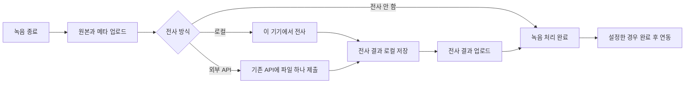

# 고정 녹음 처리 흐름: UI/UX·계약·구현 계획

기준일: **2026-09-24**. 상태: **고정 실행 흐름·셸 UI·Apple 어댑터 구현. Android·Windows 로컬 엔진과 실기기 출시 검증 미완료**.

**후속 결정:** 완료 후 연동을 새 설정·계획에서 제거하고 화자 분리는 지원할 때 자동으로 켠다.
화자 분리 토글과 인원 입력을 노출하지 않는다. 아래 최초 계획과 작업 기록보다 현재 `docs/recly.md` §5가 우선한다.
Mac 실제 모델의 짧은 전사 검증 결과는 이 문서 후반에 기록돼 있으며 장시간 부하 검증과는 구분한다.

**구현 진행:** 후속 “나머지도 전체 진행” 요청으로 P1 중단점을 해제했다. 설정·이관 코어에 이어 고정 실행 계획,
녹음별 설정 스냅샷, 결과 캐시와 업로드 분리, 로컬 전용 실행 패스, 폰 3탭·워치 피커 제거·데스크톱 설정을 연결했다.
Apple 로컬 분석기는 파일 하나와 확정 구간 체크포인트를 사용한다. Android·Windows는 실기기 검증을 통과한 엔진이
아직 등록되지 않아 지원 불가를 정직하게 표시한다. 모델 다운로드·실제 추론·부하 시험은 실행하지 않는다.

사용자 결정: 워크플로우 생성·선택·단계 편집을 사용자 경험에서 없애고, 녹음 후 처리 흐름을 고정한다.
로컬 전사를 기본으로 제공하며 외부 API 선택과 설정을 유지한다. 이 문서는
[앞선 로컬 전사 계획](2026-09-24-local-transcription-validation-plan.md)의 제품 설정·실행 연결·마이그레이션 부분을 대체한다.
그 문서의 저발열 엔진 선정·분할 원칙·실기기 검증은 계속 적용한다.
계획 작성 뒤 구현 요청에 따라 정본 `docs/recly.md`, `spec/`와 공통 설정 코어를 갱신했다.
필수 기능 검증은 직렬 빌드로 수행하며, 중단했던 모델 다운로드·추론·부하 시험은 재개하지 않는다.

## 1. 제품 결정

**녹음을 마치면 원본과 전사 결과가 사용자의 Drive에 정리된다. 사용자는 저장 위치와 전사 방식만 설정하면 된다.**



- 새 설치의 전사 방식은 **로컬**. 기존 설치는 사용 중이던 동작을 이관한다. 외부 API 사용자를 로컬로 바꾸거나,
  업로드만 하던 사용자에게 전사를 일괄 활성화하지 않는다.
- 전사 선택지는 **로컬 / 외부 API / 전사 안 함**. 마지막 선택은 업로드만 하는 기존 용도를 보존한다.
- 녹음이 끝난 뒤 위 순서로 실행한다. 원본 업로드 전에 로컬 전사를 미리 시작하는 정책은 이번 범위에 넣지 않는다.
  따라서 Drive 업로드가 대기 중이면 전사도 아직 시작하지 않는다. 로컬 엔진 자체에는 네트워크가 필요하지 않다.
- 외부 API는 기존처럼 선택 트랙의 저장 파트를 합친 파일 하나를 제출한다. 로컬용 분할·VAD·겹침을 적용하지 않는다.
  기존 provider별 한도 검증·동의·오류 처리는 유지한다.
- 무거운 로컬 계산은 기기당 하나이며 새 녹음에 양보한다. 열·OS 대기는 자동 재개하고 원인을 사용자에게 노출하지 않는다.
- 완료 후 연동은 선택 기능이며 기본 OFF. 한 개의 웹훅 목적지를 지원하고, 전사를 끈 경우 원본 업로드 후 호출한다.
  전사가 실패한 경우 성공 완료 웹훅을 보내지 않는다. 기존 복수·중간 웹훅은 §7의 호환 정책으로 처리한다.
- 설정·키는 기기별이다. Watch는 녹음·폰 전송만 담당하며, 서버·텔레메트리·클라우드 자동 전환은 추가하지 않는다.
- 자동 요약, 모델 비교 UI, 엔진의 내부 분할 설정, 새 프로필/규칙 편집기는 추가하지 않는다.

## 2. 화면 구조

기존 Blueprint 디자인을 유지하고 화면의 정보 구조를 단순화한다. 사용자에게 보이는 `워크플로우`,
`단계 추가`, `사용 중인 워크플로우`와 노드 그래프 편집을 제거한다.

| 표면 | 계획 |
|---|---|
| Android·iPhone | 기존 네 탭에서 워크플로우만 제거해 **녹음 / 목록 / 설정** 세 탭. 두 탭을 합치는 별도 개편은 하지 않음 |
| Mac·Windows | 메뉴바/트레이의 녹음·최근 목록·상세를 유지. 워크플로우 창 진입 제거. 설정 창에 처리 설정 통합 |
| Apple Watch·Galaxy Watch | 워크플로우 피커 제거. 타이머·시작/정지·폰 전송 상태·대기 개수 유지 |
| 위젯·타일·컴플리케이션·단축키 | 기존 녹음 진입점을 유지하며 워크플로우명 의존 제거. 오래된 ID/intent가 녹음이나 전달을 깨뜨리지 않도록 호환 |

### 녹음 화면

기존 세 노드는 **기기 / 전사 / 상태**로 정리한다. 기존 타이머·사각 녹음 버튼·파형 배치는 유지한다.

```text
[ phone ]     [ 전사: 로컬  › ]     [ IDLE ]

                     00:00:00
                   [ 녹음 시작 ]
```

- 전사 노드는 선택된 방식을 요약한다: `로컬`, 외부 API의 공급자 이름, `전사 안 함`.
  노드를 누르면 설정의 전사 화면으로 이동한다. 공급자를 고르는 피커를 녹음 화면에 중복 배치하지 않는다.
- 녹음 중에는 해당 녹음이 시작할 때의 설정 요약을 읽기 전용으로 표시한다. 녹음기의 상태가 후처리 상태보다 우선한다.
- 기본 화면에 전체 처리 흐름 그림, 모델 이름·RAM·열 상태, API 설정 완료 체크리스트를 상시 표시하지 않는다.
- 최초 실행은 녹음 화면에서 시작한다. Drive 연결이나 모델 준비를 위한 별도 온보딩을 녹음 전 필수 절차로 만들지 않는다.
  마이크·캡처 권한, 녹음 동의, 연결 해제 중의 시작 차단 등 기존 안전 조건은 유지한다.
- Drive 미연결이어도 녹음은 보존하고 업로드를 기다린다. 대기 작업이 생긴 뒤 목록 상단의 기존 연결 안내 한 곳에서
  해결하도록 한다. 같은 연결 안내를 녹음 화면·목록·설정 배너에 중복하지 않는다.
- 빈 목록의 기본 동작은 녹음 시작으로 연결한다. 워크플로우 만들기로 연결되는 빈 화면 문구를 제거한다.

### 설정 화면

기존 섹션형 표에 저장·전사·연동을 넣는다. 설정 페이지 전체에 하나의 거대한 저장 버튼을 만들지 않는다.

```text
저장
  Google Drive       연결된 계정 / 연결
  저장 폴더          recly/…                         ›

전사
  전사 방식          로컬                            ›

완료 후 연동
  웹훅               사용 안 함                      ›

녹음                 기존 플랫폼별 캡처 설정
앱                   기존 언어·테마 설정
설정 관리            내보내기 / 가져오기
정보                 기존 버전·빌드·기기 ID·오픈소스 고지
```

- 연결된 Drive 행과 연결 해제 확인은 공용 컴포넌트를 유지한다. 폴더 행은 저장 위치를 보여주고, 편집은 별도 화면/영역에서 한다.
- 새 설치의 폴더는 기존 시드와 같은 `recly/memo/{{yyyy}}-{{MM}}`를 유지해 폴더 변경을 이번 개편에 섞지 않는다.
  기존 경로 템플릿과 최소 녹음 길이는 고급 저장 설정으로 이관한다. 새 설치의 최소 길이는 0초이며 기본 화면에 노출하지 않는다.
- 설정 관리의 새 내보내기는 녹음 처리 설정을 대상으로 한다. 키 값·Google 인증·모델 파일·진행 중 작업은 포함하지 않는다.
  가져오기 전 적용될 저장 위치·전사 방식·연동 목적지를 미리 보여준다. 기존 언어·테마·캡처 설정을 덮어쓰지 않는다.
- 선택한 방식과 실제 실행 가능성은 별도로 관리한다. 로컬 지원 확인 중, 모델 준비 필요, 실행 가능,
  지원 불가를 구분한다. 준비 필요에는 준비 동작, 지원 불가에는 `이 기기에서 사용할 수 없음`과 방식 변경 동작을 제공한다.
  영구적인 지원 불가를 자동 재개 대기로 표시하지 않는다. 외부 API로 자동 선택하거나 자동 전송하지 않는다.

### 전사 설정

```text
전사
  [ 로컬 ]  [ 외부 API ]  [ 전사 안 함 ]

  선택한 방식에 필요한 설정만 표시

  [ 취소 ]                               [ 저장 ]
```

- 모바일은 설정 하위 화면, 데스크톱은 기존 설정 창의 상세 영역을 사용한다. 세 선택지는 기존 단일 선택 칩/라디오를 재사용한다.
  큰 글씨에서는 줄바꿈하며 가로 스크롤로 숨기지 않는다. 세 가지 선택은 폼의 컨트롤이며 세 버튼짜리 확인창이 아니다.
- **로컬:** 플랫폼에 맞는 검증된 엔진을 자동 선택한다. 일반 사용자는 엔진·양자화·스레드 수를 고르지 않는다.
  언어·화자 구분은 지원 능력에 맞게 제공한다. 화자 미확인을 실제 화자 판정처럼 표시하지 않는다.
- **외부 API:** 현재 공급자 목록과 순서, API 키·지원되는 endpoint·모델·언어·화자 구분·인원 힌트를 보존한다.
  공급자 선택 후 해당 공급자가 받는 항목만 표시한다. 조건부 필드·URL 템플릿·검증은 기존 규칙을 재사용한다.
  API 키 입력과 웹훅 서명 키 입력은 기존 보안 저장소 폼을 재사용하며, API 키 생성 버튼은 제공하지 않는다.
- **전사 안 함:** 엔진·키·언어 폼을 숨긴다. 기존 키와 설정 초안을 지우지 않아 다시 선택했을 때 재입력을 강요하지 않는다.
- 모델이 이미 준비됐으면 준비 설명을 상시 붙이지 않는다. 별도 다운로드가 필요하면 크기·준비 상태와 필요한 동작을 표시한다.
  다운로드·모델 준비 역시 저발열 예산을 따르며 녹음과 경쟁시키지 않는다.
- Save/Cancel은 전사 설정 묶음에 적용한다. 외부 API 초안이 미완성인 동안 실제 처리 방식을 바꾸지 않는다.
  입력 오류는 해당 행 아래에 표시하고 첫 오류로 포커스를 이동한다. 저장 실패 시 입력을 유지한다.
- 현재 폼의 미저장 변경 보호를 유지한다. 변경 없는 뒤로가기에는 확인하지 않는다. 모바일 탭 이동은 초안을 보존하고,
  뒤로가기는 현재 화면에만 적용한다. API 호출로 키를 자동 시험하거나 음성을 테스트 업로드하지 않는다.

### 완료 후 연동

- `사용` 선택과 URL·서명 키만 기본으로 제공한다. 사용하지 않을 때는 입력 폼을 숨긴다.
- 전사 결과 업로드 후 한 번 보내며, 전사를 끄면 원본 업로드 후 보낸다. 재시도는 같은 이벤트 ID를 유지한다.
- 웹훅 실패는 녹음·전사 완료를 되돌리지 않는다. 목록의 녹음 결과는 완료로 유지하고 연동 문제를 보조 상태로 표시한다.
  연동 재시도는 웹훅만 재시도하며 원본 업로드나 전사를 다시 하지 않는다.
- 기본 UI에 재시도 간격·횟수·`onError` 같은 실행기 옵션을 노출하지 않는다.

## 3. 녹음별 상태와 문제 해결

설정 요약은 앞으로의 처리 방식이고, 목록·상세의 상태는 해당 녹음의 실제 진행 상태다. 둘을 섞지 않는다.
기존 모노스페이스 코드 배지와 현지화된 설명을 유지하고, 내부 코드·로그 이름을 UI 개편 때문에 변경하지 않는다.

| 실제 상태 | 사용자 표시와 행동 |
|---|---|
| 원본 업로드 중 | 업로드 중. 확인 가능한 전송량만 진행률로 표시 |
| 로컬 실행 / 외부 API 처리 중 | 전사 중. 엔진이 전체 진행률을 제공하지 않으면 임의의 %·남은 시간을 만들지 않음 |
| 열·OS·다른 녹음으로 일시 대기 | 전사 대기 중. 이유·경고·푸시 없이 자동 재개; 강제 실행 버튼 없음 |
| 텍스트 생성 완료, 게시 중 | 결과 업로드 중. 로컬 전사 본문은 바로 읽기 가능 |
| 원본·필요한 결과 업로드 완료 | 완료. 전사 안 함도 정상 완료이며 빈 전사 실패로 표시하지 않음 |
| 웹훅만 대기/실패 | 녹음 완료는 유지. 보조 영역에서 연동 상태·필요한 해결 동작 표시 |
| Drive 인증·공간, 키·모델 설치 등 사용자 조치 필요 | 구체적인 이유와 해당 설정/복구 화면으로 가는 버튼 |

- 재시도로 풀리는 네트워크 오류는 기존처럼 조용히 재시도한다. 같은 조치가 필요한 작업은 기존 규칙대로 알림 하나로 묶는다.
- API 키 문제는 전사 설정의 해당 키 폼, 웹훅 문제는 완료 후 연동으로 바로 이동한다. 일반 설정 첫 화면에서 다시 찾게 하지 않는다.
- 복구 목적지는 안정적인 식별자와 job/step 문맥으로 저장한다. 이미 발행된 알림의 workflowId 딥링크도 호환 adapter로
  해당 작업의 복구 폼에 연결한다. 앱 종료·재부팅 후에도 목적지가 유효하며, 지워진 작업이면 일반 설정으로 명확히 안내한다.
- 큰 `TRANSCRIBING` 배지도 좁은 화면에서 잘리지 않게 열 너비·줄바꿈을 점검한다. 코드를 바꾸어 문제를 숨기지 않는다.
- 상세의 원본 재생과 전사 본문은 유지한다. 모바일 하단 고정 플레이어, 데스크톱 상단 플레이어·분할 배치를 유지한다.
  새 결과 반영이나 웹훅 완료 때문에 재생·스크롤 위치를 초기화하지 않는다. 기존 복사·시간 이동·빈 결과·읽기 실패 복구도 보존한다.
- 목록·녹음 화면의 배너를 기술 상태 설명판으로 만들지 않는다. 해결 행동이 없는 일시 상태는 배지/짧은 설명으로 충분하다.

## 4. 유지할 디자인·코드 컨벤션

정본은 `docs/recly.md:1470`의 Blueprint와 `docs/recly.md:1184`의 i18n 규칙이다.

| 항목 | 유지할 규칙 |
|---|---|
| 색·형태 | 기존 중립 팔레트와 블루 액센트, 위험/녹음색 구분. 사각 녹음 노드·카드·배지 반경 토큰 재사용 |
| 글꼴·간격 | 플랫폼 산세리프 본문, 데이터·코드만 모노스페이스. 4의 배수와 8/16/24 리듬. 글꼴·색·간격 하드코딩 금지 |
| 설정 | 공용 SectionRow/SectionTable/칩/입력/버튼 사용. 행 아래 보조 설명은 기존 작은 산세리프·보조색·여백 |
| 반응형 | Dynamic Type/사용자 글꼴 확대, 가로·낮은 높이·키보드 안전 영역 대응. 고정 높이로 잘리는 폼 금지 |
| 접근성 | 색+텍스트, 키보드 포커스, 스크린리더 이름·선택 상태. 기존 Apple·Windows 44 / Android 48 최소 클릭 영역 |
| 모션 | 기존 상태 전환만 사용. 시스템 Reduce Motion·고대비 반영. 앱에 중복 접근성 토글을 새로 두지 않음 |
| 다이얼로그 | 제목·짧은 설명·최대 두 동작. 저장 처리는 인라인. 설정 선택마다 새 확인창을 추가하지 않음 |
| 지역화 | English base / Korean translation. Android resources, Apple String Catalog, Windows properties를 같은 의미로 변경 |
| 코드 | 식별자·주석·로그·테스트 이름은 영어, 설계 문서는 한국어. `rec.*`, `job.step.*`, `CoreMessage` 기존 값 유지 |
| 공통 로직 | 처리 계획·검증·이관·상태 의미는 KMP. 셸은 캡처·스케줄러·표시만 맡음. 큰 ShellModel/MenuModel의 무관한 재분해 금지 |

워크플로우를 전제로 한 화면 규칙은 §9에서 명시적으로 개정하되, 인용되는 절 번호·소제목은 유지한다.
사용자가 이미 아는 재생·삭제·Drive 연결 동작까지 재디자인하지 않는다.

## 5. 내부 실행 구조

사용자 편집용 워크플로우를 없애도 저장된 작업 상태·재시도·중단 후 재개·동의·계정 바인딩은 유지한다.

- `RecordingProcessingSettings`(신설 제안): 기기별 저장·전사 방식·외부 API 설정·완료 연동·revision.
  신규 설정 문서에는 단계 배열, 워크플로우 이름/선택 포인터, 일반 조건식이 없다.
- `ProcessingPlan`(신설 제안): 설정으로부터 코어가 만드는 고정 실행 계획. 원본 업로드, 선택한 전사,
  결과 게시, 선택한 웹훅의 내부 상태를 연결한다. 기존 업로드·provider·웹훅 runner와 재시도 코드를 재사용한다.
- 로컬은 앞선 계획의 엔진·ComputeAdmission·체크포인트를 사용한다. DB dispatcher나 전역 작업 잠금을 잡고 추론하지 않는다.
  업로드·전사·결과 게시의 완료 상태를 분리해 게시 재시도 때 다시 ASR을 실행하지 않는다.
- 작업은 녹음당 중복 생성하지 않는다. 설정 revision 변경을 새 workflowId처럼 써 같은 녹음에 새 작업을 만드는 설계는 피한다.
- 로컬 대기는 해당 작업을 미완료로 유지한다. 원본 보관 스윕과 취소·삭제의 원자성을 유지하고, 늦은 결과는 generation으로 차단한다.
- 새 고정 계획과 기존 작업을 식별하는 버전을 둔다. 기존 `workflow_json`, 단계 ID·출력·전사 요청 ID를 파괴적으로 다시 쓰지 않는다.
  내부 호환 필드의 제거는 UI 제거와 별도 변경으로 다룬다.

### 설정 적용 시점과 복구

아래는 세부 동작을 구체화하기 위한 설계 선택이다.

- 폰·데스크톱은 **녹음 시작 시점**의 처리 설정을 고정한다. 설정 저장 화면은 “새 녹음부터 적용”을 안내한다.
  녹음 종료 시 고정한 설정으로 계획을 생성한다. 종료 도중 crash가 나도 같은 revision으로 한 번만 생성한다.
- 새 워치 녹음은 폰에서 검증된 수신이 완료될 때 폰의 설정을 고정한다. 이 범위를 전사 설정의 워치 보조 설명에 적는다.
  이미 큐에 들어간 작업, 다른 기기에서 가져온 목록, 과거 녹음에는 새 기본값을 소급 적용하지 않는다.
- 공급자·언어·모델·화자 요구·저장 목적지·웹훅 목적지는 작업에 고정한다. 새 설정 저장으로 실행 중인 작업을 바꾸지 않는다.
- 같은 `secretRef`의 키 값을 수정하면 재시도가 새 키를 읽는다. 잘못된 endpoint 등 **해당 실패 작업의 설정 수정**은
  오류 해결 경로에서 적용 대상을 보여주고 수정한다. 제출된 API 요청 ID가 있으면 새 공급자에 재제출하지 않는다.
  polling 주소/인증과 새 제출 설정도 혼용하지 않는다.
- 지원 불가인 로컬 작업도 복구 화면에서 처리 방식을 다시 선택하거나 해당 작업의 전사를 끌 수 있다.
  아직 제출/실행하지 않은 작업에만 명시적으로 적용하며, 대상 녹음/개수를 보여준다. 일반 설정 저장의
  “새 녹음부터”와 구분한다. 외부 API 선택은 사용자의 명시적 저장·기존 전송 동의를 거쳐야 한다.
- 현재 `Executor.liveSteps`는 같은 ID/type의 단계에 최신 문서를 덮어쓴다(`core/src/commonMain/kotlin/recly/core/job/Executor.kt:232`).
  새 고정 계획은 이 덮어쓰기를 사용하지 않는다. 기존 작업의 수정·재시도 호환은 별도 adapter로 보존한다.
- 보안 저장소를 읽지 못하면 키 없음으로 바꾸지 않고 기존 오류를 유지한다. 목적지가 바뀌는 수정은 기존 전송 동의를 다시 검증한다.
- Drive 계정이 바뀌면 기존 작업을 새 계정으로 보내지 않는다. 연결 해제 중 캡처 게이트와 기존 계정 확인 절차를 유지한다.

## 6. 계약·포맷 변경

- 새 `spec/recording-settings.schema.json`과 예제를 도입한다(파일명 제안). 첫 버전은 1이며 local/external/off를 명확히 구분한다.
  외부 API에만 provider·secretRef·관련 옵션을 요구한다. 기존 workflow schema 1~3 reader는 이관·옛 작업용으로 유지한다.
  앞선 계획의 “편집 가능한 workflow schema 4에 로컬 추가”는 새 설정 모델로 대체한다.
- 새 설정 내보내기 파일은 `recly-settings.json`. 실제 키 값은 포함하지 않는다. 미래 버전·미지 필드·손상 파일을
  기본값으로 덮어쓰지 않는다. 가져오기와 편집의 revision 충돌은 기존처럼 저장 거부 후 초안을 보존한다.
- `recording.meta`의 기존 `workflowId`, Drive appProperties, 웹훅 payload의 필수 `workflow` 필드는 즉시 삭제하지 않는다.
  옛 녹음은 기존 값을 유지하고, 새 녹음은 내부 고정 계획의 안정적인 호환 ID/이름을 쓴다. UI에는 이를 노출하지 않는다.
  외부 수신자가 필요로 하는 기존 필드를 빈 문자열로 대체하지 않는다. 필드 제거가 필요하면 별도 공개 포맷 버전으로 한다.
- 웹훅 이벤트 ID·서명·전사 파일 참조·계정 바인딩을 보존한다. 완료 후 웹훅은 전사 OFF일 때도 일관된 payload를 생성한다.
- transcript v1 읽기를 유지하고, 로컬 엔진의 화자 미확인·시간 정밀도·출처를 표현하는 v2 계획은 계속 적용한다.
- `docs/recly.md` §0 ADR-001/007/012/013/016/020/021, §1/2/3/4/5/8/9/10/11/12/13/14/15/20/21의 관련 내용,
  `AGENTS.md` 개요, 설치/사용 문서와 사용자 도움말을 함께 갱신한다. 번호를 다시 매기지 않는다.
  외부 전송 조건과 모델 배포 경로는 §15 및 해당 개인정보 문서에 실제 변경 범위만 반영한다.

## 7. 기존 설치·작업·워치 이관

### 기기 설정

| 기존 상태 | 이관 결과 |
|---|---|
| 신규 설치, 기존 문서 없음 | 새 설정 생성: 기존 기본 폴더, 로컬 전사, 웹훅 OFF |
| 선택된 워크플로우가 Drive 하나 + 전사 0~1개 + 끝의 웹훅 0~1개이며 고정 동작과 동등 | 현재 선택만 자동 이관. 외부 API·키 참조·폴더·최소 길이 보존. 전사 단계가 없었으면 OFF |
| 복수 전사·복수/중간 웹훅·다른 실패 진행 정책·복수 Drive·Drive 없는 구성 등 | 손실되는 동작을 보여주는 일회성 설정 이관 화면. 임의로 첫 단계만 가져오지 않음 |
| 선택 포인터 없음·손상 문서·지원하지 않는 버전 | 원본 설정 보존, 자동 전송 시작 안 함. 일회성 설정 확인에서 해결 |

- 변환 가능 판정에는 `includeMeta`, 재시도·`onError`, 템플릿 변수까지 포함한다. 값이 사라지는 변환을 “동등”이라고 하지 않는다.
  `{{workflowName}}`은 당시 이름의 의미를 보존하거나 검토 대상으로 올린다. 내부 계획 이름으로 조용히 치환하지 않는다.
- 저장되지 않은 다른 워크플로우도 버리지 않는다. 원본 문서·선택 포인터를 이관 백업으로 보존하고 설정 관리에서 내보낼 수 있게 한다.
  평소 화면에 기존 그래프 편집기를 “고급 모드”로 다시 노출하지 않는다.
- 변환 검토 중에도 녹음은 보존한다. 새 녹음의 후처리는 설정 확인까지 대기하고, 확인 시 대기 녹음에 적용할 범위를 알려준다.
  검토 화면은 변경 내용과 적용/취소 두 동작만 제공한다. 변경 없는 자동 이관에는 반복 확인을 요구하지 않는다.
- 마이그레이션 완료 표시는 설정 저장과 같은 트랜잭션으로 남겨 재실행에 안전하게 한다. 원본 JSON·키 값은 재직렬화로 지우지 않는다.
  앱 다운그레이드는 자동 병합하지 않으며 서로 다른 형식의 변경을 덮어쓰지 않게 revision/버전을 검사한다.

### 진행 중 작업과 오류 복구

- 기존 작업은 기존 순서·snapshot·결과·재시도 예산·전송 동의를 유지하고 완료까지 실행한다. 재업로드·재전사하지 않는다.
- 기존 작업의 키/URL 수정 동선은 그래프 대신 해당 작업의 작은 복구 폼으로 제공한다. 관련된 옛 정의만 수정하며
  새 처리 설정을 전체 옛 큐에 덮어쓰지 않는다. 중복 웹훅 같은 복잡한 옛 작업도 실패한 항목을 정확히 수정한다.
- 새 처리 설정이 활성화된 뒤에도 옛 `workflow_json`을 decode할 수 있어야 한다. 읽을 수 없는 작업은 원본을 보존하고
  다른 작업의 실행을 막지 않는다. 완료한 작업의 Drive 연결·상세·삭제도 그대로 동작한다.

### 폰·워치 버전 혼합

- 새 Watch UI는 설정 선택을 없애지만 기존 녹음 metadata와 전송 ACK/재전송/체크섬 계약은 유지한다.
- 새 폰은 옛 워치가 보낸 workflowId가 있는 녹음을 옛 정의/이관 매핑으로 해석한다. 그것을 새 외부 API 설정에 임의 연결하지 않는다.
  정의를 해석할 수 없으면 원본을 보존하고 설정 확인을 기다린다. 알 수 없는 ID를 새 기본 API 선택으로 대체하지 않는다.
- 새 워치와 옛 폰 조합에서도 녹음 전송은 보존한다. ID 생략 시 폰 기본 선택을 사용하는 현재 경로와 capability 교환을 검증한다.
  필요한 호환 summary는 기존 wire 경로로 유지하고, 키·API 설정·모델을 워치로 보내지 않는다.
- 구형 워치용 summary 송신은 프로토콜 호환 계층에만 남긴다. 새 워치의 UI/ViewModel/설정 저장소에는 목록·선택 상태를
  만들지 않는다. 구형 메시지를 처리해야 하는 경우도 전송 adapter 안에서 끝낸다.
- 위젯·타일·컴플리케이션의 기존 intent/설정 ID를 처리하며, 설정 요약 수신 실패가 녹음 버튼을 비활성화하지 않게 한다.
- iPhone의 기존 `WorkflowEntity` 인자는 `apple/RecPhone/RecPhoneShared/RecordingIntents.swift:28`에서 사용한다.
  새 Siri/Shortcuts 정의에는 워크플로우 선택을 노출하지 않는다. 저장된 옛 인자는 decode 호환을 유지하고,
  확인된 이관 매핑으로만 처리한다. 단순히 ID를 무시해 다른 외부 API로 보내지 않으며, 의미가 달라지면
  녹음을 보존하고 처리 설정 확인으로 연결한다.

## 8. 구현 순서와 파일 연결

각 단계의 결과를 보고하면서 전체 구현과 통합 검증을 이어간다. 아래 순서는 의존성을 나타낸다.

| 단계 | 변경 지점 | 완료 기준 |
|---|---|---|
| P0 계약·화면 상태 확정 | `docs/recly.md:65`, `docs/recly.md:1536`, `spec/workflow.schema.json:1`, 신규 settings schema/예제 | 고정 흐름·이관 판정·설정 적용 시점·화면 문구 합의가 문서와 schema에 일치 |
| P1 설정·이관 코어 | `core/src/commonMain/kotlin/recly/core/processing/ProcessingSettingsRepository.kt:41`, 기존 `sync_state`의 별도 키 사용(DB schema 변경 없음) | 신규·동등 이관·검토 필요·손상·미지 버전을 구분하고 재실행/동시 저장에도 원본 보존 |
| P2 고정 실행 계획 | `core/src/commonMain/kotlin/recly/core/job/JobService.kt:34`, `core/src/commonMain/kotlin/recly/core/job/Executor.kt:232`, `core/src/commonMain/kotlin/recly/core/job/JobStore.kt:47`, `core/src/commonMain/kotlin/recly/core/ReclyCore.kt:228` | 가짜 로컬 엔진과 외부 API mock으로 고정 흐름·게시 재시도·옛 작업 복구 검증. 설정 변경으로 중복 작업 없음 |
| P3 폰 설정·녹음·오류 동선 | `android/app/src/main/kotlin/app/recly/android/ui/MainActivity.kt:54`, `android/app/src/main/kotlin/app/recly/android/ui/SettingsScreen.kt:238`, `apple/RecPhone/RecPhone/RecPhoneApp.swift:66`, `apple/RecKit/Sources/RecKit/Workflow/WorkflowInspector.swift:94` | 세 탭, 전사 설정, 기존 키 폼, 신규·기존 알림의 정확한 복구 목적지, Siri/Shortcuts 인자 이관. 워크플로우 없이 첫 녹음→처리 확인 |
| P4 데스크톱·워치 | `apple/RecMac/RecMac/RecMacApp.swift:43`, `windows/app/src/main/kotlin/app/recly/windows/Main.kt:159`, `apple/RecWatch/RecWatch/RecordingView.swift:31`, `android/wear/src/main/kotlin/app/recly/wear/ui/WearRecordingViewModel.kt:26`, `android/datalayer/src/main/kotlin/app/recly/datalayer/WearJson.kt:28` | 창·피커 제거, 메뉴/트레이·작은 화면·mixed-version 전달·기존 shortcuts 유지 |
| P5 실제 로컬 엔진 | 앞선 로컬 계획의 P0 벤치 보호 장치와 Apple/Android/Windows 어댑터 | 가짜 엔진 검증 후 별도 시험 기기에서 저발열·취소·정확도 통과. 외부 API 회귀와 분리 |
| P6 출시 정리 | 각 플랫폼 지역화·접근성·설정 export/import·설치 문서·spec examples·스킬 소비자 | 아래 회귀 및 실기기 게이트 통과. 새 화면/알림에 폐기된 workflow 동선 없음 |

P2는 첫 실행 가능한 코어 체크포인트, P3는 첫 UI/UX 체크포인트다. 외부 API 경로와 전사 OFF를 먼저 확인해
설정·이관·실행 문제를 모델 품질/발열 문제와 구별한다. 실제 로컬이 준비되기 전의 앱을 완성품으로 출시하지 않는다.

## 9. 검증과 출시 조건

### UI/UX 검증

- 새 설치에서 워크플로우 이름·단계를 만들지 않고 첫 녹음을 시작할 수 있다.
- 목록의 상태를 보고 저장/전사/연동 중 어디에 있는지 알 수 있다. 자동 재개 대기는 조용하며 실제 오류는 해결 버튼이 있다.
- 외부 API 전환→필수 항목 입력→저장, 키 오류→바로 해당 폼→수정→재시도를 키 값 노출 없이 완주한다.
- 저장 전 취소·탭 이동·뒤로가기·데스크톱 창 닫기에서 기존 초안 보호가 동작한다. 두 창의 동시 수정은 서로 덮어쓰지 않는다.
- 로컬·외부 API·OFF 각각의 준비/대기/진행/완료/실패 화면을 fake 상태로 검토한다. 긴 공급자 이름·긴 한국어 오류도 확인한다.
- 최소 지원 화면, 가로·작은 높이, 최대 접근성 글꼴, 밝음/어두움·고대비·Reduce Motion, 키보드·VoiceOver/TalkBack를 확인한다.
  워치에서는 한 화면의 타이머·버튼·전송 상태가 우선하며 설정 관련 스크롤이나 작은 피커가 남지 않아야 한다.
- 원본 재생·전사 복사·시간 이동·상세 자동 갱신·원장 20행 페이지·삭제 정렬 등 기존 사용 흐름에 회귀가 없어야 한다.

### 기능·이관 검증

| 사례 | 기대 결과 |
|---|---|
| 기존 Drive-only / 외부 API / 동등 웹훅 | 각각 OFF / 기존 API / 기존 목적지 유지. 조용한 전사 활성화나 API 변경 없음 |
| 복수·중간 단계 / 임의 retry·continue / workflowName 템플릿 | 자동 손실 변환 없음. 원본 백업·검토·기존 작업 실행 가능 |
| 새 녹음 도중 설정 변경 / 워치 재전송 | 녹음별 설정 revision 고정, 작업 하나, 이전 작업의 목적지 변경 없음 |
| API polling 중 공급자 변경 / 키 수정 | 기존 요청 polling 유지. 키 복구는 가능하며 중복 API 제출·과금 없음 |
| 원본 업로드 실패 / 결과 게시 실패 / 웹훅 실패 | 실패한 구간만 재시도, 성공한 녹음·전사 보존. 웹훅은 기존 이벤트 ID 유지 |
| 열·OS 대기 / 새 녹음 / 종료·재부팅 | 로컬 실행 양보·재개, 대기는 retry 소모 없음. 이유 알림 없음 |
| 삭제·보관 스윕·계정 변경 | 미완료 원본 보존, 삭제 후 결과 부활·다른 계정 게시 없음 |
| 내보내기·가져오기 / 손상·미지 형식 / 이관 crash | 키 값 제외, 설정 미손상, 현재 revision/원본 문서 보존, 원자적 재실행 |
| 새·옛 폰/워치 / 옛 webhook 수신자 / 다른 기기 목록 | 전송·payload 호환, 녹음 보존, 자동 재전사 없음 |
| 이전 버전 알림 / 저장된 Siri·Shortcuts 인자 | 알림은 해당 작업 복구로 이동; 옛 선택을 무시한 외부 전송 없음; 새 UI에 워크플로우 선택 노출 없음 |

구현 후 Makefile을 사용해 `make test`, schema/예제 변경 시 `make spec`, core/Apple 변경 시
`make core` 후 `make mac-test`, capture-helper 변경 시 `make helper-test`를 실행한다.
시뮬레이터는 `make ios`/`make watch`로 빌드한다. UI 회귀와 실기기 발열·배터리 검증은 서로 대체하지 않는다.
공용 fake는 기존 테스트 지원 위치에 두고 같은 구현을 복제하지 않는다.

로컬 품질·저발열은 앞선 계획의 V0~V5를 사용한다. 30~120분은 실제 녹음 **파일 길이**이며, 모든 중간 길이를
강제로 시험하거나 모델을 그 시간만큼 돌린다는 의미가 아니다. 짧은 시험을 통과한 후보만 대표 장문으로 확대한다.
미측정 플랫폼을 지원 완료로 표시하지 않는다. 현재 노트북에서 중단한 실측은 재개하지 않는다.

## 10. 계획 작성 당시 확인 기록

- `rg --files`, `rg -n`, `sed -n`으로 디자인 §9, 설정·직렬화·선택 규칙, 실행기, 폰·데스크톱·워치 UI를 읽었다.
  현재 Android/iPhone은 네 탭, 기존 executor는 `liveSteps`에서 최신 단계 정의를 적용하며,
  webhook payload는 `workflow.id/name`을 필수로 요구함을 확인했다.
- 일부 초기 추정 경로/글롭은 존재하지 않아 실패했다. `rg --files`와 실제 소스에서 경로를 확인한 뒤 본문 참조를 작성했다.
- `python3` 정적 검사 결과: 새 계획과 선행 계획 두 문서 모두 `whitespace/fences/local links PASS`.
  소스 파일 경로·줄 범위 검사 결과: `Validated 22 source references.`
- 별도 읽기 전용 UI 검토에서 Siri 인자·이전 알림 딥링크·지원 불가 상태·구형 워치 summary 경계를 보강했다.
  옛 intent ID를 단순 무시하는 제안은 채택하지 않고, 기존 전송 의도를 보존하는 매핑/확인 경로로 정리했다.
- `git status --short`는 조사 문서와 기존 `scripts/stt-benchmark/`만 untracked로 표시했다. 이번에는 계획 문서
  세 개만 작성/갱신했고 제품 코드·schema·정본은 변경하지 않았다. 빌드·테스트·모델 다운로드·추론·발열 측정은 실행하지 않았다.

## 11. P1 구현·검증 기록

구현 요청 후 첫 체크포인트로 설정 저장과 이관을 구현했다. 실행기의 활성 경로·셸 UI·로컬 모델은 아직 바꾸지 않았다.
기존 `sync_state`를 재사용하므로 SQL schema migration은 필요하지 않다.

- `core/src/commonMain/kotlin/recly/core/processing/ProcessingSettings.kt:10`: 기기별 저장 위치,
  로컬/외부 API/OFF, 언어·화자, API 설정과 선택적 웹훅 모델.
- `core/src/commonMain/kotlin/recly/core/processing/ProcessingSettingsParser.kt:26`: 엄격한 v1 파서와
  기존 provider/URL/템플릿 규칙 재사용. 미래 버전·미지 필드·명시적 null은 덮어쓰지 않는다.
- `core/src/commonMain/kotlin/recly/core/processing/ProcessingMigration.kt:28`: 동일한 의미의 schema 3만
  자동 이관한다. 옛 schema가 잃어버릴 수 있는 source/enable 규칙은 별도 검토 대상으로 남긴다.
- `core/src/commonMain/kotlin/recly/core/processing/ProcessingSettingsRepository.kt:41`: 원자적 초기화와
  원본 백업, revision 비교 저장, 검토 fingerprint, import/export와 읽기 전용 구독.
- `core/src/commonMain/kotlin/recly/core/ReclyCore.kt:86`: 저장소만 공개한다. 초기화·실행 연결은 명시적이며
  기존 작업이나 외부 API 호출 경로를 전환하지 않는다.
- `core/src/jvmTest/kotlin/recly/core/processing/ProcessingSettingsTest.kt:25`: 기존 공용 harness를 사용한
  테스트 13개. 새 설치, 외부 옵션 보존, OFF 이관, 검토·손상·경합·가져오기·키 값 제외를 검증한다.

실행 명령과 실제 결과:

```text
/usr/sbin/taskpolicy -b make test GRADLE='./gradlew --offline --max-workers=1 --no-parallel -Pkotlin.compiler.execution.strategy=in-process'
BUILD SUCCESSFUL in 1m 40s
123 actionable tasks: 26 executed, 97 up-to-date

XML 결과 합계: tests=1429, failures=0, errors=0, skipped=0
core 580 / Android app 334 / wear 58 / recording 65 / datalayer 23 / Windows 369

npm_config_offline=true npm_config_audit=false npm_config_fund=false make spec
예제 6개, 기존 workflow 검증 17개, 새 settings 검증 11개 모두 OK; exit 0

/usr/sbin/taskpolicy -b make core CORE_GRADLE_ARGS='--offline --max-workers=1 --no-parallel -Pkotlin.compiler.execution.strategy=in-process'
BUILD SUCCESSFUL in 7m 46s
47 actionable tasks: 46 executed, 1 up-to-date
build-core: /Users/rokrokss/rec/apple/RecKit/Frameworks/ReclyCore.xcframework

/usr/sbin/taskpolicy -b make mac-test XCODEBUILD='xcodebuild -workspace apple/Rec.xcworkspace -collect-test-diagnostics never -jobs 1 -parallel-testing-enabled NO'
Executed 501 tests, with 1 test skipped and 0 failures (0 unexpected) in 26.350 (27.637) seconds
** TEST SUCCEEDED **

git diff --check
출력 없음; exit 0
```

첫 JVM 실행에서 테스트 함수 하나의 반환형이 Unit이 아니어 JUnit 초기화가 실패했다. 명시적 Unit으로 수정한 뒤
위 전체 테스트를 통과했다. 첫 스키마 검증은 npm 오프라인 캐시 부재로 실패해 소형 검증 패키지 6개를 설치했다.
이후 Ajv 엄격 모드의 조건식 오류를 수정하고 위 명령으로 재검증했다. 모델 다운로드·추론·성능/발열 벤치마크는
실행하지 않았다. 필수 빌드는 작업자 1개·병렬 실행 비활성화·백그라운드 QoS로 실행했다.
Apple 빌드에는 기존 bundle ID 추론·SKIE 이름 충돌·AppAuth deprecated API 경고가 있었으나 실패는 없었다.
RecKit 결과 번들은 `/Users/rokrokss/Library/Developer/Xcode/DerivedData/Rec-hceoraeiiygpllftfieamwnnkyff/Logs/Test/Test-RecKit-2026.09.24_01-53-00-+0400.xcresult`다.
빌드 중 여러 차례 조회한 `NSProcessInfo.thermalState`는 `0`(nominal)이었다. 이는 OS 상태 확인이며,
기기 표면 온도를 측정하거나 로컬 전사의 저발열을 검증한 결과는 아니다.

P1 당시 기록이다. 후속 전체 진행 요청으로 P2 고정 실행 계획·외부 API/OFF 경로·결과 게시 재시도를 이어서 구현하며,
아래 §12는 후속 전체 진행 요청 이후의 구현 기록이다.


## 12. 전체 진행 요청 이후 구현 기록

P2~P4의 공통 실행 흐름과 각 셸의 설정·녹음 UI를 연결했다. P5는 Apple 네이티브 어댑터를 구현했으며,
Android·Windows의 실제 추론 엔진 선정·연결과 모든 플랫폼의 실기기 정확도·발열 검증은 남아 있다.
검증 전 플랫폼을 지원 완료로 표시하지 않는다.

- 녹음별 설정 snapshot, 고정 실행 계획, 로컬 계산/외부 API/결과 게시 분리, checkpoint·취소·삭제 경합 처리.
- 폰 3탭, 데스크톱 설정, 워치 선택기 제거. 기존 외부 API·OFF 이관, 설정 import preview·revision 충돌 보호.
- 새 설정 적용은 실패한 해당 녹음에서만 명시적으로 실행한다. 이전 작업의 URL·키 복구도 녹음별 스냅샷에 한정한다.
  이미 제출한 API 요청의 endpoint 변경은 거부하고 요청 ID와 성공한 업로드 결과를 보존한다.
- 로컬 실행/자동 대기를 별도로 표시하고 강제 재시도를 숨긴다. 열/OS 대기 이유는 알림으로 올리지 않는다.
- API 키 저장·개별 삭제를 새 설정 화면에 연결했다. 삭제 전 확인하며 export에는 값이 포함되지 않는다.
- Apple SpeechAnalyzer는 pull 기반 PCM 변환과 final segment checkpoint를 사용한다. 합성 오디오에서 발견한
  리샘플러 끝부분의 추가 프레임은 원본 길이로 계산한 출력 프레임 수로 제한했다.
- transcript v2의 화자 미확인을 schema·예제·notes/Notion 소비 지침에 반영했다. 설치/사용·개인정보 안내를 갱신했다.
- 설정 이관 대기와 해석되지 않는 구형 Watch/Siri ID를 완료로 표시하지 않으며 목록·상세 창에서 설정으로 연결한다.
  구형 ID는 사용자가 해당 녹음에 저장된 설정을 적용할 때만 편입한다. 원래 metadata는 보존하고 중복 작업을 만들지 않는다.
- 화자 미확인 전사 시간 버튼에 빈 화자 접미사를 붙이지 않는다. Apple에서는 녹음 중 새 모델 준비 요청을 차단한다.
  다만 이미 요청한 공유 모델 자산은 OS 관리다. Apple은 연결 문제 뒤 시스템이 설치를 재시도할 수 있다고 설명하므로,
  앱의 추론 중단 정책이 OS의 모든 자산 설치를 즉시 중단한다고 주장하지 않는다.
  [Apple downloadAndInstall](https://developer.apple.com/documentation/speech/assetinstallationrequest/downloadandinstall%28%29)

확인된 명령과 실제 결과:

```text
/usr/sbin/taskpolicy -b make test GRADLE='./gradlew --offline --max-workers=1 --no-parallel -Pkotlin.compiler.execution.strategy=in-process'
BUILD SUCCESSFUL in 1m 1s
123 actionable tasks: 15 executed, 108 up-to-date
XML: tests=1439, failures=0, errors=0, skipped=0
core 590 / Android app 334 / wear 58 / recording 65 / datalayer 23 / Windows 369

npm_config_offline=true npm_config_audit=false npm_config_fund=false make spec
예제 7개, workflow 17개, settings 11개, transcript v2 4개 모두 OK; exit 0

/usr/sbin/taskpolicy -b make core CORE_GRADLE_ARGS='--offline --max-workers=1 --no-parallel -Pkotlin.compiler.execution.strategy=in-process'
BUILD SUCCESSFUL in 7m 18s
47 actionable tasks: 27 executed, 20 up-to-date
build-core: /Users/rokrokss/rec/apple/RecKit/Frameworks/ReclyCore.xcframework
```

첫 통합 실행의 옛 Watch 선택 기대값과 다중 셸 문구 사전을 새 흐름에 맞게 수정한 뒤 JVM 전체 테스트를 통과했다.
Apple 첫 테스트에서 변환기 추가 프레임을 발견해 수정했으며, Apple 최종 테스트 결과는 아래와 같다.
실제 모델 다운로드·추론·벤치마크는 수행하지 않았다. 빌드는 한 번에 하나만 백그라운드 QoS로 실행했다.
OS thermal state 조회는 nominal(0)이었으며, 이는 표면 온도나 전사 저발열을 검증한 결과가 아니다.


```text
/usr/sbin/taskpolicy -b make mac-test XCODEBUILD='xcodebuild -workspace apple/Rec.xcworkspace -collect-test-diagnostics never -jobs 1 -parallel-testing-enabled NO'
Executed 502 tests, with 1 test skipped and 0 failures (0 unexpected) in 26.305 (27.430) seconds
** TEST SUCCEEDED **
```

건너뛴 1개는 `REC_MIC_TEST=1`을 명시해야 하는 실제 마이크 smoke test다. 합성 PCM 변환·재개 시각 검사는 통과했다.
첫 테스트에서 로컬 알림의 namespace 키를 수정하고, 옛 기본 워크플로우가 없어야 큐가 멈춘다는 테스트를
고정 설정으로 한 번만 enqueue되는 동작으로 바꿨다. 결과 번들은
`/Users/rokrokss/Library/Developer/Xcode/DerivedData/Rec-hceoraeiiygpllftfieamwnnkyff/Logs/Test/Test-RecKit-2026.09.24_03-33-23-+0400.xcresult`다.


후속 검토에서 구형 Watch/Siri ID 복구의 두 중단 지점을 보강했다. 기존 수신기가 원래 ID를 다시 넘겨도
이미 명시적으로 저장된 고정 snapshot을 우선하며, snapshot 저장 직후 종료되어 재수신이 없는 경우에도 복구 목록에서 숨기지 않는다.
재개 시 이후 변경된 전역 설정으로 바꾸지 않는다. Drive에서 입양한 녹음·해석 가능한 옛 ID·아직 녹음 중인 행은 편입하지 않는다.

현재 플랫폼 범위:

| 플랫폼 | 구현/검증 상태 |
|---|---|
| iPhone·Mac | SpeechTranscriber 어댑터와 고정 처리 UI 구현. 파일 변환·모의 큐 검증 완료. 아래 추가 검증에서 Mac 한국어 모델의 짧은 파일 실제 추론 완료. iPhone 실기기 추론·장문·정확도·발열은 미검증 |
| Android | 고정 처리 UI·로컬 계산 Worker·외부 API 경로 구현. 실제 로컬 추론 엔진/JNI·모델 배포는 미구현 |
| Windows | 고정 처리 UI·외부 API 경로 구현. 실제 로컬 추론 helper·모델/가속기 배포는 미구현 |
| 두 Watch | 처리 선택 제거, 녹음·폰 전송 유지. 구형 metadata 선택 ID의 명시적 복구 경로 제공 |

연결된 Android 기기 확인 결과 `adb devices -l`은 헤더만 반환했다. Windows 실기기 실행도 이 Mac에서 수행하지 않았다.
따라서 Android·Windows의 로컬 엔진 통합과 해당 기기의 가속·발열 검증을 완료했다고 주장하거나 출시 게이트를 통과시키지 않는다.

### 최종 변경분 검증

아래는 구형 ID 복구·중간 종료·화자 미확인 표시·모델 준비 진입 제한까지 포함한 최종 변경분의 결과다.
이전 명령 결과는 위에 작업 기록으로 남겼다.

```text
/usr/sbin/taskpolicy -b make core-test GRADLE='./gradlew --offline --max-workers=1 --no-parallel -Pkotlin.compiler.execution.strategy=in-process'
BUILD SUCCESSFUL in 30s
7 actionable tasks: 5 executed, 2 up-to-date
core XML: tests=595, failures=0, errors=0, skipped=0

/usr/sbin/taskpolicy -b make core CORE_GRADLE_ARGS='--offline --max-workers=1 --no-parallel -Pkotlin.compiler.execution.strategy=in-process'
BUILD SUCCESSFUL in 7m 33s
47 actionable tasks: 27 executed, 20 up-to-date

/usr/sbin/taskpolicy -b make -j1 mac-test mac ios watch XCODEBUILD='xcodebuild -workspace apple/Rec.xcworkspace -collect-test-diagnostics never -jobs 1 -parallel-testing-enabled NO' SIM_BUILD_ARGS='-jobs 1 -parallel-testing-enabled NO'
Executed 504 tests, with 1 test skipped and 0 failures (0 unexpected) in 23.050 (24.042) seconds
** TEST SUCCEEDED **
Recly Mac: ** BUILD SUCCEEDED **
iPhone 17 Pro simulator: ** BUILD SUCCEEDED **
Apple Watch Series 11 (46mm) simulator: ** BUILD SUCCEEDED **
```

Apple 결과 번들:
`/Users/rokrokss/Library/Developer/Xcode/DerivedData/Rec-hceoraeiiygpllftfieamwnnkyff/Logs/Test/Test-RecKit-2026.09.24_04-06-17-+0400.xcresult`.
skip은 위와 같은 실제 마이크 선택 테스트다. 실제 앱 설치·실계정 업로드·실제 전사·장문 부하·접근성 수동 조작 검증은
이번 자동 검증에 포함하지 않았다. 새 모델을 다운로드하거나 중단했던 벤치마크를 다시 실행하지 않았다.

```text
/usr/sbin/taskpolicy -b make test GRADLE='./gradlew --offline --max-workers=1 --no-parallel -Pkotlin.compiler.execution.strategy=in-process'
BUILD SUCCESSFUL in 51s
123 actionable tasks: 9 executed, 114 up-to-date
XML: tests=1446, failures=0, errors=0, skipped=0
core 595 / Android app 335 / wear 58 / recording 65 / datalayer 23 / Windows 370

git diff --check
exit 0, no output
```

스키마는 위 `make spec` 결과 이후 바뀌지 않았다. 최종 Apple 빌드 로그는 `/tmp/recly-fixed-final-apple.log`,
JVM 로그는 `/tmp/recly-fixed-verified-jvm.log`, 코어 프레임워크 로그는 `/tmp/recly-fixed-final-core-build.log`다.

### Mac 모델 준비와 실제 전사 추가 검증

사용자가 모델 준비와 필요한 작업 진행을 요청한 뒤, 시스템 한국어 자산을 준비하고 실제 앱의
`LocalSpeechEngine` 어댑터를 호출하는 선택 테스트를 추가했다. 일반 테스트에서는 모델 다운로드와 추론을 실행하지 않는다.
개인 녹음 대신 macOS `say`의 Yuna 음성으로 만든 7.416초 샘플을 사용했다.

```text
/usr/sbin/taskpolicy -b say -v Yuna -r 165 -o /tmp/recly-local-speech-smoke.aiff '안녕하세요. 이것은 음성 녹음 테스트입니다. 오늘 회의에서는 다음 주 일정과 준비 사항을 확인했습니다.'

TEST_RUNNER_REC_SPEECH_TEST=1 TEST_RUNNER_REC_SPEECH_PREPARE=1 TEST_RUNNER_REC_SPEECH_AUDIO=/tmp/recly-local-speech-smoke.aiff TEST_RUNNER_REC_SPEECH_EXPECTED='녹음' /usr/sbin/taskpolicy -b make mac-test XCODEBUILD='xcodebuild -workspace apple/Rec.xcworkspace -collect-test-diagnostics never -jobs 1 -parallel-testing-enabled NO -only-testing:RecKitTests/LocalSpeechSmokeTests'

local speech smoke: initial=ready, duration=7.416326530612245
local speech smoke: completed=true, seconds=0.40478629153221846, thermal=0, segments=1, text=안녕하세요. 이것은 음성 녹음 테스트입니다. 오늘 회의에서는 다음 주 일정과 준비 상황을 확인했습니다.
** TEST SUCCEEDED **
```

첫 실행에서는 모델 상태가 `modelRequired` → 준비 후 `ready`로 바뀌었다. 그 직후 테스트용 Swift actor를
Kotlin 콜백으로 넘기면서 Objective-C associated object 오류가 발생했다. 테스트 콜백을 잠금으로 보호하는
`NSObject`로 바꾼 뒤 위 결과로 통과했다. 실제 앱은 Kotlin이 생성한 콜백을 사용하므로 이 오류는 테스트의
Swift actor 구현에 한정된다. 후속 실행에서 자산을 재사용한 것도 확인했다.

확인한 범위는 실제 모델의 텍스트 반환, 최종 구간 체크포인트, 유효한 타임스탬프, 정상 완료다.
출력에 `사항` → `상황` 치환이 있으므로 정확도 완료 판정은 하지 않는다. 0.4초 수치는 짧은 합성 샘플의
해당 실행 시간이며 장문 처리 속도나 무발열 보장이 아니다. `thermal=0`은 종료 시 OS의 nominal 상태다.

추가 보완:

- 모델 준비 성공 시 같은 언어의 `LOCAL_MODEL_REQUIRED` 실패 단계만 자동 재개한다.
  완료된 원본 업로드, 저장한 진행 상태, 이후 단계, 다른 실패, Drive 연결 해제 상태는 유지한다.
- 설정에 모델 준비 중/준비 완료를 표시하고 화면 복귀 시 상태를 갱신한다.
  언어를 빠르게 바꿔도 이전 조회의 늦은 응답이 현재 언어의 상태를 덮지 않는다.
- 열/저전력 조건이 설치 시작을 막은 경우 실제 모델 상태를 다시 반환하여 모델 준비 버튼이 사라지지 않게 했다.
- 다른 앱이 이미 설치한 공유 자산을 곧바로 사용하는 경우에도 전사 직전에 `AssetInventory.reserve(locale:)`로
  Recly의 언어 예약을 확보한다. 모델 설치 여부와 앱별 예약은 별개다.
- 기존 외부 API의 자동/혼합 언어에서 Apple 로컬로 전환할 때 지원하는 언어를 선택하고 화자 분리를 끈다.
  이미 선택한 한국어/영어와 API 공급자·키 참조 필드는 유지한다. 저장하기 전에는 실제 처리 설정을 바꾸지 않는다.

로그: `/tmp/recly-speech-smoke.log`.

최신 코드 회귀 검증:

```text
/usr/sbin/taskpolicy -b make test GRADLE='./gradlew --offline --max-workers=1 --no-parallel -Pkotlin.compiler.execution.strategy=in-process'
BUILD SUCCESSFUL in 2m 6s
123 actionable tasks: 23 executed, 100 up-to-date
XML: tests=1448, failures=0, errors=0, skipped=0
core 597 / Android app 335 / wear 58 / recording 65 / datalayer 23 / Windows 370

/usr/sbin/taskpolicy -b make core CORE_GRADLE_ARGS='--offline --max-workers=1 --no-parallel -Pkotlin.compiler.execution.strategy=in-process'
BUILD SUCCESSFUL in 7m 30s
47 actionable tasks: 27 executed, 20 up-to-date

TEST_RUNNER_REC_SPEECH_TEST=1 TEST_RUNNER_REC_SPEECH_PREPARE=1 TEST_RUNNER_REC_SPEECH_AUDIO=/tmp/recly-local-speech-smoke.aiff TEST_RUNNER_REC_SPEECH_EXPECTED='녹음' /usr/sbin/taskpolicy -b make -j1 mac-test mac ios XCODEBUILD='xcodebuild -workspace apple/Rec.xcworkspace -collect-test-diagnostics never -jobs 1 -parallel-testing-enabled NO' SIM_BUILD_ARGS='-jobs 1 -parallel-testing-enabled NO'
local speech smoke: initial=ready, duration=7.416326530612245
local speech smoke: completed=true, seconds=0.4760604999028146, thermal=0, segments=1, text=안녕하세요. 이것은 음성 녹음 테스트입니다. 오늘 회의에서는 다음 주 일정과 준비 상황을 확인했습니다.
Executed 506 tests, with 1 test skipped and 0 failures (0 unexpected) in 26.753 (27.765) seconds
** TEST SUCCEEDED **
Recly Mac: ** BUILD SUCCEEDED **
iPhone simulator: ** BUILD SUCCEEDED **
```

skip은 실제 마이크 선택 테스트다. 이 직전 같은 코어로 실행한
`make -j1 mac-test mac ios watch`에서도 세 앱 빌드가 모두 성공했다. 이후 변경은
Apple 폰/Mac 처리 설정의 로컬 모드 전환 보정 및 테스트로, Watch 대상 소스는 바뀌지 않았다.
JVM 로그는 `/tmp/recly-speech-jvm.log`, 코어 빌드는 `/tmp/recly-speech-core.log`,
Watch 포함 빌드는 `/tmp/recly-speech-apple.log`, 최종 Apple 검증은 `/tmp/recly-speech-final-apple.log`다.

주요 구현 위치:

- `core/src/commonMain/kotlin/recly/core/ReclyCore.kt:106`: 모델 준비와 같은 언어의 대기 작업 재개.
- `core/src/commonMain/kotlin/recly/core/job/JobStore.kt:404`: 해당 실패 단계만 트랜잭션으로 복구.
- `apple/RecKit/Sources/RecKit/Transcription/AppleSpeechTranscriber.swift:56`: 전사 직전 앱별 언어 예약.
- `apple/RecKit/Sources/RecKit/Transcription/ProcessingSettingsView.swift:120`: 준비 진행 상태.
- `apple/RecKit/Sources/RecKit/Transcription/ProcessingSettingsView.swift:363`: 외부 API에서 로컬 모드로 전환 시 지원 옵션 정규화.
- `apple/RecKit/Tests/RecKitTests/LocalSpeechSmokeTests.swift:12`: 실제 어댑터와 OS 모델 선택 검증.

설치 및 실행 확인:

임시 Debug 설치본은 기존 설치본과 다른 로컬 인증서로 서명돼 로그인 키체인 접근에서
SecurityAgent 인증을 기다렸다. 암호를 입력하거나 자격 증명을 지우지 않고 임시 요청을 거절한 뒤,
기존 설치본과 같은 Developer ID로 최신 앱을 다시 빌드했다. 인증서만 지정한 첫 빌드는 SwiftPM
리소스 번들의 team 누락으로 실패했고, team과 manual signing을 함께 지정한 아래 명령은 성공했다.

```text
/usr/sbin/taskpolicy -b make mac XCODEBUILD='xcodebuild -workspace apple/Rec.xcworkspace -collect-test-diagnostics never -jobs 1 -parallel-testing-enabled NO CODE_SIGN_IDENTITY=F28FEB1373DC6357F762A1750B40711E4DA8A09A DEVELOPMENT_TEAM=87G5R48C73 CODE_SIGN_STYLE=Manual'
Signing Identity: "Developer ID Application: Hyungrok Kim (87G5R48C73)"
** BUILD SUCCEEDED **

codesign --verify --deep --strict /Applications/Recly.app
exit 0, no output

cua-driver launch_app '{"name":"Recly"}'
bundle_id: app.recly.mac, pid: 32477, running: true, active: false

/usr/bin/log show --last 5m --info --style compact --predicate 'process == "Recly" AND (eventMessage BEGINSWITH "shell.ready" OR eventMessage BEGINSWITH "shell.failed")'
2026-09-24 06:41:52.264 I Recly[32477:568f475] [app.recly.mac:shell] shell.ready device=<private> dataDir=<private> workflows=0 recovered=0

ps -p 32477 -o pid=,comm=
32477 /Applications/Recly.app/Contents/MacOS/Recly
```

기존 앱과 새 앱의 designated requirement가 정확히 일치함을 확인했다. 원래 앱과 DB는
`~/Library/Caches/recly-before-speech-rvwpwqb6`에 보관하고, 검증한 앱을 staging 후 교체했다.
재실행 후 SecurityAgent 창은 없었고 앱의 AX 응답도 확인했다. 숨겨진 메뉴 막대 앱의
1픽셀 보조 창은 스크린샷 캡처가 불가능하므로 AX와 `shell.ready` 로그로 시작을 검증했다.
실제 업로드, 계정 재로그인, 화면 전체 수동 조작은 실행하지 않았다.

DB를 읽기 전용으로 확인한 결과 녹음은 `finalized|4`, 작업은 0개였고 처리 설정은
`processing/settings|external|auto`로 유지됐다. 기존 사용자의 외부 API 선택을 자동 변경하지 않았다.
로컬 전사는 선택 가능한 상태이며 별도 모델 파일을 앱에 동봉하지 않는다.

최종 서명 빌드 로그는 `/tmp/recly-speech-signed-mac.log`, 시작 로그는 `/tmp/recly-speech-launch.log`다.
`git diff --check`는 exit 0, 출력 없음으로 통과했다.
