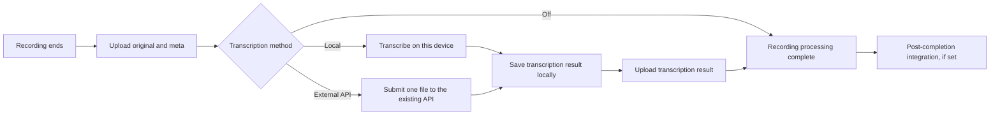

# Fixed recording processing flow: UI/UX · contract · implementation plan

Reference date: **2026-09-24**. Status: **Fixed execution flow, shell UI and Apple adapter implemented. Android · Windows local engines and real-device release verification not done**.

**Follow-up decision:** Post-completion integration is removed from the new settings and plan, and speaker diarization turns on automatically where it is supported.
The speaker diarization toggle and the speaker-count input are not exposed. The current `docs/recly.md` §5 takes precedence over the initial plan and the work log below.
The results of a short transcription check with a real Mac model are recorded later in this document, and are kept separate from long-duration load verification.

**Implementation progress:** A follow-up request to “proceed with all the rest too” lifted the P1 stopping point. After the settings · migration core, the fixed execution plan,
per-recording settings snapshots, the separation of the result cache from upload, a local-only execution path, the phone's 3 tabs, the removal of the watch picker and the desktop settings were connected.
The Apple local analyzer uses a single file and checkpoints at finalized segments. Android · Windows have no engine registered yet that has passed
real-device verification, so they honestly show that local transcription is unsupported. Model downloads, real inference and load tests are not run.

User decision: workflow creation, selection and step editing are removed from the user experience, and the post-recording processing flow is fixed.
Local transcription is provided as the default, and the external API choice and its settings are kept. This document
replaces the product settings, execution wiring and migration parts of the [earlier local transcription plan](2026-09-24-local-transcription-validation-plan.md).
That document's low-heat engine selection, splitting principles and real-device verification still apply.
After the plan was written, the canonical `docs/recly.md`, `spec/` and the shared settings core were updated following the implementation request.
Required feature verification runs as serial builds, and the model downloads, inference and load tests that were stopped are not resumed.

## 1. Product decision

**When a recording ends, the original and the transcription result are organized in the user's Drive. The user only sets the storage location and the transcription method.**


```mermaid
flowchart LR
    A[Recording ends] --> B[Upload original and meta]
    B --> C{Transcription method}
    C -->|Local| D[Transcribe on this device]
    C -->|External API| E[Submit one file to the existing API]
    C -->|Off| H[Recording processing complete]
    D --> F[Save transcription result locally]
    E --> F
    F --> G[Upload transcription result]
    G --> H
    H --> I[Post-completion integration, if set]
```

- The transcription method of a new install is **local**. An existing install migrates the behavior it was using. External API users are not switched to local,
  and transcription is not enabled in bulk for users who only uploaded.
- The transcription choices are **local / external API / off**. The last choice preserves the existing upload-only use.
- After a recording ends, the steps run in the order above. A policy that starts local transcription before the original upload is out of scope this time.
  So while the Drive upload is pending, transcription has not started yet either. The local engine itself needs no network.
- The external API, as before, receives one file that joins the stored parts of the selected track. Local splitting, VAD and overlap are not applied.
  The existing per-provider limit checks, consent and error handling are kept.
- Heavy local computation runs one at a time per device and yields to a new recording. Heat and OS waits resume automatically, and the cause is not shown to the user.
- Post-completion integration is an optional feature and OFF by default. It supports one webhook destination; with transcription off, it is called after the original upload.
  When transcription fails, the success-completion webhook is not sent. Existing multiple and intermediate webhooks are handled by the compatibility policy in §7.
- Settings and keys are per device. The watch only records and transfers to the phone; no server, telemetry or automatic cloud switching is added.
- Automatic summaries, a model comparison UI, engine-internal splitting settings, and a new profile/rule editor are not added.

## 2. Screen structure

The existing Blueprint design is kept, and the information structure of the screens is simplified. The user-visible `Workflows`,
`Add step`, `Workflow in use` and node-graph editing are removed.

| Surface | Plan |
|---|---|
| Android · iPhone | Only Workflows is removed from the existing four tabs, leaving three tabs: **Record / List / Settings**. No separate redesign that merges two tabs |
| Mac · Windows | Recording, the recent list and detail stay in the menu bar/tray. The entry to the workflow window is removed. Processing settings are folded into the settings window |
| Apple Watch · Galaxy Watch | The workflow picker is removed. The timer, start/stop, phone transfer status and pending count stay |
| Widgets · tiles · complications · shortcuts | The existing recording entry points stay, and the dependency on workflow names is removed. Compatible so that old IDs/intents do not break recording or delivery |

### Recording screen

The existing three nodes become **device / transcription / status**. The existing timer, square record button and waveform layout stay.

```text
[ phone ]     [ Transcription: On device  › ]     [ IDLE ]

                     00:00:00
                 [ Start recording ]
```

- The transcription node summarizes the selected method: `On device`, the provider name for an external API, or `Off`.
  Tapping the node goes to the transcription screen in Settings. A provider picker is not duplicated on the recording screen.
- During a recording, the summary of the settings in effect when that recording started is shown read-only. The recorder's state takes precedence over the post-processing state.
- The default screen does not permanently show a diagram of the whole processing flow, the model name · RAM · thermal state, or an API setup checklist.
- The first run starts on the recording screen. Separate onboarding for connecting Drive or preparing a model is not made a required step before recording.
  Existing safety conditions stay: microphone and capture permissions, recording consent, blocking start during a disconnect, and so on.
- Even without a Drive connection, the recording is kept and waits for upload. Once pending work exists, it is resolved in one place, the existing connection notice
  at the top of the list. The same connection notice is not duplicated on the recording screen, the list and a settings banner.
- The default action of an empty list leads to starting a recording. Empty-screen copy that leads to creating a workflow is removed.

### Settings screen

Storage, transcription and integration go into the existing sectioned table. No single giant save button is made for the whole settings page.

```text
Storage
  Google Drive         Connected account / Connect
  Storage folder       recly/…                       ›

Transcription
  Transcription method On device                     ›

Post-completion integration
  Webhook              Not used                      ›

Recording            Existing per-platform capture settings
App                  Existing language · theme settings
Settings management  Export / Import
About                Existing version · build · device ID · open-source notices
```

- The connected Drive row and the disconnect confirmation keep the shared components. The folder row shows the storage location, and editing happens on a separate screen/area.
- The folder of a new install stays `recly/memo/{{yyyy}}-{{MM}}`, the same as the existing seed, so a folder change is not mixed into this redesign.
  The existing path template and minimum recording length move to advanced storage settings. The minimum length of a new install is 0 seconds and is not shown on the default screen.
- The new export in settings management covers the recording processing settings. It does not include key values, Google authentication, model files or in-progress work.
  Before import, it previews the storage location, transcription method and integration destination that will apply. It does not overwrite the existing language, theme or capture settings.
- The selected method and its actual runnability are managed separately. Checking local support, model preparation needed, runnable
  and unsupported are distinguished. Preparation needed offers a prepare action; unsupported offers `Not available on this device` and an action to change the method.
  A permanent unsupported state is not shown as a wait that resumes automatically. Nothing is automatically switched to or automatically sent to an external API.

### Transcription settings

```text
Transcription
  [ On device ]  [ External API ]  [ Off ]

  Only the settings the selected method needs are shown

  [ Cancel ]                             [ Save ]
```

- Mobile uses a settings subscreen; desktop uses the detail area of the existing settings window. The three choices reuse the existing single-select chips/radios.
  At large text sizes they wrap and are not hidden behind horizontal scrolling. The three choices are form controls, not a three-button confirmation dialog.
- **Local:** a verified engine suited to the platform is selected automatically. Ordinary users do not choose the engine, quantization or thread count.
  Language and speaker separation are offered according to what the engine supports. An unidentified speaker is not shown as if it were a real speaker attribution.
- **External API:** the current provider list and order, API keys, supported endpoints, models, languages, speaker separation and speaker-count hints are kept.
  After a provider is chosen, only the fields that provider accepts are shown. Conditional fields, URL templates and validation reuse the existing rules.
  API key input and webhook signing key input reuse the existing secure-storage forms, and no API key generation button is offered.
- **Off:** the engine, key and language forms are hidden. Existing keys and settings drafts are not erased, so choosing a method again does not force re-entry.
- When the model is already prepared, no preparation explanation is permanently attached. When a separate download is needed, the size, preparation state and the needed action are shown.
  Downloading and model preparation also follow the low-heat budget and do not compete with recording.
- Save/Cancel apply to the transcription settings group as a whole. While an external API draft is incomplete, the actual processing method does not change.
  Input errors appear under the relevant row, and focus moves to the first error. If saving fails, the input is kept.
- The current form's protection of unsaved changes is kept. Going back with no changes asks for no confirmation. Switching mobile tabs keeps the draft,
  and back applies only to the current screen. Keys are not tested automatically with API calls, and no audio is test-uploaded.

### Post-completion integration

- By default, only a `Use` choice plus the URL and signing key are offered. When it is not in use, the input form is hidden.
- It is sent once after the transcription result is uploaded; with transcription off, it is sent after the original upload. Retries keep the same event ID.
- A webhook failure does not undo recording or transcription completion. The recording's result in the list stays complete, and the integration problem is shown as a secondary status.
  An integration retry retries only the webhook and does not redo the original upload or transcription.
- The default UI does not expose runner options such as the retry interval, retry count or `onError`.

## 3. Per-recording status and troubleshooting

The settings summary is how recordings will be processed from now on; the status in the list and detail is that recording's actual progress. The two are not mixed.
The existing monospace code badges and localized descriptions stay, and internal codes and log names are not changed because of the UI redesign.

| Actual state | What the user sees and does |
|---|---|
| Uploading the original | Uploading. Only verifiable transferred amounts are shown as progress |
| Running locally / processing at the external API | Transcribing. If the engine does not report overall progress, no made-up % or time remaining |
| Temporarily waiting because of heat, the OS or another recording | Waiting to transcribe. Resumes automatically with no reason, warning or push; no force-run button |
| Text generated, publishing | Uploading result. The local transcript text is readable right away |
| Original and required results uploaded | Complete. Transcription off is also a normal completion and is not shown as an empty-transcript failure |
| Only the webhook is waiting/failed | The recording stays complete. A secondary area shows the integration status and the fix it needs |
| User action needed: Drive authentication or space, keys, model install, etc. | A specific reason and a button that goes to the relevant settings/recovery screen |

- Network errors that clear with retries are retried quietly, as before. Jobs that need the same action are grouped into one notice under the existing rules.
- An API key problem goes straight to that key's form in the transcription settings, and a webhook problem goes straight to post-completion integration. The user does not have to search again from the top of the general settings.
- Recovery destinations are stored with stable identifiers and job/step context. workflowId deep links in notices already issued are also connected, through a compatibility adapter,
  to that job's recovery form. Destinations stay valid after the app quits or the device reboots; if the job has been deleted, the user is clearly directed to the general settings.
- Column widths and wrapping are checked so that even the large `TRANSCRIBING` badge is not clipped on narrow screens. The problem is not hidden by changing the code.
- Original playback and the transcript text in the detail stay. The mobile bottom-pinned player and the desktop top player and split layout stay.
  Playback and scroll positions are not reset because a new result arrives or a webhook completes. The existing copy, time seeking, empty-result and read-failure recovery are also preserved.
- The banners on the list and recording screens are not turned into technical status boards. For transient states with no fixing action, a badge or a short description is enough.

## 4. Design and code conventions to keep

The canonical sources are the Blueprint at `docs/recly.md:1470` and the i18n rules at `docs/recly.md:1184`.

| Item | Rule to keep |
|---|---|
| Color · shape | The existing neutral palette and blue accent, and the distinction between the danger and recording colors. Reuse the radius tokens for the square record node, cards and badges |
| Font · spacing | Platform sans-serif for body text, monospace only for data and code. Multiples of 4 and an 8/16/24 rhythm. No hard-coded fonts, colors or spacing |
| Settings | Use the shared SectionRow/SectionTable/chips/inputs/buttons. Secondary descriptions under rows use the existing small sans-serif, secondary color and spacing |
| Responsive | Support Dynamic Type/user font enlargement, landscape, short heights and keyboard safe areas. No forms clipped by fixed heights |
| Accessibility | Color + text, keyboard focus, screen-reader names and selection states. The existing minimum hit areas of 44 on Apple · Windows / 48 on Android |
| Motion | Only the existing state transitions. Respect system Reduce Motion and high contrast. No new duplicate accessibility toggles in the app |
| Dialogs | Title, short description, at most two actions. Saving is handled inline. No new confirmation dialog for every settings choice |
| Localization | English base / Korean translation. Change Android resources, the Apple String Catalog and Windows properties with the same meaning |
| Code | Identifiers, comments, logs and test names in English; design documents in Korean. Existing `rec.*`, `job.step.*` and `CoreMessage` values are kept |
| Shared logic | Processing plan, validation, migration and status meaning live in KMP. Shells only handle capture, schedulers and display. No unrelated re-splitting of the large ShellModel/MenuModel |

Screen rules that assume workflows are explicitly revised in §9, but the cited section numbers and subsection headings are kept.
Playback, deletion and Drive connection behavior that the user already knows is not redesigned.

## 5. Internal execution structure

Even without user-editable workflows, stored job state, retries, resume after interruption, consent and account binding are kept.

- `RecordingProcessingSettings` (proposed new): per-device storage, transcription method, external API settings, completion integration, revision.
  The new settings document has no step array, no workflow name/selection pointer and no general condition expressions.
- `ProcessingPlan` (proposed new): the fixed execution plan the core builds from the settings. It links the internal state of the original upload, the selected transcription,
  result publishing and the selected webhook. It reuses the existing upload, provider and webhook runners and the retry code.
- Local uses the engine, ComputeAdmission and checkpoints of the earlier plan. It does not run inference while holding the DB dispatcher or a global job lock.
  The completion states of upload, transcription and result publishing are separate, so a publish retry does not rerun ASR.
- Jobs are not created more than once per recording. A design that treats a settings revision change like a new workflowId and creates a new job for the same recording is avoided.
- A local wait keeps the job incomplete. The original-retention sweep and the atomicity of cancel and delete are kept, and late results are blocked by generation.
- A version identifies the new fixed plan versus existing jobs. The existing `workflow_json`, step IDs, outputs and transcription request IDs are not destructively rewritten.
  Removing internal compatibility fields is handled as a change separate from the UI removal.

### When settings apply, and recovery

The following are design choices that make the detailed behavior concrete.

- Phone and desktop fix the processing settings at **the moment recording starts**. The settings save screen says “applies to new recordings”.
  When recording ends, the plan is created from the fixed settings. Even if a crash happens while ending, it is created only once, with the same revision.
- A new watch recording fixes the phone's settings when verified receipt on the phone completes. This scope is written in the watch helper text of the transcription settings.
  New defaults are not applied retroactively to jobs already in the queue, lists brought in from other devices, or past recordings.
- The provider, language, model, speaker requirement, storage destination and webhook destination are fixed to the job. Saving new settings does not change a running job.
- Editing the key value of the same `secretRef` makes retries read the new key. **Editing the settings of that failed job**, such as a wrong endpoint,
  shows what it applies to in the error-resolution path and then makes the edit. If there is a submitted API request ID, it is not resubmitted to a new provider.
  The polling address/authentication and new submission settings are not mixed either.
- An unsupported local job can also, from the recovery screen, choose a processing method again or turn off transcription for that job.
  This applies explicitly only to jobs not yet submitted/run, and shows the target recordings and count. It is distinct from the
  “from new recordings” of a general settings save. Choosing an external API requires the user's explicit save and the existing transfer consent.
- Currently `Executor.liveSteps` overwrites steps with the same ID/type with the latest document (`core/src/commonMain/kotlin/recly/core/job/Executor.kt:232`).
  The new fixed plan does not use this overwrite. Edit and retry compatibility for existing jobs is preserved with a separate adapter.
- If secure storage cannot be read, the key is not treated as missing; the existing error stays. Edits that change the destination re-verify the existing transfer consent.
- If the Drive account changes, existing jobs are not sent to the new account. The capture gate during a disconnect and the existing account-check procedure stay.

## 6. Contract and format changes

- A new `spec/recording-settings.schema.json` and examples are introduced (proposed file name). The first version is 1 and clearly distinguishes local/external/off.
  Only the external API requires provider, secretRef and the related options. The existing workflow schema 1–3 reader stays for migration and old jobs.
  The earlier plan's “add local to an editable workflow schema 4” is replaced by the new settings model.
- The new settings export file is `recly-settings.json`. It does not include real key values. Future versions, unknown fields and corrupt files are not
  overwritten with defaults. A revision conflict on import or edit refuses the save and keeps the draft, as before.
- The existing `workflowId` in `recording.meta`, the Drive appProperties and the required `workflow` field of the webhook payload are not deleted right away.
  Old recordings keep their existing values, and new recordings use a stable compatibility ID/name of the internal fixed plan. This is not shown in the UI.
  Existing fields that external receivers need are not replaced with empty strings. If a field has to be removed, that is done in a separate public format version.
- Webhook event IDs, signatures, transcript file references and account binding are preserved. The post-completion webhook produces a consistent payload even when transcription is OFF.
- Reading transcript v1 stays, and the v2 plan that expresses the local engine's unidentified speakers, time precision and source still applies.
- The related content of `docs/recly.md` §0 ADR-001/007/012/013/016/020/021 and §1/2/3/4/5/8/9/10/11/12/13/14/15/20/21,
  the `AGENTS.md` overview, the install/usage documents and the user help are updated together. Nothing is renumbered.
  External transfer conditions and the model distribution path are reflected in §15 and the relevant privacy documents only to the extent of the actual change.

## 7. Migrating existing installs, jobs and watches

### Device settings

| Existing state | Migration result |
|---|---|
| New install, no existing document | Create new settings: the existing default folder, local transcription, webhook OFF |
| The selected workflow is one Drive + 0–1 transcriptions + 0–1 webhooks at the end, and is equivalent to the fixed behavior | Only the current selection migrates automatically. External API, key reference, folder and minimum length are preserved. OFF if there was no transcription step |
| Multiple transcriptions, multiple/intermediate webhooks, a different on-failure policy, multiple Drives, a configuration without Drive, etc. | A one-time settings migration screen that shows the behavior that would be lost. Does not arbitrarily take only the first step |
| No selection pointer, corrupt document, unsupported version | Keep the original settings and do not start automatic transfer. Resolved in a one-time settings check |

- The convertibility check also covers `includeMeta`, retries · `onError` and template variables. A conversion that drops values is not called “equivalent”.
  `{{workflowName}}` either keeps the meaning of the name at the time or is raised for review. It is not silently replaced with the internal plan name.
- Other workflows that are not saved are not thrown away either. The original document and the selection pointer are kept as a migration backup and can be exported from settings management.
  The existing graph editor is not re-exposed as an “advanced mode” on everyday screens.
- Recordings are kept even during conversion review. Post-processing of new recordings waits until the settings are confirmed, and on confirmation the scope that applies to the waiting recordings is shown.
  The review screen offers only the changes and two actions, apply/cancel. An automatic migration with no changes does not require repeated confirmation.
- The migration-complete mark is written in the same transaction as the settings save, so a rerun is safe. The original JSON and key values are not erased by reserialization.
  App downgrades are not merged automatically, and the revision/version is checked so that changes in different formats do not overwrite each other.

### In-progress jobs and error recovery

- Existing jobs keep their existing order, snapshot, results, retry budget and transfer consent, and run to completion. They are not re-uploaded or re-transcribed.
- The path for editing an existing job's key/URL is a small recovery form for that job instead of the graph. Only the related old definition is edited, and
  the new processing settings are not written over the whole old queue. Even for complex old jobs such as duplicate webhooks, exactly the failed item is edited.
- Old `workflow_json` must still decode after the new processing settings are active. A job that cannot be read keeps its original and
  does not block other jobs from running. The Drive links, detail and deletion of completed jobs also keep working.

### Mixed phone and watch versions

- The new watch UI removes the settings choice but keeps the existing recording metadata and the transfer ACK/retransmission/checksum contract.
- The new phone interprets a recording that carries a workflowId sent by an old watch through the old definition/migration mapping. It does not arbitrarily link it to the new external API settings.
  If the definition cannot be interpreted, the original is kept and waits for a settings check. An unknown ID is not replaced with the new default API choice.
- Recording transfer is also preserved with a new watch and an old phone. The current path, which uses the phone's default selection when the ID is omitted, and the capability exchange are verified.
  Any compatibility summary that is needed stays on the existing wire path, and keys, API settings and models are not sent to the watch.
- Sending summaries for old watches stays only in the protocol compatibility layer. The new watch's UI/ViewModel/settings store does not create list or selection
  state. Even when an old message has to be handled, the handling ends inside the transfer adapter.
- Existing intent/settings IDs of widgets, tiles and complications are handled, and a failure to receive the settings summary does not disable the record button.
- The iPhone's existing `WorkflowEntity` parameter is used in `apple/RecPhone/RecPhoneShared/RecordingIntents.swift:28`.
  New Siri/Shortcuts definitions do not expose a workflow choice. Stored old parameters stay decode-compatible and
  are handled only through a confirmed migration mapping. The ID is not simply ignored and the recording sent to a different external API; if the meaning changes,
  the recording is kept and the user is led to the processing settings check.

## 8. Implementation order and file links

Full implementation and integration verification continue while the result of each step is reported. The order below shows the dependencies.

| Step | Change points | Done criteria |
|---|---|---|
| P0 Settle the contract and screen states | `docs/recly.md:65`, `docs/recly.md:1536`, `spec/workflow.schema.json:1`, new settings schema/examples | The agreement on the fixed flow, migration decisions, when settings apply and screen copy is consistent across the documents and schema |
| P1 Settings · migration core | `core/src/commonMain/kotlin/recly/core/processing/ProcessingSettingsRepository.kt:41`, a separate key in the existing `sync_state` (no DB schema change) | Distinguishes new, equivalent migration, needs review, corrupt and unknown version, and keeps the original even on reruns/concurrent saves |
| P2 Fixed execution plan | `core/src/commonMain/kotlin/recly/core/job/JobService.kt:34`, `core/src/commonMain/kotlin/recly/core/job/Executor.kt:232`, `core/src/commonMain/kotlin/recly/core/job/JobStore.kt:47`, `core/src/commonMain/kotlin/recly/core/ReclyCore.kt:228` | The fixed flow, publish retries and old-job recovery verified with a fake local engine and an external API mock. No duplicate jobs from settings changes |
| P3 Phone settings · recording · error paths | `android/app/src/main/kotlin/app/recly/android/ui/MainActivity.kt:54`, `android/app/src/main/kotlin/app/recly/android/ui/SettingsScreen.kt:238`, `apple/RecPhone/RecPhone/RecPhoneApp.swift:66`, `apple/RecKit/Sources/RecKit/Workflow/WorkflowInspector.swift:94` | Three tabs, transcription settings, the existing key forms, exact recovery destinations for new and existing notices, Siri/Shortcuts parameter migration. First recording → processing confirmed without a workflow |
| P4 Desktop · watch | `apple/RecMac/RecMac/RecMacApp.swift:43`, `windows/app/src/main/kotlin/app/recly/windows/Main.kt:159`, `apple/RecWatch/RecWatch/RecordingView.swift:31`, `android/wear/src/main/kotlin/app/recly/wear/ui/WearRecordingViewModel.kt:26`, `android/datalayer/src/main/kotlin/app/recly/datalayer/WearJson.kt:28` | Window and picker removed; menu/tray, small screens, mixed-version delivery and existing shortcuts kept |
| P5 Real local engine | The earlier local plan's P0 bench safeguards and the Apple/Android/Windows adapters | After fake-engine verification, low heat, cancel and accuracy pass on separate test devices. Kept separate from external API regressions |
| P6 Release cleanup | Per-platform localization, accessibility, settings export/import, install docs, spec examples, skill consumers | The regression and real-device gates below pass. No retired workflow paths in new screens/notices |

P2 is the first runnable core checkpoint, and P3 the first UI/UX checkpoint. The external API path and transcription OFF are checked first so that
settings, migration and execution problems are told apart from model quality/heat problems. The app is not released as finished before real local transcription is ready.

## 9. Verification and release conditions

### UI/UX verification

- On a new install, the first recording can start without creating a workflow name or steps.
- From the status in the list, the user can tell whether a recording is at storage, transcription or integration. Automatic-resume waits are quiet, and real errors have a fix button.
- Switching to an external API → entering the required fields → saving, and a key error → straight to that form → fixing → retrying, both complete without exposing key values.
- The existing draft protection works for cancel before saving, tab switches, back and closing a desktop window. Concurrent edits in two windows do not overwrite each other.
- The prepare/wait/progress/complete/failure screens of each of local, external API and OFF are reviewed with fake states. Long provider names and long Korean errors are checked too.
- The minimum supported screen, landscape and short heights, the largest accessibility font, light/dark, high contrast, Reduce Motion, keyboard and VoiceOver/TalkBack are checked.
  On the watch, the timer, button and transfer status on one screen come first, and no settings-related scrolling or small pickers remain.
- No regressions in existing flows such as original playback, transcript copy, time seeking, automatic detail refresh, 20-row ledger pages and deletion ordering.

### Feature and migration verification

| Case | Expected result |
|---|---|
| Existing Drive-only / external API / equivalent webhook | OFF / the existing API / the existing destination kept, respectively. No silent transcription enabling or API change |
| Multiple or intermediate steps / custom retry · continue / workflowName template | No automatic lossy conversion. Original backup, review, and existing jobs can still run |
| Settings change during a new recording / watch retransmission | Settings revision fixed per recording, one job, no destination change for earlier jobs |
| Provider change during API polling / key edit | Polling of the existing request continues. Key recovery is possible, with no duplicate API submission or charge |
| Original upload failure / result publish failure / webhook failure | Only the failed stretch is retried; the successful recording and transcription are preserved. The webhook keeps its existing event ID |
| Heat · OS wait / new recording / quit · reboot | Local execution yields and resumes; waiting consumes no retries. No notices about the reason |
| Deletion · retention sweep · account change | Incomplete originals kept; no results resurrected after deletion, no publishing to another account |
| Export · import / corrupt or unknown format / migration crash | Key values excluded, settings undamaged, current revision/original document kept, atomic rerun |
| New/old phone and watch / old webhook receivers / lists from other devices | Transfer and payload compatible, recordings kept, no automatic re-transcription |
| Notices from earlier versions / stored Siri · Shortcuts parameters | Notices go to that job's recovery; no external transfer that ignores the old choice; no workflow choice exposed in the new UI |

After implementation, use the Makefile to run `make test`, `make spec` when schemas/examples change,
`make core` then `make mac-test` when core/Apple changes, and `make helper-test` when capture-helper changes.
Simulators are built with `make ios`/`make watch`. UI regression checks and real-device heat and battery verification do not substitute for each other.
Shared fakes live in the existing test-support location, and the same implementation is not duplicated.

Local quality and low heat use V0–V5 of the earlier plan. 30–120 minutes is the **file length** of real recordings; it does not mean that every intermediate length
is tested by force or that the model runs for that long. Only candidates that pass short tests are expanded to representative long recordings.
Unmeasured platforms are not marked as supported. The measurements stopped on the current laptop are not resumed.

## 10. Checks made while writing the plan

- With `rg --files`, `rg -n` and `sed -n`, design §9, the settings · serialization · selection rules, the executor, and the phone, desktop and watch UIs were read.
  It was confirmed that Android/iPhone currently have four tabs, that the existing executor applies the latest step definitions in `liveSteps`,
  and that the webhook payload requires `workflow.id/name`.
- Some initially guessed paths/globs did not exist and failed. Paths were confirmed with `rg --files` and the actual sources before the references in the text were written.
- `python3` static check result: both the new plan and the preceding plan give `whitespace/fences/local links PASS`.
  Source file path and line range check result: `Validated 22 source references.`
- A separate read-only UI review strengthened the Siri parameters, old-notice deep links, the unsupported state and the old-watch summary boundary.
  The suggestion to simply ignore old intent IDs was not adopted; it was settled as a mapping/confirmation path that preserves the existing transfer intent.
- `git status --short` showed only the research documents and the existing `scripts/stt-benchmark/` as untracked. This time only three plan documents
  were written/updated, and no product code, schema or canonical document was changed. No builds, tests, model downloads, inference or heat measurements were run.

## 11. P1 implementation and verification log

After the implementation request, settings storage and migration were implemented as the first checkpoint. The executor's active path, the shell UI and the local model were not changed yet.
Because the existing `sync_state` is reused, no SQL schema migration is needed.

- `core/src/commonMain/kotlin/recly/core/processing/ProcessingSettings.kt:10`: the per-device storage location,
  local/external API/OFF, language · speaker, and the API settings and optional webhook model.
- `core/src/commonMain/kotlin/recly/core/processing/ProcessingSettingsParser.kt:26`: a strict v1 parser that
  reuses the existing provider/URL/template rules. Future versions, unknown fields and explicit nulls are not overwritten.
- `core/src/commonMain/kotlin/recly/core/processing/ProcessingMigration.kt:28`: only schema 3 with identical meaning
  migrates automatically. Source/enable rules that the old schema could lose are left for separate review.
- `core/src/commonMain/kotlin/recly/core/processing/ProcessingSettingsRepository.kt:41`: atomic initialization and
  original backup, revision-compare save, review fingerprint, import/export and read-only subscription.
- `core/src/commonMain/kotlin/recly/core/ReclyCore.kt:86`: exposes only the repository. Initialization and execution wiring are explicit, and
  existing jobs and external API call paths are not switched over.
- `core/src/jvmTest/kotlin/recly/core/processing/ProcessingSettingsTest.kt:25`: 13 tests that use the existing shared
  harness. They verify a new install, preservation of external options, OFF migration, review, corruption, races, import and exclusion of key values.

Commands run and actual results:

```text
/usr/sbin/taskpolicy -b make test GRADLE='./gradlew --offline --max-workers=1 --no-parallel -Pkotlin.compiler.execution.strategy=in-process'
BUILD SUCCESSFUL in 1m 40s
123 actionable tasks: 26 executed, 97 up-to-date

XML result totals: tests=1429, failures=0, errors=0, skipped=0
core 580 / Android app 334 / wear 58 / recording 65 / datalayer 23 / Windows 369

npm_config_offline=true npm_config_audit=false npm_config_fund=false make spec
6 examples, 17 existing workflow checks and 11 new settings checks all OK; exit 0

/usr/sbin/taskpolicy -b make core CORE_GRADLE_ARGS='--offline --max-workers=1 --no-parallel -Pkotlin.compiler.execution.strategy=in-process'
BUILD SUCCESSFUL in 7m 46s
47 actionable tasks: 46 executed, 1 up-to-date
build-core: /Users/rokrokss/rec/apple/RecKit/Frameworks/ReclyCore.xcframework

/usr/sbin/taskpolicy -b make mac-test XCODEBUILD='xcodebuild -workspace apple/Rec.xcworkspace -collect-test-diagnostics never -jobs 1 -parallel-testing-enabled NO'
Executed 501 tests, with 1 test skipped and 0 failures (0 unexpected) in 26.350 (27.637) seconds
** TEST SUCCEEDED **

git diff --check
no output; exit 0
```

On the first JVM run, one test function's return type was not Unit, so JUnit initialization failed. After it was fixed to an explicit Unit,
the full test run above passed. The first schema validation failed because the npm offline cache was missing, so 6 small validation packages were installed.
After that, an Ajv strict-mode conditional expression error was fixed and the schemas were revalidated with the command above. Model downloads, inference and performance/heat benchmarks were
not run. The required builds ran with 1 worker, parallel execution disabled and background QoS.
The Apple build had the existing bundle ID inference, SKIE name collision and AppAuth deprecated API warnings, but no failures.
The RecKit result bundle is `/Users/rokrokss/Library/Developer/Xcode/DerivedData/Rec-hceoraeiiygpllftfieamwnnkyff/Logs/Test/Test-RecKit-2026.09.24_01-53-00-+0400.xcresult`.
`NSProcessInfo.thermalState`, queried several times during the builds, was `0` (nominal). This is a check of the OS state;
it is not a measurement of the device surface temperature or a verification of low heat in local transcription.

This is the record as of P1. With the follow-up request to proceed with everything, the P2 fixed execution plan, the external API/OFF paths and result-publish retries were implemented next,
and §12 below is the implementation record after that follow-up request.


## 12. Implementation log after the request to proceed with everything

The shared execution flow of P2–P4 and each shell's settings and recording UI were connected. For P5 the Apple native adapter was implemented;
selecting and wiring the real inference engines for Android · Windows, and real-device accuracy and heat verification on every platform, remain.
Platforms are not marked as supported before they are verified.

- Per-recording settings snapshot, fixed execution plan, separation of local computation / external API / result publishing, handling of checkpoint · cancel · delete races.
- Phone 3 tabs, desktop settings, watch selector removed. Migration of existing external API · OFF, settings import preview, revision conflict protection.
- Applying new settings runs explicitly only on the failed recording in question. URL and key recovery for earlier jobs is also limited to the per-recording snapshot.
  Changing the endpoint of an API request that was already submitted is refused, and the request ID and the successful upload results are preserved.
- Local running and automatic waiting are shown separately, and forced retry is hidden. Heat/OS wait reasons are not raised as notifications.
- Saving API keys and deleting them individually are connected to the new settings screen. Deletion asks for confirmation first, and the export does not include the values.
- Apple SpeechAnalyzer uses pull-based PCM conversion and final segment checkpoints. The extra frames at the end of the resampler, found with synthetic audio,
  were limited to the output frame count computed from the original length.
- Unidentified speakers in transcript v2 were reflected in the schema, examples and the notes/Notion consumer guidance. The install/usage and privacy notices were updated.
- A pending settings migration and old Watch/Siri IDs that cannot be interpreted are not shown as complete, and the list and detail windows link to the settings.
  Old IDs are brought in only when the user applies the settings saved for that recording. The original metadata is kept and no duplicate job is created.
- No empty speaker suffix is added to the time buttons of transcripts with unidentified speakers. On Apple, new model-preparation requests are blocked during a recording.
  However, shared model assets that were already requested are managed by the OS. Apple explains that the system may retry the install after a connection problem,
  so the app does not claim that its inference-pause policy immediately stops every OS asset install.
  [Apple downloadAndInstall](https://developer.apple.com/documentation/speech/assetinstallationrequest/downloadandinstall%28%29)

Confirmed commands and actual results:

```text
/usr/sbin/taskpolicy -b make test GRADLE='./gradlew --offline --max-workers=1 --no-parallel -Pkotlin.compiler.execution.strategy=in-process'
BUILD SUCCESSFUL in 1m 1s
123 actionable tasks: 15 executed, 108 up-to-date
XML: tests=1439, failures=0, errors=0, skipped=0
core 590 / Android app 334 / wear 58 / recording 65 / datalayer 23 / Windows 369

npm_config_offline=true npm_config_audit=false npm_config_fund=false make spec
7 examples, 17 workflow, 11 settings and 4 transcript v2 checks all OK; exit 0

/usr/sbin/taskpolicy -b make core CORE_GRADLE_ARGS='--offline --max-workers=1 --no-parallel -Pkotlin.compiler.execution.strategy=in-process'
BUILD SUCCESSFUL in 7m 18s
47 actionable tasks: 27 executed, 20 up-to-date
build-core: /Users/rokrokss/rec/apple/RecKit/Frameworks/ReclyCore.xcframework
```

After the old Watch selection expectations and the multi-shell copy dictionary from the first integration run were updated for the new flow, the full JVM test run passed.
The first Apple test found the converter's extra frames, which were fixed; the final Apple test result is below.
No real model download, inference or benchmark was performed. Builds ran one at a time with background QoS.
The OS thermal state query returned nominal (0); this is not a verification of surface temperature or of low heat during transcription.


```text
/usr/sbin/taskpolicy -b make mac-test XCODEBUILD='xcodebuild -workspace apple/Rec.xcworkspace -collect-test-diagnostics never -jobs 1 -parallel-testing-enabled NO'
Executed 502 tests, with 1 test skipped and 0 failures (0 unexpected) in 26.305 (27.430) seconds
** TEST SUCCEEDED **
```

The 1 skipped test is the real microphone smoke test, which needs `REC_MIC_TEST=1` set explicitly. The synthetic PCM conversion and resume-time checks passed.
In the first test, the namespace key of local notifications was fixed, and the test expecting the queue to stop when there is no old default workflow
was changed to the behavior of enqueuing only once with the fixed settings. The result bundle is
`/Users/rokrokss/Library/Developer/Xcode/DerivedData/Rec-hceoraeiiygpllftfieamwnnkyff/Logs/Test/Test-RecKit-2026.09.24_03-33-23-+0400.xcresult`.


A follow-up review strengthened two interruption points in old Watch/Siri ID recovery. Even if the existing receiver passes the original ID again,
the fixed snapshot that was already explicitly saved takes precedence, and even if the app exits right after the snapshot is saved and no re-receipt follows, the recording is not hidden from the recovery list.
On resume it is not switched to global settings that changed later. Recordings adopted from Drive, interpretable old IDs and rows that are still recording are not brought in.

Current platform scope:

| Platform | Implementation/verification status |
|---|---|
| iPhone · Mac | SpeechTranscriber adapter and fixed processing UI implemented. File conversion and mock queue verification done. In the additional verification below, real inference on a short file with the Mac Korean model done. iPhone real-device inference, long recordings, accuracy and heat not verified |
| Android | Fixed processing UI, local computation Worker and external API path implemented. Real local inference engine/JNI and model distribution not implemented |
| Windows | Fixed processing UI and external API path implemented. Real local inference helper and model/accelerator distribution not implemented |
| Both watches | Processing choice removed, recording and phone transfer kept. An explicit recovery path for selection IDs in old metadata is provided |

Checking for a connected Android device, `adb devices -l` returned only the header. No Windows real-device run was done from this Mac either.
So the Android · Windows local engine integration and the acceleration and heat verification on those devices are not claimed as done, and they are not passed through the release gate.

### Final change verification

Below are the results for the final change, which includes old ID recovery, interrupted exits, the unidentified speaker display and the restriction on starting model preparation.
Earlier command results are left above as the work log.

```text
/usr/sbin/taskpolicy -b make core-test GRADLE='./gradlew --offline --max-workers=1 --no-parallel -Pkotlin.compiler.execution.strategy=in-process'
BUILD SUCCESSFUL in 30s
7 actionable tasks: 5 executed, 2 up-to-date
core XML: tests=595, failures=0, errors=0, skipped=0

/usr/sbin/taskpolicy -b make core CORE_GRADLE_ARGS='--offline --max-workers=1 --no-parallel -Pkotlin.compiler.execution.strategy=in-process'
BUILD SUCCESSFUL in 7m 33s
47 actionable tasks: 27 executed, 20 up-to-date

/usr/sbin/taskpolicy -b make -j1 mac-test mac ios watch XCODEBUILD='xcodebuild -workspace apple/Rec.xcworkspace -collect-test-diagnostics never -jobs 1 -parallel-testing-enabled NO' SIM_BUILD_ARGS='-jobs 1 -parallel-testing-enabled NO'
Executed 504 tests, with 1 test skipped and 0 failures (0 unexpected) in 23.050 (24.042) seconds
** TEST SUCCEEDED **
Recly Mac: ** BUILD SUCCEEDED **
iPhone 17 Pro simulator: ** BUILD SUCCEEDED **
Apple Watch Series 11 (46mm) simulator: ** BUILD SUCCEEDED **
```

Apple result bundle:
`/Users/rokrokss/Library/Developer/Xcode/DerivedData/Rec-hceoraeiiygpllftfieamwnnkyff/Logs/Test/Test-RecKit-2026.09.24_04-06-17-+0400.xcresult`.
The skip is the same opt-in real microphone test as above. Real app installation, real-account upload, real transcription, long-recording load and manual accessibility operation were
not part of this automated verification. No new model was downloaded, and the stopped benchmarks were not rerun.

```text
/usr/sbin/taskpolicy -b make test GRADLE='./gradlew --offline --max-workers=1 --no-parallel -Pkotlin.compiler.execution.strategy=in-process'
BUILD SUCCESSFUL in 51s
123 actionable tasks: 9 executed, 114 up-to-date
XML: tests=1446, failures=0, errors=0, skipped=0
core 595 / Android app 335 / wear 58 / recording 65 / datalayer 23 / Windows 370

git diff --check
exit 0, no output
```

The schemas have not changed since the `make spec` result above. The final Apple build log is `/tmp/recly-fixed-final-apple.log`,
the JVM log is `/tmp/recly-fixed-verified-jvm.log`, and the core framework log is `/tmp/recly-fixed-final-core-build.log`.

### Additional verification: Mac model preparation and real transcription

After the user asked for the model to be prepared and the needed work to go ahead, the system Korean assets were prepared and an opt-in test was added that calls the real app's
`LocalSpeechEngine` adapter. Regular tests do not run model downloads or inference.
Instead of a personal recording, a 7.416-second sample made with the Yuna voice of macOS `say` was used.

```text
/usr/sbin/taskpolicy -b say -v Yuna -r 165 -o /tmp/recly-local-speech-smoke.aiff '안녕하세요. 이것은 음성 녹음 테스트입니다. 오늘 회의에서는 다음 주 일정과 준비 사항을 확인했습니다.'

TEST_RUNNER_REC_SPEECH_TEST=1 TEST_RUNNER_REC_SPEECH_PREPARE=1 TEST_RUNNER_REC_SPEECH_AUDIO=/tmp/recly-local-speech-smoke.aiff TEST_RUNNER_REC_SPEECH_EXPECTED='녹음' /usr/sbin/taskpolicy -b make mac-test XCODEBUILD='xcodebuild -workspace apple/Rec.xcworkspace -collect-test-diagnostics never -jobs 1 -parallel-testing-enabled NO -only-testing:RecKitTests/LocalSpeechSmokeTests'

local speech smoke: initial=ready, duration=7.416326530612245
local speech smoke: completed=true, seconds=0.40478629153221846, thermal=0, segments=1, text=안녕하세요. 이것은 음성 녹음 테스트입니다. 오늘 회의에서는 다음 주 일정과 준비 상황을 확인했습니다.
** TEST SUCCEEDED **
```

On the first run, the model state changed from `modelRequired` to `ready` after preparation. Right after that, passing the test's Swift actor
as a Kotlin callback raised an Objective-C associated object error. After the test callback was changed to an `NSObject` guarded by a lock,
the test passed with the result above. The real app uses callbacks generated by Kotlin, so this error is limited to the test's
Swift actor implementation. Reuse of the assets on later runs was also confirmed.

The confirmed scope is that the real model returns text, the final segment checkpoint, valid timestamps and normal completion.
The output replaces `사항` ("matters") with `상황` ("situation"), so accuracy is not judged as done. The 0.4-second figure is the run time of that short synthetic sample,
not a long-recording processing speed or a no-heat guarantee. `thermal=0` is the OS nominal state at the end.

Additional fixes:

- When model preparation succeeds, only `LOCAL_MODEL_REQUIRED` failed steps in the same language resume automatically.
  Completed original uploads, saved progress, later steps, other failures and the Drive-disconnected state are kept.
- Settings show model preparing/prepared, and the state is refreshed on returning to the screen.
  Even when the language is changed quickly, a late response to an earlier query does not overwrite the state of the current language.
- When heat/low-power conditions block the install from starting, the real model state is returned again so the model preparation button does not disappear.
- Even when shared assets already installed by another app are used right away, Recly's language reservation is secured with `AssetInventory.reserve(locale:)`
  just before transcription. Whether a model is installed and the per-app reservation are separate things.
- When switching from an existing external API's automatic/mixed language to Apple local, a supported language is selected and speaker diarization is turned off.
  An already selected Korean/English and the API provider · key reference fields are kept. Before saving, the actual processing settings do not change.

Log: `/tmp/recly-speech-smoke.log`.

Regression verification of the latest code:

```text
/usr/sbin/taskpolicy -b make test GRADLE='./gradlew --offline --max-workers=1 --no-parallel -Pkotlin.compiler.execution.strategy=in-process'
BUILD SUCCESSFUL in 2m 6s
123 actionable tasks: 23 executed, 100 up-to-date
XML: tests=1448, failures=0, errors=0, skipped=0
core 597 / Android app 335 / wear 58 / recording 65 / datalayer 23 / Windows 370

/usr/sbin/taskpolicy -b make core CORE_GRADLE_ARGS='--offline --max-workers=1 --no-parallel -Pkotlin.compiler.execution.strategy=in-process'
BUILD SUCCESSFUL in 7m 30s
47 actionable tasks: 27 executed, 20 up-to-date

TEST_RUNNER_REC_SPEECH_TEST=1 TEST_RUNNER_REC_SPEECH_PREPARE=1 TEST_RUNNER_REC_SPEECH_AUDIO=/tmp/recly-local-speech-smoke.aiff TEST_RUNNER_REC_SPEECH_EXPECTED='녹음' /usr/sbin/taskpolicy -b make -j1 mac-test mac ios XCODEBUILD='xcodebuild -workspace apple/Rec.xcworkspace -collect-test-diagnostics never -jobs 1 -parallel-testing-enabled NO' SIM_BUILD_ARGS='-jobs 1 -parallel-testing-enabled NO'
local speech smoke: initial=ready, duration=7.416326530612245
local speech smoke: completed=true, seconds=0.4760604999028146, thermal=0, segments=1, text=안녕하세요. 이것은 음성 녹음 테스트입니다. 오늘 회의에서는 다음 주 일정과 준비 상황을 확인했습니다.
Executed 506 tests, with 1 test skipped and 0 failures (0 unexpected) in 26.753 (27.765) seconds
** TEST SUCCEEDED **
Recly Mac: ** BUILD SUCCEEDED **
iPhone simulator: ** BUILD SUCCEEDED **
```

The skip is the opt-in real microphone test. Just before this, with the same core,
`make -j1 mac-test mac ios watch` also built all three apps successfully. The changes after that are
the local-mode switching fix and tests for the Apple phone/Mac processing settings; the Watch target sources did not change.
The JVM log is `/tmp/recly-speech-jvm.log`, the core build `/tmp/recly-speech-core.log`,
the build including Watch `/tmp/recly-speech-apple.log`, and the final Apple verification `/tmp/recly-speech-final-apple.log`.

Main implementation locations:

- `core/src/commonMain/kotlin/recly/core/ReclyCore.kt:106`: model preparation and resuming waiting jobs in the same language.
- `core/src/commonMain/kotlin/recly/core/job/JobStore.kt:404`: recovering only that failed step, in a transaction.
- `apple/RecKit/Sources/RecKit/Transcription/AppleSpeechTranscriber.swift:56`: per-app language reservation just before transcription.
- `apple/RecKit/Sources/RecKit/Transcription/ProcessingSettingsView.swift:120`: preparation progress state.
- `apple/RecKit/Sources/RecKit/Transcription/ProcessingSettingsView.swift:363`: normalizing to supported options when switching from an external API to local mode.
- `apple/RecKit/Tests/RecKitTests/LocalSpeechSmokeTests.swift:12`: opt-in verification with the real adapter and the OS model.

Install and launch check:

The temporary Debug install was signed with a local certificate different from the existing install's, so it waited on SecurityAgent authentication
for login keychain access. Without entering a password or deleting credentials, the temporary request was declined, and the latest app was rebuilt
with the same Developer ID as the existing install. The first build, which specified only the certificate, failed because the SwiftPM
resource bundle had no team; the command below, which specified the team and manual signing together, succeeded.

```text
/usr/sbin/taskpolicy -b make mac XCODEBUILD='xcodebuild -workspace apple/Rec.xcworkspace -collect-test-diagnostics never -jobs 1 -parallel-testing-enabled NO CODE_SIGN_IDENTITY=F28FEB1373DC6357F762A1750B40711E4DA8A09A DEVELOPMENT_TEAM=87G5R48C73 CODE_SIGN_STYLE=Manual'
Signing Identity: "Developer ID Application: Hyungrok Kim (87G5R48C73)"
** BUILD SUCCEEDED **

codesign --verify --deep --strict /Applications/Recly.app
exit 0, no output

cua-driver launch_app '{"name":"Recly"}'
bundle_id: app.recly.mac, pid: 32477, running: true, active: false

/usr/bin/log show --last 5m --info --style compact --predicate 'process == "Recly" AND (eventMessage BEGINSWITH "shell.ready" OR eventMessage BEGINSWITH "shell.failed")'
2026-09-24 06:41:52.264 I Recly[32477:568f475] [app.recly.mac:shell] shell.ready device=<private> dataDir=<private> workflows=0 recovered=0

ps -p 32477 -o pid=,comm=
32477 /Applications/Recly.app/Contents/MacOS/Recly
```

The designated requirements of the existing app and the new app were confirmed to match exactly. The original app and DB were
kept in `~/Library/Caches/recly-before-speech-rvwpwqb6`, and the verified app was staged and then swapped in.
After relaunch there was no SecurityAgent window, and the app's AX response was also confirmed. The 1-pixel helper window of the hidden menu bar app
cannot be captured in a screenshot, so startup was verified with AX and the `shell.ready` log.
Real upload, account re-sign-in and full manual operation of the screens were not done.

A read-only check of the DB showed recordings `finalized|4`, 0 jobs, and the processing settings
kept as `processing/settings|external|auto`. The existing user's external API choice was not changed automatically.
Local transcription is selectable, and no separate model file is bundled with the app.

The final signed build log is `/tmp/recly-speech-signed-mac.log`, and the launch log is `/tmp/recly-speech-launch.log`.
`git diff --check` passed with exit 0 and no output.
