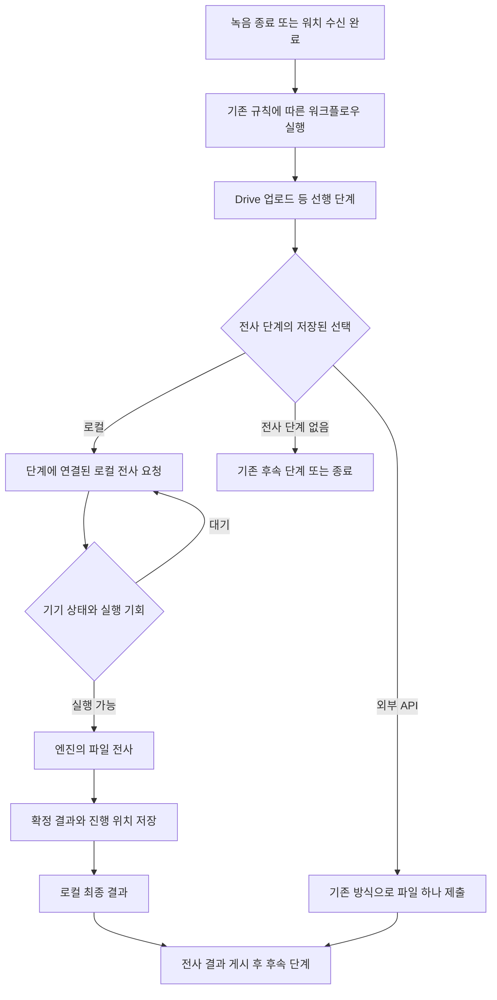

# 전사 워크플로우의 로컬 옵션: 검증·구현 계획

기준일: **2026-09-24**. 상태: **계획 완료, 제품 구현 전**.

**후속 결정:** 사용자 대면 워크플로우를 제거하는
[고정 녹음 처리 흐름 계획](2026-09-24-fixed-recording-flow-plan.md)이 이 문서의 제품 설정·실행 연결·이관 계획을 대체한다.
아래의 워크플로우 유지 전제는 이전 결정의 기록이다. 저발열 제어, 로컬 분할 원칙, 엔진 후보와 실기기 검증은 계속 적용한다.

이 문서는 9월 23일 아키텍처 계획의 실행 정책·모델 선정 순서·검증 순서를 대체한다.
사용자 정정 반영: 로컬은 새 전사 단계의 기본 선택 옵션이다. 워크플로우 밖의 자동 전사 설정은 도입하지 않는다.
현재 제품 계약인 `docs/recly.md`와 `spec/`는 아직 변경하지 않았다.
이번 작업은 문서·소스·기존 로그 읽기와 계획 작성에 한정한다. 사용자가 중단시킨 노트북의
모델 추론·다운로드·부하 시험을 재개하지 않는다. 장시간 시험은 별도의 시험 기기 확보 후 진행한다.

## 1. 목표와 확정할 구조

**전사 워크플로우를 만들거나 전사 단계를 추가할 때 로컬을 기본 선택한다. 기존 외부 API도 계속
선택·설정할 수 있다. 로컬 엔진은 체감 발열과 녹음 안정성의 제약을 통과한 구성 중 정확도가
가장 높은 것을 선택한다. 구현 난이도는 선정 기준에서 제외한다.**

- 대상: 짧은 음성 메모, 한국어·한영 혼용 대화, 30~120분 회의 파일.
- 실행은 기존처럼 녹음 종료 후 선택한 워크플로우의 단계 순서를 따른다. 실시간 자막과 녹음 중
  선행 추론은 이번 범위에 넣지 않는다. 전사 단계가 없는 녹음에는 전사 작업을 만들지 않는다.
- 다른 녹음이 시작되면 진행 중인 로컬 추론도 양보한다. Watch는 녹음·전송하고 폰이 전사한다.
- 기본값은 새 전사 단계의 처리 방식에만 적용한다. 별도의 앱 전체 자동 전사 ON/OFF는 만들지 않는다.
  로컬 단계는 열·OS 실행 기회·모델 준비로 기다릴 수 있다. 자동으로 재개되는 일시 대기는
  일반적인 ‘전사 대기 중’으로 표시하고 원인은 노출하지 않는다.
  사용자 조치가 필요한 경우에만 이유와 필요한 행동을 표시한다. 계속 대기만 하는 구성도 성공으로 보지 않는다.
- 로컬 추론의 내부 처리와 결과 게시는 분리하되, 기존 워크플로우의 실행 조건과 순서는 유지한다.
  외부 API를 선택한 단계는 해당 API만 실행한다. 로컬로 자동 변경하거나 두 경로를 중복 실행하지 않는다.
- 전사 1회를 기본으로 한다. 다른 ASR로 전체 파일을 다시 전사하는 다중 패스는 기본값에서 제외한다.
- 요약은 기존처럼 사용자 워크플로우/에이전트의 역할이며 앱 내 LLM을 새로 넣지 않는다.

선정 순서: **원본·취소·재개 안정성 → 체감 발열/자원 예산 → 정확도 → 에너지·완료 시간**.
빠르지만 뜨거운 구성과 시원하지만 실용적인 시간 안에 끝나지 않는 구성을 모두 걸러낸다.

### 사용자 확인을 반영한 제품 동작

새 단계의 기본 선택과 저장된 워크플로우의 실행을 구분한다. 기존 사용자의 워크플로우를 바꾸지 않는다.

| 생성·실행 조건 | 동작 |
|---|---|
| 새 전사 워크플로우 생성 / `transcribe` 단계 추가 | 처리 방식의 초기 선택은 로컬. 외부 API로 변경·설정 가능 |
| 저장된 로컬 `transcribe` 단계 실행 | 해당 단계에 연결된 로컬 작업을 실행. 단계 재시도는 진행 상태/결과를 재사용 |
| 저장된 외부 API `transcribe` 단계 실행 | 선택한 provider와 설정으로 기존 외부 API 경로만 실행 |
| 워크플로우 선택 없음 / 선택한 워크플로우에 전사 단계 없음 | 전사하지 않음 |
| 기존 외부 API 워크플로우 편집·가져오기·업데이트 | 기존 선택, 모델, API key 참조와 지원되는 endpoint 설정 유지 |
| 다른 기기의 녹음을 Drive에서 목록에 가져옴 | 자동 재전사하지 않음 |

기존 기본 워크플로우 선택과 자동 실행 규칙을 유지한다. 과거 라이브러리를 일괄 처리하지 않는다.
기본 선택은 새 단계의 UI 초기값이며, 기존 JSON의 누락·오류를 로컬 선택으로 조용히 보정하지 않는다.
처리 방식·조건·언어·화자 분리 요구는 기존 workflow job/step snapshot에 연결한다. 뒤늦은 편집이
이미 실행 중인 작업을 다른 엔진으로 바꾸지 않게 한다. 워치 녹음도 검증된 수신 후 기존 실행 규칙을 따른다.
로컬 요청은 workflow job/step + 원본 revision에 묶어 중복 재개를 방지한다. 사용자가 별도로 정의한
전사 단계들은 유지하며, 전역 자동 전사나 별도 암묵적 요청과 합치는 구조는 만들지 않는다.

## 2. 지금 확인된 것과 아직 확인하지 못한 것

### 기존 시험의 유효 범위

- 환경: M4 Pro 24 GB, macOS 26.6.2. 스마트폰·Windows 실기기 결과가 아니다.
- 입력은 한국어 FLEURS 150개 + HiKE 150개 + 무음 대조군 2개, 합계 약 49분이다.
  **49분 연속 회의 한 개를 처리한 시험이 아니다.**
- 기존 JSONL을 읽어 확인: Apple Speech, Qwen 1.7B, Qwen 0.6B 각각 302개 결과, 기록된 오류 0개,
  프로세스 exit 0. 프로세스 시간은 각각 26.21초, 129.74초, 68.03초다.
- 전력·표면 온도 측정이 없고 준비 작업과 다른 앱의 부하도 있었다. 위 시간으로 저발열 순위,
  스마트폰 배터리, 긴 회의 완료 시간을 결론 내리지 않는다. Whisper Turbo 이후 비교는 미완료다.
- 사용자 발열 보고로 시험을 중단했다. 기존 출력은 보존하고, 미완료 실행을 완주한 비교표에 섞지 않는다.

### 재사용할 참고와 적용 한계

| 근거 | 이번 계획에서 쓰는 범위 |
|---|---|
| [Whisper 내부 30초 창](https://github.com/openai/whisper#python-usage) | 긴 파일 입력과 모델 내부 구간 처리는 양립함 |
| [WhisperKit 파일 API](https://github.com/argmaxinc/argmax-oss-swift/blob/main/Sources/WhisperKit/Core/WhisperKit.swift) | 점진적 파일 로딩과 제한된 버퍼. 이것만으로 발열이 제어되지는 않음 |
| [Argmax 배터리 모드](https://app.argmaxinc.com/docs/examples/real-time-transcription) | 실시간 모드의 참고 정책. 파일 전사에 이미 적용된 저발열 기능으로 취급하지 않음 |
| [murmur·Edge-Veda·Tapeback·bestASR 조사](2026-09-23-low-heat-transcription-references.md) | 열 제어·대기·시작 시 모델 선택의 부분 구현. 그대로 도입하는 완성품은 아님 |

## 3. 외부 API의 파일 제출과 로컬 엔진의 문맥·중단 방식

### 외부 API — 기존 파일 제출 유지

외부 API는 기존처럼 선택한 트랙의 저장 파트를 필요한 경우 합쳐 **파일 하나로 제출**한다.
로컬 엔진의 입력 창·문맥·재개를 위한 분할이나 열 제어를 외부 API 요청에 적용하지 않는다.
기존 provider별 길이·크기 제한 검증과 오류 처리는 유지하고, 초과 시 자동 분할을 새로 도입하지 않는다.
현재 경로: `core/src/commonMain/kotlin/recly/core/transcribe/TranscribeRunner.kt:83`에서 합친 파일을 준비하고,
`core/src/commonMain/kotlin/recly/core/transcribe/TranscribeRunner.kt:282`에서 한도를 검증한다.

### 로컬 엔진 — 장문 파일 처리를 우선

원본 파일과 사용자가 보는 전사 작업은 각각 하나로 유지한다. 녹음 저장 파트, 오디오 로딩 버퍼,
모델 입력 창, 재개를 위한 처리 구간을 별개로 다룬다.

1. 짧은 메모는 엔진의 파일 전사 API에 그대로 전달한다.
2. 긴 파일은 **엔진의 장문 처리와 문맥 유지 기능을 우선**한다. 모든 모델에 고정 10~30초 분할을 강제하지 않는다.
3. 엔진 입력 한도나 제어/재개 API의 한계 때문에 앱 분할이 필요할 때만 적용한다. 발화 경계·문맥 길이·
   타임스탬프를 이용하고 필요한 겹침만 둔다. 경계 누락·중복·용어 일관성을 별도로 평가한다.
4. 엔진의 확정 결과와 원본 sample 범위를 저장한다. 결과의 구간 타임스탬프만으로 내부 상태까지 복원할 수
   있다고 가정하지 않는다. 지원하지 않는 엔진은 안전한 경계부터 제한된 오디오를 다시 처리한다.
5. 처리 결과는 원본 시간축에 놓는다. 파트별 AAC padding, 녹음 gap, mic/system 트랙 동기화를 유지한다.
6. 화자 분리 요청은 녹음 전체의 화자 일관성을 검증한다. 조각마다 `S1`을 새 사람처럼 붙이지 않는다.

앱 분할은 품질 향상의 전제가 아니다. 전체 파일 API와 앱 분할 방식의 차이는 같은 엔진·파일로 측정한다.
겹침·VAD를 추가해 생기는 재연산도 전력에 포함한다. **분할만 하고 계속 실행하면 발열 제한이 되지 않는다.**

## 4. 저발열 실행 제어

### 기본 정책

- 한 기기에서 무거운 로컬 추론은 한 작업만 실행한다. ASR·화자 분리·정렬도 같은 계산 슬롯을 사용한다.
- 시작 전에 녹음 여부, OS 실행 권한, 열 신호, 저전력 모드, 메모리와 모델 준비를 확인한다.
- 처음부터 검증된 보수적 실행 프로필로 시작한다. 뜨거워진 뒤에만 제한하는 방식을 기본으로 하지 않는다.
- 엔진이 지원하는 효율 설정과 순차 실행을 우선한다. 짧게 최대 부하로 돌리고 고정 시간 쉬는 방식이
  최선이라고 가정하지 않는다. 효율 실행과 구간 대기의 에너지·온도·완료 시간을 함께 비교한다.
- 처리 중 열 상승이나 새 녹음을 감지하면 새 추론을 중지하고 안전하게 대기한다. 중지할 수 없는 엔진은
  자동 실행 후보에서 제외하거나, 제어 가능한 구간 입력이 품질 검증을 통과한 경우에만 사용한다.
- 정상 회복을 일정 시간 확인한 뒤 한 단계씩 재개한다. 중지·재개가 빈번한 경우 실행 프로필을 낮춘다.
- CPU 우선순위를 낮췄다는 사실을 GPU/NPU 소비전력 제한으로 해석하지 않는다. GPU가 뜨거우면 CPU로
  바꾸어 계속 돌리는 자동 전환도 기본 정책으로 두지 않는다.
- 매 구간마다 모델을 내려서 다시 올리지 않는다. 짧은 대기와 긴 대기의 메모리 유지 정책을 구분하고 측정한다.
- 충전 중이라는 이유만으로 제한을 해제하지 않는다. 열 신호가 없는 기기는 검증된 시간·연산 예산을 쓰며,
  검증된 프로필도 없으면 자동 고부하 실행을 보류한다. `unknown`을 `normal`로 바꾸지 않는다.

### 플랫폼별 제어 지점

| 플랫폼 | 우선 검증할 제어 | 한계·확인 항목 |
|---|---|---|
| iPhone/Mac | SpeechAnalyzer 작업 우선순위, 열 상태 알림, 취소 API, Core ML/ANE 경로 | 우선순위는 전력 상한이 아님. 시스템 서비스까지 계측. OS 26/27을 별도 검증 |
| Android | Thermal API, 기기별 검증된 NPU/CPU 실행 프로필, 네트워크 불필요 계산 Worker | 열 여유 API 미지원/NaN 처리, OEM 작업 제한, 실제 NPU 배치와 CPU fallback 확인 |
| Windows | 별도 추론 프로세스, CPU EcoQoS, 지원 NPU EP의 효율 힌트, 실행 시간 예산 | 범용 표면 온도 API를 가정하지 않음. 드라이버/EP별 효과 확인 |

Apple `SpeechAnalyzer.Options.priority`는 OS 26부터 있고 대부분의 처리 우선순위에 영향을 준다.
호출 Task도 같은 의도를 사용한다. `ignoresResourceLimits`는 **OS 27부터**인 별도 속성이며,
사용할 수 있는 환경에서도 저발열 경로에서 시스템 제한을 무시하도록 설정하지 않는다.
[priority](https://developer.apple.com/documentation/speech/speechanalyzer/options/priority)
· [resource limits](https://developer.apple.com/documentation/speech/speechanalyzer/options/ignoresresourcelimits)

Android의 열 여유 조회는 공식 권장 빈도를 지킨다. 모든 제조사가 동일하게 보고한다고 가정하지 않는다.
[Thermal API](https://developer.android.com/games/optimize/adpf/thermal)

Windows는 CPU EcoQoS와 NPU 세션의 `ep.dynamic.workload_type=Efficient`를 구분하고 성공 반환값과 실제
효과를 확인한다. 자동으로 모든 GPU/NPU 전력을 제한하는 옵션으로 취급하지 않는다.
[Windows ML 효율 가이드](https://learn.microsoft.com/en-us/windows/ai/new-windows-ml/efficiency-tips)

## 5. 검증 계획: 제어기부터, 긴 파일은 마지막

### 시험 순서와 통과 조건

| 단계 | 시험 | 다음 단계 진입 조건 |
|---|---|---|
| V0 — 추론 없는 제어 시험 | 가짜 엔진·시계·열 신호로 대기/재개/취소/삭제/OS 만료/모델 없음 재현 | 대기 중 새 추론 0회, 재시도 예산 소모 없음, 결과 중복·삭제 후 부활 없음 |
| V1 — 단일 짧은 파일 | 시험 기기에서 후보 1개씩 10~30초 음성. 초기 실행 전체 상한 60초 | 정상 출력, 오프라인 실행, 취소 후 실제 연산 정지, 측정 가능한 자원 프로필 |
| V2 — 작은 정확도 세트 | 한국어·혼용·고유명사·숫자·작은 목소리·무음의 고정 소규모 세트 | 오류 유형을 확인하고 열 예산 안에서 경쟁 가능한 후보만 남김 |
| V3 — 파일 처리 방식 비교 | 5분 연속 파일로 엔진 기본 방식 대 필요한 경우의 앱 분할 비교 | 경계 누락/중복 없음, 품질 저하 한도 통과, 중지 후 제한된 재처리 |
| V4 — 긴 파일 처리 | 별도 시험 기기에서 30~120분 길이의 실제 녹음 파일 중 대표 길이를 선정하고, 앞선 시험 통과 후 확대 | 체감/표면 온도·소비 에너지·완료 시간·완료율·화자 일관성 통과 |
| V5 — 제품 통합 | 모델 설치부터 녹음 종료·전사·Drive 게시·웹훅·삭제까지 | 네트워크 단절/화면 잠금/프로세스 종료/재부팅에서도 정합성 유지 |

**이 노트북에서는 V1~V4를 재개하지 않는다.** V0 코드 작성과 실제 시험 실행은 다음 구현 작업이다.
30~120분은 입력 녹음 파일의 길이이며 실제 추론 실행 시간이나 앱 분할 길이가 아니다.
모든 중간 길이를 반드시 시험하는 것은 아니다. 로컬 장문 시험과 외부 API 회귀를 구분한다.
기기·센서가 없어서 측정하지 못한 항목은 `미측정`으로 남기고 다음 단계 합격으로 처리하지 않는다.
장시간 파일을 처리하더라도 기기가 뜨거워지도록 의도적으로 계속 돌리는 스트레스 시험은 하지 않는다.
중지 조건을 처음 만족하면 종료하고 그 실행을 미통과로 기록한다.

### 측정 설계

- 같은 기기에서 유휴/일상 사용 기준선, 녹음만, 전사, 녹음+전사 요청 대기의 조건을 분리한다.
  실시간 자막은 비교 대상에 넣지 않는다. 다른 앱 부하를 기록하고 정상 사용자 앱을 강제 종료하지 않는다.
- 실내 온도, 케이스, 화면 밝기/잠금, 전원 연결, 배터리 범위, OS, 드라이버, 엔진·모델 hash를 고정/기록한다.
- 표면 온도는 고정 위치 외부 센서로 측정한다. OS thermal state는 보조 신호이고 피부가 느끼는 온도가 아니다.
  휴대폰 배터리 온도를 표면 온도라고 보고하지 않는다.
- 전력은 계측 도구/시험 장비로 측정하고 가능하면 기준선 차이도 함께 기록한다. 충전 중 소비전력을
  배터리 방전량으로 환산하지 않는다. 총 에너지는 작업 시작부터 대기·재로딩·완료 후 정리까지 포함한다.
- 시간은 대기 시간과 실제 처리 시간으로 나눈다. 빠르기만 한 처리 시간을 전체 사용자 대기 시간으로 쓰지 않는다.
- Apple 시스템 STT 서비스와 네이티브 helper의 자원도 포함한다. 앱 RSS 하나로 엔진 메모리를 비교하지 않는다.
- 후보 순서를 바꾸고 기준선으로 회복한 다음 반복한다. 모델 설치/컴파일과 정상 전사를 분리해 측정하고,
  최초 설치·콜드 스타트의 부담도 별도 보고한다. 준비 작업을 다른 엔진 시험과 겹치지 않는다.
- 정확도는 고정 정답과 동일 정규화로 CER, 한국어/영어 혼용 오류, 숫자·고유명사 오류를 본다. 무음 환각은
  따로 집계한다. 실패·취소·누락은 0% 오류율로 처리하지 않는다.
- FLEURS/HiKE는 짧은 발화 선별용이다. 장문 평가에는 자연스러운 연속 회의와 실제 경계 사례가 필요하다.
  짧은 파일을 이어 붙인 자료는 내구성 시험으로만 쓰고 자연 회의 정확도라고 보고하지 않는다.
- 장문은 회의 단위로 분리해 튜닝/평가 데이터 중복을 막는다. 같은 문장/화자 반복을 독립 표본처럼 세지 않는다.
  HiKE의 기존 자체 지표는 공식 평가 점수와 구분하고, 한국어/영문 표기 손실을 각각 기록한다.

### 수치 기준 초안 — 검증된 성능 수치가 아님

체감 발열을 검증 가능하게 하기 위한 **초기 제품 목표**다. 결과가 나쁘다고 사후에 기준을 느슨하게
바꾸지 않는다. 기기별 측정 불확실성과 사용자가 느끼는 온도를 함께 확인한 뒤 출시 기준으로 확정한다.

| 항목 | 초기 판정 기준 |
|---|---|
| 표면 온도 | 통제된 실내 조건에서 같은 사용 기준선 대비 최대 상승 2°C 이내를 목표. 사용자가 뜨겁다고 느끼면 수치와 관계없이 미통과 |
| 시험 중 열 신호 | Apple `fair` 이상 또는 Android 열 압박 초기 신호에서 추가 추론 보류를 검증. 재개 기준은 더 보수적으로 설정 |
| 팬/사용감 | 전사 때문에 지속적인 팬 소음이나 UI 끊김이 새로 나타나면 미통과 |
| 취소/새 녹음 | 새 추론 요청은 즉시 차단. 실제 연산 종료 목표 2초, 초기 허용 상한 5초. 시스템 서비스까지 확인; 못 지키는 엔진은 자동 실행 후보 제외 |
| 분할로 인한 정확도 변화 | 같은 엔진 기본 파일 처리 대비 CER 악화 0.5%p 이내를 초기 비열등성 한도로 사용. 신뢰구간이 넓으면 결론 보류. 단어 누락/중복 사례는 별도 해결 |
| 완료 지연 | 실행 기회가 연속으로 주어진 조건에서 총 완료 시간/오디오 길이 ≤1을 1차 실용성 목표로 둠. OS가 실행을 허용하지 않은 시간은 별도 표시하되 실제 사용자 지연에도 포함 |
| 배터리·전력 | J/음성 분, 지속 평균·최대 전력, 기준선 대비 방전량을 모두 기록. 측정 없이 일률적인 W 또는 % 보장은 하지 않음 |

2°C나 5초는 OS 보장값/기존 측정값이 아니다. 시험의 목표와 중단 조건이다. 기기가 이미 따뜻하거나
고부하이면 정상 시작 조건이 성립하지 않는다. 상한을 넘어도 끝까지 실행해서 평균을 좋게 만드는 시험은 금지한다.

### 플랫폼별 후보와 시험 기기

| 플랫폼 | 첫 비교 후보 | 확장 조건 |
|---|---|---|
| iPhone/Mac | 지원되는 SpeechTranscriber 파일 전사, WhisperKit/Core ML의 한국어 지원 모델 | 둘이 요구 정확도를 못 채우면 Qwen 계열의 가속 경로 추가. MLX/GPU를 기본 우승자로 두지 않음 |
| Android | 한국어 지원 Whisper 계열의 검증 가능한 NPU 경로, Qwen 0.6B 양자화의 지원 런타임 | CPU/NPU 실제 실행을 구분. 1.7B 등 큰 모델은 작은 후보의 품질이 부족하고 열 예산을 통과할 여지가 있을 때 추가 |
| Windows | 호환되는 한국어 모델의 Windows ML/ONNX Runtime NPU 경로, 효율 설정을 적용한 CPU 경로 | NPU에서 지원하지 않는 모델을 억지로 지원한다고 표시하지 않음. GPU 후보도 같은 열 기준을 통과해야 함 |
| Watch | 폰 수신 후 전사 | 워치 ASR은 이번 범위 아님 |

각 플랫폼에서 한 번에 1~2개 후보로 시작한다. NPU라고 반드시 저발열인 것은 아니다.
Android는 Snapdragon·Exynos·MediaTek/Tensor 중 지원을 주장할 SoC, 주력·중급 RAM 계층을 나눠 검증한다.
Apple은 지원 최저 등급 iPhone, 주력 iPhone, 팬 없는 Mac과 팬 있는 Mac을 구분한다.
Windows는 NPU 없는 CPU 노트북, 지원 NPU 기기, GPU 기기를 구분한다. 제품이 지원할 OS 버전과
업데이트 전후를 포함하고 시뮬레이터 결과로 실기기 전력 검증을 대신하지 않는다.
검증되지 않은 기기는 설치된 작은 모델을 무조건 실행하지 않고 기능 준비/지원 상태를 표시한다.

## 6. 구현할 구성

워크플로우를 선택하지 않은 녹음에는 이 전사 경로가 생기지 않는다.
대기 화살표는 polling busy loop가 아니라 OS/기기 상태 이벤트와 지연 재예약이다.

### 공통 코어와 네이티브 엔진

- `LocalTranscriptionEngine`(신설 제안): 지원 언어, 장문 입력, 확정 결과, 취소 한도, 재개 방식,
  모델/런타임 revision, 실제 가속기 경로를 선언한다. 공통 코어에 PCM 프레임을 계속 복사하지 않는다.
- `LocalTranscriptionService`(신설): 실행 가능한 로컬 `transcribe` 단계가 요청한 작업을 유지한다.
  workflow job/step, 원본 revision, 요구 설정을 연결하며 녹음 종료 이벤트에서 독립 작업을 만들지 않는다.
  추론은 DB dispatcher/전역 작업 lock 밖에서 실행한다. 결과 반영은 짧은 트랜잭션으로 한다.
- `ComputeAdmission`(신설): OS 실행 권한과 기기 자원 프로필로 실행/대기를 결정한다.
  기존 `TranscriptionPolicy`는 클라우드 지역 정책이므로 다른 책임을 섞지 않는다.
- `ModelStore`(신설): 모델 준비·checksum·원자적 설치·오류 복구를 담당한다. 모델 설치와 추론을
  동시에 경쟁시키지 않는다. 시스템 모델은 해당 플랫폼의 asset 관리 API를 사용한다.
- `TranscriptRepository`(신설): 확정 구간, 최종 revision, 원본 시간축, 결과 provenance를 관리한다.
  로컬 READY는 Drive 로그인/게시 여부와 독립적으로 조회할 수 있어야 한다.

DB에는 request, resume position, result revision, publication 상태를 분리한다. 큰 PCM/텐서는
`step_run.state_json`에 넣지 않는다. 재개 상태에는 source/model/options hash와 완료 범위를 포함한다.

작업 상태는 `QUEUED → RUNNING → READY`, 또는 이유가 있는 `WAITING`, `FAILED`, `CANCELLED`로 구분한다.
WAITING의 이유는 model/thermal/recording/OS/power 등이며 실패 재시도 횟수를 소비하지 않는다.
프로세스 종료로 남은 RUNNING은 lease를 회수해 재개 가능한 상태로 돌린다. 늦게 도착한 결과는 실행
generation과 원본 revision이 일치할 때만 저장한다. 부분 결과를 최종 결과로 게시하지 않는다.

### 대기 상태의 사용자 표시

- 열 상태·OS 실행 기회·다른 녹음 때문에 자동 재개를 기다리는 동안에는 ‘전사 대기 중’만 표시한다.
  세부 원인, 경고, 토스트, 푸시 알림을 추가하지 않는다. 조건이 회복되면 사용자 조작 없이 재개한다.
- 대기 원인은 내부 스케줄링·복구·진단용 상태로 보존한다. 내부 상태 변화마다 화면 문구를 바꾸지 않는다.
- 모델 설치 동의, 권한 설정, 공간 확보 등 사용자 조치가 필요한 경우에만 원인과 해결 행동을 표시한다.
  자동으로 해결될 일시 대기와 실제 실패·지원 불가를 구분하고, 후자를 일반 대기로 숨기지 않는다.

### 업로드·기존 워크플로우와의 호환

- 로컬 전사도 기존 `transcribe` 단계의 처리 방식으로 실행한다. 기존 Drive-only/webhook 워크플로우에
  전사를 추가하지 않는다. 로컬 처리 결과는 기기에 먼저 저장하고 게시 재시도에 재추론하지 않는다.
- 워크플로우 schema 4에 `transcribe`의 local/cloud 분기를 명시하는 방안을 구현한다.
  로컬 분기는 API key/secretRef를 요구하지 않는다. 외부 API 분기는 기존 provider·모델·비밀 참조·
  지원되는 endpoint 설정과 검증을 유지한다. 기존 cloud JSON은 의미를 보존해 읽는다.
- **로컬 transcribe 단계도 기존과 같이 Drive 단계 뒤에서 실행한다.** 녹음 종료 시 별도 선행 계산을
  예약하지 않으며, 기존 실행 순서와 조건을 유지한다. 새 workflow DAG나 전역 자동 실행 정책을 만들지 않는다.
- 로컬 추론 자체는 네트워크가 필요하지 않다. 실행 가능한 로컬 단계의 내부 계산·재개와 결과 게시는 분리해
  불필요한 네트워크 제약을 피한다. 다만 선행 Drive 업로드가 미완료인 워크플로우가 오프라인에서도
  전사까지 실행된다고 보장하지 않는다. `runDueJobs`의 원격 동기화와 플랫폼별 네트워크 제약은 이 범위에서 분리한다.
- 해당 로컬 단계 뒤의 webhook은 게시 성공한 최종 revision만 참조한다. 결과 게시가 실패해도 로컬
  결과는 읽을 수 있고, 재시도 때 ASR을 다시 실행하지 않는다. 게시 대상 Drive 계정도 고정/검증한다.
- schema 1~3 로컬 저장/가져오기, 진행 중 cloud 작업 snapshot, 옛 클라이언트의 새 schema 거부를 시험한다.

### 원본 보존·삭제·결과 계약

- 로컬 계산·대기·결과 게시는 해당 workflow step이 미완료인 동안 수행한다. 기존의
  ‘모든 workflow DONE + 업로드 성공 + 7일’ 보관 판정과 연결해 원본 보호를 유지한다.
  네이티브 계산이 진행 중인데 단계만 DONE이 되는 상태를 금지하고, 취소·삭제와 원본 사용을 원자적으로 조정한다.
- 사용자 삭제는 원본 보관 대기보다 우선한다. 먼저 작업을 취소·무효화하고 늦은 결과를 차단한 뒤 지운다.
  Drive 연결 해제만으로 로컬 녹음/결과를 지우지 않으며 기존 ‘녹음도 삭제’ 선택의 의미를 보존한다.
- 불완전한 워치 수신, 손상된 파트, 모델 미설치, 공간 부족에서 원본을 보존한다. 자동 대기 때문에
  쌓인 용량은 표시하고 임의 삭제/클라우드 전송으로 해결하지 않는다.
- 현재 transcript schema 1은 모든 segment의 `speaker`와 최소 한 명의 화자를 요구한다. 화자 분리
  미실행을 실제 단일 화자 판정처럼 포장하지 않도록 schema 2에서 ‘화자 미확인’ 표현을 정한다.
  타임스탬프 정밀도/출처도 명시하고, 구간 시간만 있는 엔진에 가짜 단어 시간을 만들지 않는다.
- 화자 분리를 요구한 작업은 ASR만 끝났다고 완료로 처리하지 않는다. 로컬 단계 실행 중에는
  텍스트를 먼저 제공할 수 있지만 화자 처리 상태를 별도로 표시한다. 모든 부가 처리도 같은 열 예산을 쓴다.
- reader는 transcript v1/v2를 읽고, webhook의 파일 참조·스킬 소비자까지 호환을 확인한다.
- 새 모델 배포 경로·SDK 네트워크 동작은 `docs/recly.md` §15에 반영한다. 원격 telemetry는 추가하지 않는다.
  모델을 받은 뒤 네트워크를 차단해 전사 경로를 검증하고 외부 업로드로 자동 전환하지 않는다.

## 7. 변경 지점과 구현 순서

아래 줄 번호는 2026-09-24 읽기 시점 기준이다. 단계마다 완성된 동작과 검증 결과를 보고한다.

| 순서 | 변경 지점 | 완료 조건 |
|---|---|---|
| P0. 기존 벤치 보강 | `scripts/stt-benchmark/run_suite.py:12`, `score.py:65`, `apple_speech.swift:44` | 프로세스 트리 취소, 샘플/실행 상한, 열/시간 watchdog, 중단 결과 보존, 누락 점수를 N/A로 표시. 가짜 엔진으로 먼저 검증 |
| P1. 정책·계약 | `docs/recly.md:65`, `:80`, `:85`, `:1261`; `spec/workflow.schema.json:100`, `spec/transcript.schema.json:26`; `model/Workflow.kt:42`, `workflow/WorkflowParser.kt:306` | 새 전사 단계의 로컬 기본 선택, 외부 API 설정 보존, schema 이행, 미확인 화자, 기존 실행 순서 유지 |
| P2. 로컬 계산 기반 | `platform/CoreDeps.kt:10`, `ReclyCore.kt:228`, `recording/RecordingRepository.kt:163`, `:599`, SQLDelight DB/새 migration | 실행 가능한 로컬 단계에서 가짜 엔진 요청→대기→재개→결과. 전사 단계 없는 녹음의 요청 0개, 재등록·프로세스 종료·원본 변경에서 중복 없음 |
| P3. 보존·게시 분리 | `job/JobStore.kt:208`, `job/Retention.kt:33`, `RecordingRepository.kt:467`; `transcribe/TranscribeRunner.kt:163`, `RecordingResults.kt:54`, `ReclyCore.kt:175` | pending 원본 보존, 삭제 후 결과 부활 없음, Drive 실패에도 로컬 결과 표시, 게시 재시도에 재추론 없음 |
| P4. Apple 어댑터 | `apple/RecKit/Sources/RecKit/CoreBridge/CoreBridge.swift:42`, `Jobs/BackgroundJobs.swift:67`, `Jobs/JobRunner.swift:175`와 신설 native 엔진 | SpeechTranscriber 파일 경로부터 기능 완성. 별도 시험 기기 V1~V3, WhisperKit과 열 제약 내 품질 비교. Mac 결과를 iPhone으로 일반화하지 않음 |
| P5. Android·Windows 어댑터 | `android/app/src/main/kotlin/app/recly/android/core/CoreModule.kt:61`, `work/WorkScheduler.kt:64`, `work/WorkflowWorker.kt:45`; `windows/app/src/main/kotlin/app/recly/windows/core/AppGraph.kt:60`, `jobs/JobRunner.kt:63` | 계산용 스케줄러, 실제 가속기 검증, 네이티브 취소/재개. 지원하지 않는 조합의 대기/지원 상태 표시 |
| P6. UI·장문 검증·출시 | 각 셸 워크플로우 편집/상세/리소스, spec examples, `skills/recly-notes/`, `skills/recly-notion/` | 새 전사 단계는 로컬 기본 선택, 외부 API 선택·설정 유지. 준비/대기/진행/완료/실패 표시. 자동 재개 대기의 원인은 숨기고 사용자 조치가 필요할 때만 안내. V4~V5 통과 조합만 기본 프로필에 포함 |

P2까지가 첫 동작 가능한 구현의 체크포인트다. 실제 모델 없이 작업·결과 경계를 확인한다.
P4 이후의 기본 엔진은 검증 결과로 결정한다. SpeechTranscriber는 첫 검증 후보이며 이미 최종 선정된 것은 아니다.
각 기기의 프로필은 앱과 함께 버전 관리한다. 원격 설정이나 사용자 기기에서 몰래 실행하는 자동 벤치마크는 넣지 않는다.

### OS별 백그라운드 통합

- iOS: 기존 `requiresNetworkConnectivity = true` 요청과 실행 가능한 로컬 단계의 계산용 요청을 분리한다.
  로컬 단계의 요청은 OS가 허용하는 실행 기회를 사용한다. continued processing은 명시적 사용자 시작 조건과
  지원 리소스를 확인한다. 워치 자동 수신만으로 즉시 장시간 백그라운드 추론을 보장하지 않는다.
  expiration 시 취소/저장하며 녹음 종료 후 가짜 오디오 세션으로 실행 시간을 확보하지 않는다.
  [Apple WWDC](https://developer.apple.com/videos/play/wwdc2025/227/)
- Android: 네트워크 없는 계산 Worker를 분리하고, OS/OEM 중지 후 재예약한다. 장시간 Worker의
  Android 16 quota와 적합한 foreground service 유형을 확인한다. microphone 서비스로 파일 추론을 유지하지 않는다.
  [공식 장시간 작업 가이드](https://developer.android.com/develop/background-work/background-tasks/persistent/how-to/long-running)
- Mac/Windows: 앱 lifecycle과 계산 executor를 분리한다. 절전·앱 종료 후 재개를 지원하되 절전 방지로
  노트북을 계속 깨워 두지 않는다. Windows helper의 실패가 녹음 프로세스를 종료시키지 않도록 한다.

## 8. 필수 회귀와 출시 판단

| 시나리오 | 확인할 결과 |
|---|---|
| 비행기 모드 / Drive 연결 상태 변경 | 이미 실행 가능한 로컬 단계의 계산·재개는 네트워크 없이 가능; 선행 업로드와 결과 게시의 인증·순서 제약 유지 |
| 새 전사 단계 / 기존 외부 API 단계 편집·가져오기 | 새 단계만 로컬 기본 선택; 기존 provider·모델·비밀 참조·endpoint 값과 외부 API 선택·설정 기능 보존 |
| 워크플로우 없음 / 전사 단계 없음 / 외부 API 선택 | 암묵적 로컬 요청 0개; 선택한 워크플로우와 처리 방식만 실행 |
| 외부 API 긴 파일 / 크기·길이 한도 초과 | 기존 단일 파일 제출과 한도 검증 유지; 로컬용 분할·VAD·겹침·열 대기를 API 요청에 적용하지 않음 |
| 모델 없음/설치 중 취소/손상 | 준비 상태가 정확하고 녹음 보존; 부분 모델 실행/무한 재시도 없음 |
| 전사 중 새 녹음 | 원본 저장 우선, 추론 양보, 녹음 drop/지연 증가 없음 |
| 열 상승→회복, 열 센서 미지원 | 추가 추론 차단·보수적 재개·unknown 처리; 대기를 실패로 세지 않음 |
| 자동 재개 대기와 사용자 조치 필요 상태 | 열·OS 일시 대기는 원인/경고 알림 없이 일반 대기로 표시하고 자동 재개; 설치 동의·권한·공간 문제는 필요한 행동 안내 |
| 화면 잠금/OS 만료/프로세스 종료/재부팅 | 완료 범위 유지, 원본 하나, 결과 중복 없음, 허용 범위만 재처리 |
| 전사 대기 중 7일 보관 스윕 | 전사에 필요한 파트가 삭제되지 않음 |
| 삭제/작업 취소와 완료 콜백 경합 | 삭제된 결과가 돌아오지 않음; 취소한 단계의 늦은 결과가 게시되지 않음 |
| 로컬 완료 후 업로드 실패/계정 변경 | 재전사 없이 올바른 계정/동의 조건에서 게시; 이전 계정 자료의 오게시 없음 |
| 기존 cloud workflow·옛 schema 가져오기 | 기존 선택과 비밀 참조·동의·에러 코드 보존; 이중 전사 없음 |
| 화자 미확인/2명 이상/겹친 발화/트랙 gap | 화자·시간 정합성, 미확인을 실제 사람으로 단정하지 않음 |

구현 후 저장소 규칙에 따라 `make test`, spec 변경 시 `make spec`, core/Apple 변경 시
`make core` 후 `make mac-test`, capture-helper 변경 시 `make helper-test`를 수행한다.
시뮬레이터 빌드는 `make ios`/`make watch`를 사용한다. 이들은 기능 회귀이며 발열 실기기 시험을 대체하지 않는다.

출시 보고서는 기기/OS/모델/가속기별 **정확도, 표면 온도 변화, 에너지, 처리·대기 시간, 재개 비용**을
함께 제시한다. 미측정 조합을 기본 지원이라고 표시하지 않는다. 품질이나 열 기준을 만족하는 후보가 없으면
해당 기기의 로컬 옵션은 지원 불가 상태를 정확히 표시하고 원본을 보존한다. 기존 외부 API 선택·설정은
유지하지만, 실행 중인 로컬 단계를 사용자 선택 없이 외부 API로 전환하지 않는다.

## 9. 이번 계획 작성의 검증 기록

- `git status --short`: 기존 조사 문서와 `scripts/stt-benchmark/`가 untracked 상태. 제품 코드 변경 없음.
- `rg`와 줄 번호를 붙인 소스 읽기로 네트워크 제약, Drive 종속, 보관 스윕, schema를 확인했다.
  초기 추정 경로 중 존재하지 않는 것은 `rg --files`로 실제 경로를 찾아 위 표에 정정했다.
- 기존 `main-processes.json`/JSONL 읽기 결과: `apple/qwen17/qwen06` 모두 `samples 302 errors 0 exit 0`.
  재추론하거나 전체 점수를 재계산한 결과가 아니다.
- Apple 공식 Markdown에서 `priority`/`ModelRetention`은 OS 26, `ignoresResourceLimits`는 OS 27임을 확인했다.
  Android 장시간 작업 문서는 2026-09-16, Windows 효율 가이드는 2026-08-17 갱신본을 확인했다.
- `python3` 정적 검사로 두 문서의 후행 공백·코드 펜스·로컬 링크와 소스 참조 27개의 경로/줄 범위를 확인했다.
  실제 출력: `whitespace/fences/local links PASS`(두 문서), `Validated 27 source references.`
- 사용자 정정 후 전역 자동 전사 가정의 제거도 확인했다.
  실제 출력: `PASS: superseded global auto-transcription requirements removed`.
- 이번에는 계획 문서만 변경했다. 사용자 요청으로 중단한 이 노트북의 빌드·모델 다운로드·추론·부하 시험을
  재개하지 않았으며, 제품 구현이나 실기기 합격을 보고하지 않는다.
