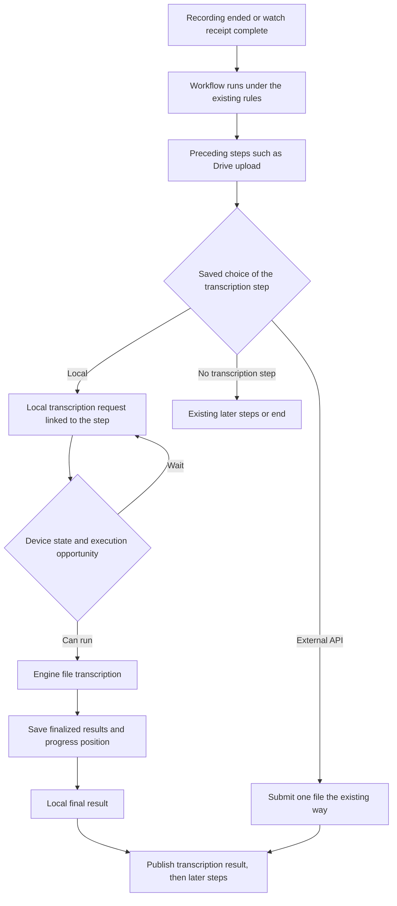

# A local option for transcription workflows: validation and implementation plan

As of: **2026-09-24**. Status: **plan complete, before product implementation**.

**Follow-up decision:** the [fixed recording flow plan](2026-09-24-fixed-recording-flow-plan.md), which removes user-facing workflows,
supersedes this document's plans for product settings, execution wiring and migration.
The premise below that workflows stay is a record of the earlier decision. Low-heat control, the local splitting principles, the engine candidates and real-device validation still apply.

This document supersedes the execution policy, model selection order and validation order of the September 23 architecture plan.
Reflects the user's correction: local is the default choice for a new transcription step. No automatic transcription setting outside workflows is introduced.
The current product contracts, `docs/recly.md` and `spec/`, have not been changed yet.
This work is limited to reading documents, sources and existing logs, and writing the plan. The model inference, downloads and load tests on the laptop,
which the user stopped, are not resumed. Long tests happen after a separate test device is obtained.

## 1. Goal and the structure to settle

**When a transcription workflow is created or a transcription step is added, local is the default choice. Existing external APIs can still be
chosen and configured. The local engine is the most accurate configuration among those that pass the constraints on perceived heat and recording stability.
Implementation difficulty is excluded from the selection criteria.**

- Targets: short voice memos, Korean and mixed Korean-English conversations, 30–120 minute meeting files.
- As before, execution follows the step order of the selected workflow after the recording ends. Live captions and
  inference ahead of time during recording are not in this scope. A recording with no transcription step gets no transcription job.
- When another recording starts, local inference in progress also yields. The watch records and transfers; the phone transcribes.
- The default applies only to the processing method of a new transcription step. No separate app-wide automatic transcription ON/OFF is made.
  A local step can wait for heat, OS execution opportunities or model preparation. A temporary wait that resumes automatically
  is shown as the general "Transcription pending", and the cause is not exposed.
  The reason and the action needed are shown only when the user must act. A configuration that only ever waits is not counted as success either.
- Local inference's internal processing and publishing its results are separated, but the existing workflow's execution conditions and order are kept.
  A step that chose an external API runs only that API. It is not switched to local automatically, and the two paths are not run twice.
- One transcription pass is the default. Multi-pass, which transcribes the whole file again with a different ASR, is excluded from the default.
- Summaries remain the role of the user's workflow/agent as before, and no in-app LLM is added.

Selection order: **original, cancel and resume stability → perceived heat/resource budget → accuracy → energy and completion time**.
This filters out both configurations that are fast but hot and configurations that are cool but do not finish in a practical time.

### Product behavior reflecting the user's confirmation

The default choice for a new step is kept apart from running a saved workflow. Existing users' workflows are not changed.

| Creation or execution condition | Behavior |
|---|---|
| Creating a new transcription workflow / adding a `transcribe` step | The initial choice of processing method is local. Can be changed to and configured as an external API |
| Running a saved local `transcribe` step | Runs the local job linked to that step. A step retry reuses its progress/results |
| Running a saved external API `transcribe` step | Runs only the existing external API path with the selected provider and settings |
| No workflow selected / the selected workflow has no transcription step | Not transcribed |
| Editing, importing or updating an existing external API workflow | Keeps the existing choice, model, API key reference and supported endpoint settings |
| A recording from another device is brought into the list from Drive | Not automatically retranscribed |

The existing default workflow selection and automatic execution rules are kept. The past library is not processed in bulk.
The default choice is the UI's initial value for a new step; a missing or invalid field in existing JSON is not silently corrected to local.
The processing method, conditions, language and speaker diarization requirement are linked to the existing workflow job/step snapshot. A late edit
does not switch a job that is already running to a different engine. Watch recordings also follow the existing execution rules after a verified receipt.
A local request is bound to the workflow job/step + source revision to prevent duplicate resumes. Transcription steps the user defined separately
are kept, and no structure is built that merges them with global automatic transcription or a separate implicit request.

## 2. What is confirmed now and what is not yet confirmed

### Valid scope of the existing tests

- Environment: M4 Pro 24 GB, macOS 26.6.2. Not results from a smartphone or a real Windows device.
- The input is 150 Korean FLEURS items + 150 HiKE items + 2 silence controls, about 49 minutes in total.
  **It is not a test that processed one continuous 49-minute meeting.**
- Confirmed by reading the existing JSONL: Apple Speech, Qwen 1.7B and Qwen 0.6B each have 302 results, 0 recorded errors,
  and process exit 0. The process times are 26.21 s, 129.74 s and 68.03 s respectively.
- There are no power or surface temperature measurements, and preparation work and load from other apps were present. The times above do not settle a low-heat ranking,
  smartphone battery or completion time for long meetings. Comparisons from Whisper Turbo onward are incomplete.
- The test was stopped after the user reported heat. Existing output is preserved, and unfinished runs are not mixed into the table of completed comparisons.

### References to reuse and the limits of applying them

| Source | Scope used in this plan |
|---|---|
| [Whisper's internal 30-second window](https://github.com/openai/whisper#python-usage) | Long file input and the model's internal segment processing are compatible |
| [WhisperKit file API](https://github.com/argmaxinc/argmax-oss-swift/blob/main/Sources/WhisperKit/Core/WhisperKit.swift) | Progressive file loading and a bounded buffer. These alone do not control heat |
| [Argmax battery mode](https://app.argmaxinc.com/docs/examples/real-time-transcription) | A reference policy for real-time mode. Not treated as a low-heat feature already applied to file transcription |
| [Survey of murmur, Edge-Veda, Tapeback and bestASR](2026-09-23-low-heat-transcription-references.md) | Partial implementations of heat control, waiting and model selection at startup. Not finished products to adopt as is |

## 3. File submission for external APIs, and context and interruption for local engines

### External APIs — keep the existing file submission

As before, external APIs **submit one file**, joining the selected track's stored parts when needed.
Splitting or heat control for the local engine's input window, context or resume is not applied to external API requests.
The existing per-provider length and size limit checks and error handling are kept, and no automatic splitting on overflow is newly introduced.
Current path: `core/src/commonMain/kotlin/recly/core/transcribe/TranscribeRunner.kt:83` prepares the joined file, and
`core/src/commonMain/kotlin/recly/core/transcribe/TranscribeRunner.kt:282` checks the limits.

### Local engines — long-file processing first

The source file and the transcription job the user sees each stay single. The recording's stored parts, the audio loading buffer,
the model input window and the processing segments for resume are handled as separate things.

1. A short memo is passed as is to the engine's file transcription API.
2. For a long file, **the engine's long-form processing and context retention come first**. A fixed 10–30 second split is not forced on every model.
3. App-side splitting is applied only when needed because of the engine's input limit or limits of its control/resume API. It uses utterance boundaries, context length and
   timestamps, with only the overlap needed. Dropped boundaries, duplicates and term consistency are evaluated separately.
4. The engine's finalized results and the source sample range are saved. It is not assumed that internal state can be restored from
   a result's segment timestamps alone. For engines that do not support it, a bounded amount of audio is reprocessed from a safe boundary.
5. Processing results are placed on the source timeline. Per-part AAC padding, recording gaps and mic/system track synchronization are kept.
6. A speaker diarization request validates speaker consistency across the whole recording. `S1` is not attached to each piece as if a new person.

App-side splitting is not a prerequisite for better quality. The difference between the whole-file API and app-side splitting is measured with the same engine and file.
Recomputation caused by adding overlap and VAD is included in power. **Splitting while still running continuously does not limit heat.**

## 4. Low-heat execution control

### Default policy

- On one device, only one heavy local inference job runs. ASR, speaker diarization and alignment use the same compute slot too.
- Before starting, check whether recording is in progress, OS execution permission, thermal signals, low power mode, memory and model readiness.
- Start with a conservative execution profile validated from the beginning. Throttling only after the device gets hot is not the default.
- Prefer the efficiency settings the engine supports and sequential execution. Do not assume that running briefly at full load and resting for a fixed time is
  best. Compare the energy, temperature and completion time of efficient execution and per-segment waiting together.
- When a heat rise or a new recording is detected during processing, stop new inference and wait safely. An engine that cannot be stopped is
  excluded from automatic execution candidates, or used only when controllable segmented input has passed quality validation.
- Resume one step at a time after confirming normal recovery for a set period. When stops and resumes are frequent, lower the execution profile.
- Lowering CPU priority is not interpreted as limiting GPU/NPU power draw. Automatic switching to the CPU to keep running when the GPU is hot
  is not the default policy either.
- Do not unload and reload the model for every segment. Distinguish and measure memory retention policies for short and long waits.
- Being on charge alone does not lift the limits. A device with no thermal signal uses a validated time and compute budget,
  and if there is no validated profile either, automatic heavy execution is withheld. `unknown` is not turned into `normal`.

### Control points by platform

| Platform | Controls to validate first | Limits and checks |
|---|---|---|
| iPhone/Mac | SpeechAnalyzer task priority, thermal state notifications, cancel API, Core ML/ANE path | Priority is not a power cap. Instrument down to system services. Validate OS 26/27 separately |
| Android | Thermal API, NPU/CPU execution profiles validated per device, network-free compute Worker | Handle thermal headroom API unsupported/NaN, OEM task limits, confirm actual NPU placement and CPU fallback |
| Windows | Separate inference process, CPU EcoQoS, efficiency hints of supported NPU EPs, execution time budget | Do not assume a general surface temperature API. Confirm the effect per driver/EP |

Apple's `SpeechAnalyzer.Options.priority` exists from OS 26 and affects the priority of most processing.
The calling Task also uses the same intent. `ignoresResourceLimits` is a separate property **from OS 27**, and
even where it is available, the low-heat path is not set to ignore system limits.
[priority](https://developer.apple.com/documentation/speech/speechanalyzer/options/priority)
· [resource limits](https://developer.apple.com/documentation/speech/speechanalyzer/options/ignoresresourcelimits)

Android's thermal headroom query keeps to the officially recommended frequency. It is not assumed that every manufacturer reports the same way.
[Thermal API](https://developer.android.com/games/optimize/adpf/thermal)

On Windows, CPU EcoQoS is kept apart from `ep.dynamic.workload_type=Efficient` on an NPU session, and both the success return value and the actual
effect are checked. Neither is treated as an option that automatically limits all GPU/NPU power.
[Windows ML efficiency guide](https://learn.microsoft.com/en-us/windows/ai/new-windows-ml/efficiency-tips)

## 5. Validation plan: the controller first, long files last

### Test order and pass conditions

| Stage | Test | Condition to enter the next stage |
|---|---|---|
| V0 — control test without inference | Reproduce wait/resume/cancel/delete/OS expiry/no model with a fake engine, clock and thermal signal | 0 new inferences while waiting, no retry budget consumed, no duplicate results or resurrection after deletion |
| V1 — single short file | On a test device, 10–30 seconds of audio, one candidate at a time. Overall cap of 60 seconds for the initial run | Correct output, offline execution, actual compute stops after cancel, a measurable resource profile |
| V2 — small accuracy set | A fixed small set of Korean, mixed language, proper nouns, numbers, quiet voices and silence | Check the error types and keep only candidates that can compete within the heat budget |
| V3 — comparison of file processing methods | Compare the engine's default method with app-side splitting where needed, on a 5-minute continuous file | No dropped or duplicated boundaries, passes the quality degradation limit, bounded reprocessing after a stop |
| V4 — long-file processing | On a separate test device, pick a representative length among real recording files 30–120 minutes long, and expand after the earlier tests pass | Passes on perceived/surface temperature, energy consumed, completion time, completion rate and speaker consistency |
| V5 — product integration | From model installation through recording end, transcription, Drive publishing, webhook and deletion | Consistency holds through network loss, screen lock, process termination and reboot |

**V1–V4 are not resumed on this laptop.** Writing the V0 code and actually running the tests are the next implementation work.
30–120 minutes is the length of the input recording file, not the actual inference run time or the app-side split length.
Not every intermediate length is necessarily tested. Local long-form tests are kept apart from external API regressions.
Items not measured for lack of a device or sensor stay `not measured` and are not treated as passing for the next stage.
Even when long files are processed, no stress test that deliberately keeps running to make the device hot is done.
The first time a stop condition is met, the run ends and is recorded as not passing.

### Measurement design

- On the same device, separate the conditions: idle/everyday-use baseline, recording only, transcription, and recording + a waiting transcription request.
  Live captions are not in the comparison. Load from other apps is recorded, and normal user apps are not force-quit.
- Fix or record room temperature, case, screen brightness/lock, power connection, battery range, OS, drivers, and engine and model hashes.
- Surface temperature is measured with an external sensor at a fixed position. The OS thermal state is an auxiliary signal, not the temperature skin feels.
  The phone's battery temperature is not reported as surface temperature.
- Power is measured with instrumentation/test equipment, recording the difference from baseline where possible. Power draw while charging is not
  converted into battery drain. Total energy covers everything from job start through waiting, reloading and cleanup after completion.
- Time is split into waiting time and actual processing time. A processing time that is merely fast is not used as the user's total wait.
- Resources of the Apple system STT service and native helpers are included too. Engine memory is not compared by the app's RSS alone.
- Change the candidate order and repeat after recovering to baseline. Measure model installation/compilation separately from normal transcription,
  and report the cost of first installation and cold start separately. Preparation work does not overlap with tests of other engines.
- Accuracy looks at CER, Korean/English mixing errors, and number and proper noun errors with fixed references and the same normalization. Hallucination on silence is
  counted separately. Failures, cancellations and drops are not treated as a 0% error rate.
- FLEURS/HiKE are for screening short utterances. Long-form evaluation needs natural continuous meetings and real boundary cases.
  Material made by concatenating short files is used only for endurance tests and is not reported as natural meeting accuracy.
- Long-form data is split per meeting to avoid overlap between tuning and evaluation data. Repeats of the same sentence/speaker are not counted as independent samples.
  HiKE's existing in-house metric is kept apart from the official evaluation score, and losses in Korean and English spelling are each recorded.

### Draft numeric criteria — not validated performance figures

These are **initial product targets** that make perceived heat verifiable. The criteria are not loosened after the fact because results are bad.
They are settled as release criteria after checking both per-device measurement uncertainty and the temperature users feel.

| Item | Initial pass criterion |
|---|---|
| Surface temperature | Target a maximum rise within 2°C over the same usage baseline under controlled indoor conditions. If the user feels it is hot, it fails regardless of the number |
| Thermal signal during the test | Validate that further inference is withheld at Apple `fair` or higher, or at Android's early thermal pressure signal. Set the resume criterion more conservatively |
| Fan / feel | Fails if sustained fan noise or UI stutter newly appears because of transcription |
| Cancel / new recording | New inference requests are blocked immediately. Target 2 seconds for actual compute to end, initial allowed cap 5 seconds. Check down to system services; engines that cannot meet this are excluded from automatic execution candidates |
| Accuracy change from splitting | Use a CER worsening within 0.5 percentage points over the same engine's default file processing as the initial non-inferiority limit. Withhold a conclusion if the confidence interval is wide. Cases of dropped/duplicated words are resolved separately |
| Completion delay | Under conditions where execution opportunities are given continuously, set total completion time / audio length ≤1 as the first practicality target. Time the OS did not allow execution is shown separately but also counted in the actual user delay |
| Battery and power | Record J per minute of audio, sustained average and peak power, and drain compared with baseline. No blanket W or % guarantee is made without measurement |

2°C and 5 seconds are not OS-guaranteed values or existing measurements. They are the test's targets and stop conditions. If the device is already warm or
under heavy load, the conditions for a normal start do not hold. A test that keeps running past the cap to make the average look better is forbidden.

### Candidates and test devices by platform

| Platform | First comparison candidates | Expansion conditions |
|---|---|---|
| iPhone/Mac | Supported SpeechTranscriber file transcription, WhisperKit/Core ML models that support Korean | If the two cannot meet the required accuracy, add an accelerated path for the Qwen family. Do not treat MLX/GPU as the default winner |
| Android | A verifiable NPU path for Whisper-family models that support Korean, a supported runtime for quantized Qwen 0.6B | Distinguish actual CPU/NPU execution. Add larger models such as 1.7B when the smaller candidates' quality is insufficient and there is room to pass the heat budget |
| Windows | Windows ML/ONNX Runtime NPU path for compatible Korean models, a CPU path with efficiency settings applied | Do not claim support for a model the NPU does not support by forcing it. GPU candidates must pass the same heat criteria too |
| Watch | Transcription after the phone receives it | Watch ASR is not in this scope |

Each platform starts with 1–2 candidates at a time. An NPU is not necessarily low-heat.
On Android, validate separately across the SoCs among Snapdragon, Exynos and MediaTek/Tensor for which support will be claimed, and across flagship and mid-range RAM tiers.
On Apple, distinguish the lowest supported iPhone tier, flagship iPhones, fanless Macs and Macs with fans.
On Windows, distinguish CPU laptops without an NPU, supported NPU devices and GPU devices. Include the OS versions the product will support and
before and after updates, and do not replace real-device power validation with simulator results.
On unvalidated devices, an installed small model is not run unconditionally; the feature's preparation/support state is shown instead.

## 6. Components to implement

```mermaid
flowchart TD
    A[Recording ended or watch receipt complete] --> B[Workflow runs under the existing rules]
    B --> D[Preceding steps such as Drive upload]
    D --> J{Saved choice of the transcription step}
    J -->|Local| C[Local transcription request linked to the step]
    J -->|External API| K[Submit one file the existing way]
    J -->|No transcription step| L[Existing later steps or end]
    C --> E{Device state and execution opportunity}
    E -->|Wait| C
    E -->|Can run| F[Engine file transcription]
    F --> G[Save finalized results and progress position]
    G --> H[Local final result]
    H --> I[Publish transcription result, then later steps]
    K --> I
```

A recording with no workflow selected does not get this transcription path.
The wait arrow is not a polling busy loop but OS/device state events and delayed rescheduling.

### Common core and native engines

- `LocalTranscriptionEngine` (proposed new): declares supported languages, long-form input, finalized results, cancel limits, resume method,
  model/runtime revision and the actual accelerator path. PCM frames are not continuously copied into the common core.
- `LocalTranscriptionService` (new): keeps the jobs requested by runnable local `transcribe` steps.
  It links the workflow job/step, source revision and required settings, and does not create independent jobs from the recording-ended event.
  Inference runs outside the DB dispatcher/global job lock. Results are applied in short transactions.
- `ComputeAdmission` (new): decides run/wait from OS execution permission and the device resource profile.
  The existing `TranscriptionPolicy` is a cloud region policy, so a different responsibility is not mixed into it.
- `ModelStore` (new): handles model preparation, checksums, atomic installation and error recovery. Model installation and inference
  do not compete at the same time. System models use that platform's asset management API.
- `TranscriptRepository` (new): manages finalized segments, the final revision, the source timeline and result provenance.
  Local READY must be queryable independently of Drive sign-in/publishing state.

The DB keeps request, resume position, result revision and publication state separate. Large PCM/tensors are not put into
`step_run.state_json`. The resume state includes the source/model/options hash and the completed range.

Job states are `QUEUED → RUNNING → READY`, or `WAITING` with a reason, `FAILED`, `CANCELLED`.
WAITING reasons include model/thermal/recording/OS/power, and do not consume failure retry counts.
A RUNNING left behind by process termination has its lease reclaimed and goes back to a resumable state. A late-arriving result is saved only when
the execution generation and source revision match. Partial results are not published as the final result.

### User-facing display of waiting states

- While waiting to resume automatically because of thermal state, OS execution opportunities or another recording, show only "Transcription pending".
  Do not add detailed causes, warnings, toasts or push notifications. When conditions recover, resume without user action.
- The wait cause is kept as a state for internal scheduling, recovery and diagnostics. The on-screen text does not change with every internal state change.
- Show the cause and the fix only when the user must act, such as consent to install a model, permission settings or freeing space.
  Distinguish temporary waits that resolve on their own from actual failures and unsupported states, and do not hide the latter as a general wait.

### Compatibility with uploads and existing workflows

- Local transcription also runs as a processing method of the existing `transcribe` step. Transcription is not added to existing Drive-only/webhook workflows.
  Local processing results are first saved on the device, and publishing retries do not re-run inference.
- Implement the approach of stating the local/cloud branch of `transcribe` explicitly in workflow schema 4.
  The local branch does not require an API key/secretRef. The external API branch keeps the existing provider, model, secret reference,
  supported endpoint settings and validation. Existing cloud JSON is read with its meaning preserved.
- **The local transcribe step also runs after the Drive step, as before.** No separate computation ahead of time is scheduled at recording end,
  and the existing execution order and conditions are kept. No new workflow DAG or global automatic execution policy is created.
- Local inference itself needs no network. The internal computation and resume of a runnable local step are separated from publishing results to
  avoid unnecessary network constraints. However, it is not guaranteed that a workflow whose preceding Drive upload is incomplete runs as far as
  transcription while offline. Remote sync in `runDueJobs` and per-platform network constraints are kept out of this scope.
- A webhook after that local step references only the final revision that was published successfully. Even if publishing the result fails, the local
  result is readable, and a retry does not run ASR again. The Drive account to publish to is also pinned/verified.
- Test schema 1–3 local storage/import, in-progress cloud job snapshots, and old clients rejecting the new schema.

### Original preservation, deletion and the result contract

- Local computation, waiting and result publishing happen while that workflow step is incomplete. They tie into the existing
  ‘all workflows DONE + upload succeeded + 7 days’ retention decision to keep the original protected.
  A state where the step becomes DONE while native computation is still running is forbidden, and cancel/delete are coordinated atomically with use of the original.
- User deletion takes priority over waiting for original retention. The job is first cancelled and invalidated and late results are blocked, then it is deleted.
  Disconnecting Drive alone does not delete local recordings/results, and the meaning of the existing "Also delete the recordings" option is preserved.
- The original is preserved on incomplete watch receipts, damaged parts, a missing model and low space. Space that
  builds up because of automatic waiting is shown and not resolved by arbitrary deletion or cloud transfer.
- The current transcript schema 1 requires `speaker` on every segment and at least one speaker. So that not running speaker diarization
  is not dressed up as an actual single-speaker judgment, schema 2 defines a representation for ‘speaker unknown’.
  Timestamp precision/source is also stated, and fake word times are not made up for engines that only have segment times.
- A job that requires speaker diarization is not treated as complete just because ASR finished. While the local step runs,
  text can be provided first, but the speaker processing state is shown separately. All additional processing uses the same heat budget.
- The reader reads transcript v1/v2, and compatibility is checked through to the webhook's file references and skill consumers.
- New model distribution paths and SDK network behavior are reflected in `docs/recly.md` §15. No remote telemetry is added.
  After the model is downloaded, the transcription path is validated with the network blocked, and it does not switch to an external upload automatically.

## 7. Change points and implementation order

The line numbers below are as of reading on 2026-09-24. Each stage reports the finished behavior and the verification results.

| Order | Change points | Done condition |
|---|---|---|
| P0. Strengthen the existing bench | `scripts/stt-benchmark/run_suite.py:12`, `score.py:65`, `apple_speech.swift:44` | Process-tree cancel, sample/run caps, thermal/time watchdog, preserve interrupted results, show missing scores as N/A. Validate with a fake engine first |
| P1. Policy and contracts | `docs/recly.md:65`, `:80`, `:85`, `:1261`; `spec/workflow.schema.json:100`, `spec/transcript.schema.json:26`; `model/Workflow.kt:42`, `workflow/WorkflowParser.kt:306` | Local default choice for new transcription steps, external API settings preserved, schema transition, unknown speaker, existing execution order kept |
| P2. Local compute foundation | `platform/CoreDeps.kt:10`, `ReclyCore.kt:228`, `recording/RecordingRepository.kt:163`, `:599`, SQLDelight DB/new migration | Fake engine request→wait→resume→result in a runnable local step. 0 requests for recordings with no transcription step, no duplicates on re-registration, process termination or source change |
| P3. Separate retention and publishing | `job/JobStore.kt:208`, `job/Retention.kt:33`, `RecordingRepository.kt:467`; `transcribe/TranscribeRunner.kt:163`, `RecordingResults.kt:54`, `ReclyCore.kt:175` | Pending originals preserved, no result resurrection after deletion, local results shown despite Drive failure, no re-inference on publishing retry |
| P4. Apple adapter | `apple/RecKit/Sources/RecKit/CoreBridge/CoreBridge.swift:42`, `Jobs/BackgroundJobs.swift:67`, `Jobs/JobRunner.swift:175` and a new native engine | Feature-complete starting from the SpeechTranscriber file path. V1–V3 on a separate test device, quality comparison with WhisperKit within the heat constraints. Mac results are not generalized to iPhone |
| P5. Android and Windows adapters | `android/app/src/main/kotlin/app/recly/android/core/CoreModule.kt:61`, `work/WorkScheduler.kt:64`, `work/WorkflowWorker.kt:45`; `windows/app/src/main/kotlin/app/recly/windows/core/AppGraph.kt:60`, `jobs/JobRunner.kt:63` | Compute scheduler, actual accelerator validation, native cancel/resume. Wait/support state shown for unsupported combinations |
| P6. UI, long-form validation, release | Each shell's workflow editing/detail/resources, spec examples, `skills/recly-notes/`, `skills/recly-notion/` | New transcription steps default to local, external API choice and settings kept. Preparing/waiting/in-progress/done/failed shown. The cause of automatic-resume waits is hidden, with guidance only when the user must act. Only combinations that pass V4–V5 go into the default profile |

Up to P2 is the checkpoint for the first working implementation. The job and result boundaries are checked without a real model.
The default engine from P4 on is decided by validation results. SpeechTranscriber is the first validation candidate, not an already final choice.
Each device's profile is versioned with the app. No remote configuration or automatic benchmark that runs secretly on users' devices is added.

### Background integration per OS

- iOS: separate the existing `requiresNetworkConnectivity = true` request from the compute request for a runnable local step.
  The local step's request uses the execution opportunities the OS allows. Continued processing checks the explicit user-start condition and
  supported resources. Automatic watch receipt alone does not guarantee immediate long background inference.
  On expiration it cancels/saves, and after recording ends it does not secure execution time with a fake audio session.
  [Apple WWDC](https://developer.apple.com/videos/play/wwdc2025/227/)
- Android: separate a network-free compute Worker and reschedule after OS/OEM stops. Check the long-running Worker's
  Android 16 quota and the appropriate foreground service type. File inference is not kept alive with a microphone service.
  [Official long-running work guide](https://developer.android.com/develop/background-work/background-tasks/persistent/how-to/long-running)
- Mac/Windows: separate the app lifecycle from the compute executor. Support resume after sleep and app exit, but do not keep the laptop
  awake with sleep prevention. A Windows helper failure must not terminate the recording process.

## 8. Required regressions and the release decision

| Scenario | Result to check |
|---|---|
| Airplane mode / Drive connection state change | Computation and resume of an already runnable local step work without a network; the authentication and ordering constraints of the preceding upload and result publishing are kept |
| New transcription step / editing or importing an existing external API step | Only new steps default to local; existing provider, model, secret reference and endpoint values and the external API choice and settings are preserved |
| No workflow / no transcription step / external API chosen | 0 implicit local requests; only the selected workflow and processing method run |
| Long file on an external API / size or length limit exceeded | Existing single-file submission and limit checks kept; local splitting, VAD, overlap and heat waits are not applied to API requests |
| No model / cancel during install / corrupted | Preparation state is accurate and recordings are preserved; no partial model execution or endless retries |
| New recording during transcription | Saving the original comes first, inference yields, no recording drops or added latency |
| Heat rise → recovery, no thermal sensor support | Further inference blocked, conservative resume, unknown handled; waiting is not counted as failure |
| Automatic-resume waits and states that need user action | Thermal and OS temporary waits are shown as a general wait without cause/warning notifications and resume automatically; install consent, permission and space problems show the action needed |
| Screen lock / OS expiry / process termination / reboot | Completed range kept, one original, no duplicate results, only the allowed range reprocessed |
| 7-day retention sweep while waiting for transcription | Parts needed for transcription are not deleted |
| Deletion/job cancel racing with the completion callback | Deleted results do not come back; late results of a cancelled step are not published |
| Upload failure / account change after local completion | Published under the correct account/consent conditions without retranscription; no mispublishing of the previous account's data |
| Importing existing cloud workflows and old schemas | Existing choice, secret references, consent and error codes preserved; no double transcription |
| Speaker unknown / 2 or more people / overlapping speech / track gaps | Speaker and time consistency; unknown is not asserted to be an actual person |

After implementation, following the repository rules, run `make test`, `make spec` on spec changes,
`make core` then `make mac-test` on core/Apple changes, and `make helper-test` on capture-helper changes.
Simulator builds use `make ios`/`make watch`. These are functional regressions and do not replace real-device heat tests.

The release report presents **accuracy, surface temperature change, energy, processing and waiting time, and resume cost** per device/OS/model/accelerator
together. Unmeasured combinations are not shown as supported by default. If no candidate meets the quality or heat criteria,
the local option on that device accurately shows an unsupported state and preserves the original. The existing external API choice and settings
are kept, but a running local step is not switched to an external API without the user's choice.

## 9. Verification log for writing this plan

- `git status --short`: the existing survey documents and `scripts/stt-benchmark/` are untracked. No product code changes.
- Network constraints, Drive dependence, the retention sweep and schemas were checked with `rg` and source reads with line numbers.
  Initially guessed paths that did not exist were located with `rg --files` and corrected in the table above.
- Result of reading the existing `main-processes.json`/JSONL: `apple/qwen17/qwen06` all `samples 302 errors 0 exit 0`.
  This is not a result of re-running inference or recomputing the full scores.
- Confirmed in Apple's official Markdown that `priority`/`ModelRetention` are OS 26 and `ignoresResourceLimits` is OS 27.
  The Android long-running work document checked was the 2026-09-16 revision, and the Windows efficiency guide the 2026-08-17 revision.
- A `python3` static check confirmed trailing whitespace, code fences and local links in the two documents, and the paths/line ranges of 27 source references.
  Actual output: `whitespace/fences/local links PASS` (both documents), `Validated 27 source references.`
- The removal of the global automatic transcription assumption after the user's correction was also confirmed.
  Actual output: `PASS: superseded global auto-transcription requirements removed`.
- Only the plan document was changed this time. The builds, model downloads, inference and load tests on this laptop, which were stopped at the user's request,
  were not resumed, and no product implementation or real-device pass is reported.
